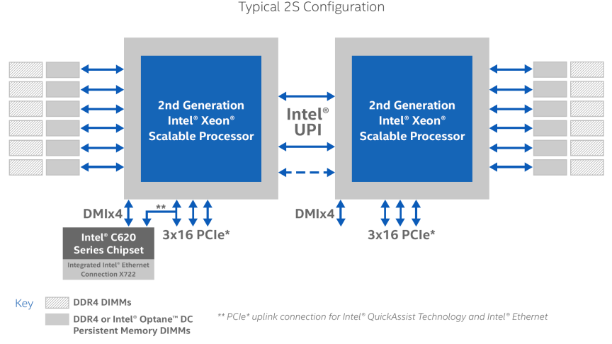

In this article, we show how to use the Linux Volume Manager (LVM) to create concatenated, striped, and mirrored logical volumes using persistent memory modules as the backing storage device. Specifically, we will be using the [Intel® Optane™ Persistent Memory Modules](https://software.intel.com/en-us/persistent-memory) on a two socket system with Intel® Cascade Lake Xeon® CPUs, also referred to as 2nd Generation Intel® Xeon® Scalable Processors.

## Contents

- [Linux Volume Manager](#Linux-Volume-Manager)

- [When Should You Use LVM with Persistent Memory?](#When-Should-You-Use-LVM-with-Persistent-Memory)

- [Step 1: Create the Persistent Memory Regions](#Step-1)

- [Step 2: Create the Persistent Memory Namespaces](#Step-2)

- [Step 3: Create the LVM Physical Volumes](#Step-3)

- [Step 4: Add the Physical Volumes to a Volume Group](#Step-4)

- [Step 5: Create LVM Logical Volumes](#Step-5)
    - [Create Concatenated Logical Volumes](#Create-Concatenated-Logical-Volumes)
    
    - [Create Striped Logical Volumes](#Create-Striped-Logical-Volumes)
    
    - [Create Mirrored Logical Volumes](#Create-Mirrored-Logical-Volumes)

- [Step 6: Create File Systems using the Logical Volumes](#Step-6)

- [Summary](#Summary)

## Linux Volume Manager

The Linux Logical Volume Manager (LVM) is a storage device management technology that gives users the power to abstract the physical layout of component storage devices for easy and flexible administration.  Utilizing the device mapper Linux kernel framework, LVM can be used to group existing storage devices and allocate logical units from the combined space as needed. 

The main advantages of LVM are increased abstraction, flexibility, and control. Logical volumes can have meaningful names like "databases" or "web." Volumes can be resized dynamically as space requirements change and migrated between physical devices within the volume group on a running system.   

Given most modern Linux distributions default to using LVM for their boot disks, I'll assume that you have at least some experience using LVM and will not describe it in too much detail.  There is a wealth of information and tutorials within the Linux documentation and on the web including the main [LVM2 Resource Page](http://www.sourceware.org/lvm2/) and [Wikipedia](https://en.wikipedia.org/wiki/Logical_Volume_Manager_(Linux)).

## When Should You Use LVM with Persistent Memory?

Persistent memory modules are installed on the memory bus alongside DDR DIMMs. In fact, persistent memory and DDR DIMMs may co-exist in the same memory channels. The result is a very fast, high bandwidth, low latency interface to persistent memory that can be used as block storage or byte addressable memory.

On NUMA ([Non-Uniform Memory Access](https://en.wikipedia.org/wiki/Non-uniform_memory_access)) systems, there is a locality factor between the CPU socket and the memory that is directly attached to it. Accessing memory on a different CPU socket incurs a small latency penalty. Latency sensitive applications, such as databases, understand this and coordinate their threads to run on the same socket as the memory they are accessing. Applications running on UMA ([Uniform Memory Access](https://en.wikipedia.org/wiki/Uniform_memory_access)) systems don't need to worry about latency of remote memory accesses.

The `numactl` and `ndctl` utilities can be used to show NUMA locality information. The following `numactl --hardware` shows two CPU sockets, each CPU has 24 cores, 48 threads, and 196GB of DDR:

```bash
# numactl --hardware
available: 2 nodes (0-1)
node 0 cpus: 0 1 2 3 4 5 6 7 8 9 10 11 12 13 14 15 16 17 18 19 20 21 22 23 48 49 50 51 52 53 54 55 56 57 58 59 60 61 62 63 64 65 66 67 68 69 70 71
node 0 size: 192155 MB
node 0 free: 184186 MB
node 1 cpus: 24 25 26 27 28 29 30 31 32 33 34 35 36 37 38 39 40 41 42 43 44 45 46 47 72 73 74 75 76 77 78 79 80 81 82 83 84 85 86 87 88 89 90 91 92 93 94 95
node 1 size: 191989 MB
node 1 free: 190078 MB
node distances:
node   0   1
  0:  10  21
  1:  21  10
```

The following shows the `numa_node` to which the persistent memory capacity (available\_size) belongs:

```bash
# ndctl list -Rv
[
  {
    "dev":"region1",
    "size":1623497637888,
    "available_size":1623497637888,
    "max_available_extent":1623497637888,
    "type":"pmem",
    "numa_node":1,
    "iset_id":-2506113243053544244,
    "persistence_domain":"memory_controller"
  },
  {
    "dev":"region0",
    "size":1623497637888,
    "available_size":1623497637888,
    "max_available_extent":1623497637888,
    "type":"pmem",
    "numa_node":0,
    "iset_id":3259620181632232652,
    "persistence_domain":"memory_controller"
  }
]
```

We won't cover ndctl in detail in this series. You should read the [NDCTL User Guide](https://docs.pmem.io/ndctl-users-guide) for more information and examples.

Disks are attached to storage controllers such as SATA, SAS or NVME. Disk controllers may provide hardware RAID support. Non-hardware RAID controllers allow you to create disk RAID groups using a software RAID Volume Manager. Similarly, the CPU communicates to DDR and persistent memory via the memory controller. However, memory controllers do not implement RAID other than striping the DIMMs, that we call interleaving. Additionally, the number of physical memory slots is restricted by the motherboard design and the number of memory slots supported by the memory controller on the CPU. Figure 1 shows a typical 2-socket Intel Xeon (Cascade Lake) microarchitecture with 12 memory slots, 6 of which can be used for DDR only and the other 6 for either DDR or Intel Optane Persistent Memory Modules.



Figure 1: Intel® 2nd Generation Xeon® Scalable Processor Microarchitecture

> Image taken from: [https://www.intel.com/content/www/us/en/design/products-and-solutions/processors-and-chipsets/cascade-lake/2nd-gen-intel-xeon-scalable-processors.html](https://www.intel.com/content/www/us/en/design/products-and-solutions/processors-and-chipsets/cascade-lake/2nd-gen-intel-xeon-scalable-processors.html)

When we provision persistent memory, the memory controllers can only configure and manage local memory for that socket. On a multi-socket system with interleaving enabled, we create one region per socket. A two socket system has two regions and a 4-socket system has 4 regions. There's no way for the memory controllers to RAID (Mirror, Concat, or Stripe) across physical sockets or regions.

There are times when applications need more memory than a single socket can provide. It is this situation when using software RAID necessitates the need to create larger persistent memory regions using the capacity across multiple sockets.

For example, let's assume you have a two socket system where each socket has 1.5TB of persistent memory and 192GB of DDR. This gives us a combined total of 3TB of persistent memory and 384GB of DDR. Lets further assume that your application requires 2.5TB of persistent memory. You could replace the persistent memory modules with larger capacity ones such that a single socket has 3TB (6TB total) or you could concatenate or stripe the capacity of both sockets to create a 3TB volume.

**You should understand that using LVM with persistent memory will add latency.** 

## Direct Access (DAX) Support

Direct Access (DAX) allows applications to memory-map files residing on a persistent memory aware file system directly into their address space from where they can access the data directly. This bypasses the Kernel, interrupts, and context switches. It provides the application with the fastest possible path to the persistent memory devices. However, DAX is not supported by all logical volume configurations. The following matrix shows which LVM modes do and do not allow mounting file systems with the DAX feature enabled (`mount -o dax _device mountpoint_`). This should be considered when creating the environment. It may seem logical to assume mirrored volumes provides data redundancy, like it does with block devices, but that is not the case when we consider memory. If you do not require DAX support, then the normal block device rules apply and all LVM modes can be configured and used.

<table><tbody><tr><td>LVM Mode</td><td class="has-text-align-center" data-align="center">DAX Support</td></tr><tr><td>Stripe (RAID0)</td><td class="has-text-align-center" data-align="center">Yes</td></tr><tr><td>Linear (RAID0)</td><td class="has-text-align-center" data-align="center">Yes</td></tr><tr><td>Mirror (RAID1)</td><td class="has-text-align-center" data-align="center">No</td></tr><tr><td>RAID4/5/6</td><td class="has-text-align-center" data-align="center">No</td></tr><tr><td>Mirrored Stripe (RAID10)</td><td class="has-text-align-center" data-align="center">No</td></tr></tbody></table>

LVM DAX Support Matrix

## Step 1: Create the Persistent Memory Regions

This step is vendor specific.  For Intel Optane Persistent Memory, regions can be created using the `ipmctl` utility. [IPMCTL](https://github.com/intel/ipmctl) is available as an open source project and it is available for both Linux and Windows. The following `ipmctl` command interleaves all persistent memory modules within the same socket. On a two socket system, this will result in two regions, one per socket.

```bash
# sudo ipmctl create -goal PersistentMemoryType=AppDirect 
```

output:

```bash
The following configuration will be applied: 
SocketID | DimmID | MemorySize | AppDirect1Size | AppDirect2Size 
================================================================== 
0x0000   | 0x0001 | 0.0 GiB    | 252.0 GiB      | 0.0 GiB 
0x0000   | 0x0011 | 0.0 GiB    | 252.0 GiB      | 0.0 GiB 
0x0000   | 0x0021 | 0.0 GiB    | 252.0 GiB      | 0.0 GiB 
0x0000   | 0x0101 | 0.0 GiB    | 252.0 GiB      | 0.0 GiB 
0x0000   | 0x0111 | 0.0 GiB    | 252.0 GiB      | 0.0 GiB 
0x0000   | 0x0121 | 0.0 GiB    | 252.0 GiB      | 0.0 GiB 
0x0001   | 0x1001 | 0.0 GiB    | 252.0 GiB      | 0.0 GiB 
0x0001   | 0x1011 | 0.0 GiB    | 252.0 GiB      | 0.0 GiB 
0x0001   | 0x1021 | 0.0 GiB    | 252.0 GiB      | 0.0 GiB 
0x0001   | 0x1101 | 0.0 GiB    | 252.0 GiB      | 0.0 GiB 
0x0001   | 0x1111 | 0.0 GiB    | 252.0 GiB      | 0.0 GiB 
0x0001   | 0x1121 | 0.0 GiB    | 252.0 GiB      | 0.0 GiB 
Do you want to continue? [y/n] y 
SocketID | DimmID | MemorySize | AppDirect1Size | AppDirect2Size 
================================================================== 
0x0000   | 0x0001 | 0.0 GiB    | 252.0 GiB      | 0.0 GiB 
0x0000   | 0x0011 | 0.0 GiB    | 252.0 GiB      | 0.0 GiB 
0x0000   | 0x0021 | 0.0 GiB    | 252.0 GiB      | 0.0 GiB 
0x0000   | 0x0101 | 0.0 GiB    | 252.0 GiB      | 0.0 GiB 
0x0000   | 0x0111 | 0.0 GiB    | 252.0 GiB      | 0.0 GiB 
0x0000   | 0x0121 | 0.0 GiB    | 252.0 GiB      | 0.0 GiB 
0x0001   | 0x1001 | 0.0 GiB    | 252.0 GiB      | 0.0 GiB 
0x0001   | 0x1011 | 0.0 GiB    | 252.0 GiB      | 0.0 GiB 
0x0001   | 0x1021 | 0.0 GiB    | 252.0 GiB      | 0.0 GiB 
0x0001   | 0x1101 | 0.0 GiB    | 252.0 GiB      | 0.0 GiB 
0x0001   | 0x1111 | 0.0 GiB    | 252.0 GiB      | 0.0 GiB 
0x0001   | 0x1121 | 0.0 GiB    | 252.0 GiB      | 0.0 GiB 
A reboot is required to process new memory allocation goals. 
# systemctl reboot  
```

After the system reboots, you can check the current region configuration using `ipmctl show –region`.

```bash
# ipmctl show -region 
 SocketID | ISetID             | PersistentMemoryType | Capacity   | FreeCapacity | HealthState 
================================================================================================ 
 0x0000   | 0x2d3c7f48f4e22ccc | AppDirect            | 1512.0 GiB | 1512.0 GiB   | Healthy 
 0x0001   | 0xdd387f488ce42ccc | AppDirect            | 1512.0 GiB | 1512.0 GiB   | Healthy 
```

## Step 2: Create the Persistent Memory Namespaces 

[Creating namespaces](https://docs.pmem.io/ndctl-users-guide/managing-namespaces#creating-namespaces) is accomplished using the `ndctl` utility.  To use the full capacity of each region to create fsdax namespaces, we could run `ndctl create-namespace` twice.  `ndctl` automatically selects a region with enough available capacity if no region is provided to it.  To specify which region we want to create the namespaces within, we can use the `--region` option. There are several namespace modes, although the only two which make sense for LVM are fsdax and sector:

**fsdax:** Filesystem-DAX mode is the default mode of a namespace when specifying `ndctl create-namespace` with no options. It creates a block device (/dev/pmemX\[.Y\]) that supports the DAX capabilities of Linux filesystems (xfs and ext4 to date). DAX removes the page cache from the I/O path and allows mmap(2) to establish direct mappings to persistent memory media. The DAX capability enables workloads / working-sets that would exceed the capacity of the page cache to scale up to the capacity of persistent memory. Workloads that fit in page cache or perform bulk data transfers may not see benefit from DAX. When in doubt, pick this mode.

**sector:** Use this mode to host legacy filesystems that do not checksum metadata or applications that are not prepared for torn sectors after a crash. Expected usage for this mode is for small boot volumes. This mode is compatible with other operating systems.

You can read more in the "[Managing Namespaces](https://docs.pmem.io/ndctl-users-guide/managing-namespaces)" section of the [NDCTL User Guide](https://docs.pmem.io/ndctl-users-guide).

Here we use region0 to create an fsdax namespace: 

```bash
$ sudo ndctl create-namespace --region=region0 --mode=fsdax
```

output:

```bash
{ 
  "dev":"namespace0.0", 
  "mode":"fsdax", 
  "map":"dev", 
  "size":"1488.37 GiB (1598.13 GB)", 
  "uuid":"2f373b37-d9b3-48e3-a2e4-472462d884ce", 
  "sector_size":512, 
  "align":2097152, 
  "blockdev":"pmem0" 
} 
```

Now we can create another namespace on the other region:

```bash
$ sudo ndctl create-namespace --region=region1 --mode=fsdax 
```

output:

```bash
{ 
  "dev":"namespace1.0", 
  "mode":"fsdax", 
  "map":"dev", 
  "size":"1488.37 GiB (1598.13 GB)", 
  "uuid":"e0c7c12e-5006-4116-a8ce-e59b25bc0293", 
  "sector_size":512, 
  "align":2097152, 
  "blockdev":"pmem1" 
} 
```

To create `sector` namespaces, we can use the `--mode=sector` option instead: 

```
$ sudo ndctl create-namespace --region=region0 --mode=sector 
$ sudo ndctl create-namespace --region=region1 --mode=sector 
```

## Step 3: Create the LVM Physical Volumes 

Scan the system for block devices that LVM can see and manage. The output will display all available block devices that LVM can interact with.  You can do this using the `lvmdiskscan` command: 

```bash
$ sudo lvmdiskscan  
```

output:

```bash
  /dev/pmem0                [       1.45 TiB] 
  /dev/pmem1                [       1.45 TiB] 
  […] 
  /dev/sdb                  [     512.00 GiB] 
  /dev/sdc                  [     512.00 GiB] 
  3 disks 
  4 partitions 
  0 LVM physical volume whole disks 
  1 LVM physical volume
```

We want to use `/dev/pmem0` and `/dev/pmem1` to create our physical volumes using the `pvcreate` command:

```bash
$ sudo pvcreate /dev/pmem0 /dev/pmem1 
```

   output:

```bash
  Physical volume "/dev/pmem0" successfully created. 
  Physical volume "/dev/pmem1" successfully created. 
```

This will write an LVM metadata to the devices to indicate that they are ready to be added to a volume group.  You can verify that LVM has registered the physical volumes using the `pvs` command: 

```bash
$ sudo pvs 
```

output:

```bash
  PV         VG              Fmt  Attr PSize   PFree 
  /dev/pmem0                 lvm2 --- 1.45t  1.45t 
  /dev/pmem1                 lvm2 --- 1.45t  1.45t 
```

## Step 4: Add the Physical Volumes to a Volume Group 

We can create a volume group using the two physical volumes we just created using the `vgcreate` command.  The `vgcreate` command requires a volume name so we will call our volume group “PmemVol” for simplicity. 

To create the volume group using both of our pmem physical volumes, we use: 

```bash
$ sudo vgcreate PmemVol /dev/pmem0 /dev/pmem1 
```

output:

```bash
  Volume group "PmemVol" successfully created 
```

Rerunning `pvs` allows us to verify our physical volumes are now associated with the new volume group: 

```bash
$ sudo pvs 
```

output:

```bash
  PV         VG              Fmt  Attr PSize   PFree 
  /dev/pmem0 PmemVol         lvm2 a-- 1.45t  1.45t 
  /dev/pmem1 PmemVol         lvm2 a-- 1.45t  1.45t 
```

To display the volume group configuration, we use the `vgs` command: 

```bash
$ sudo vgs 
```

output:

```bash
  VG              #PV #LV #SN Attr   VSize   VFree 
  PmemVol           2   0   0 wz--n- <2.91t <2.91t 
```

## Step 5: Create LVM Logical Volumes 

With a volume group available, we can use it as a pool to allocate logical volumes within.  Unlike conventional partitioning, when working with logical volumes, you do not need to know the layout of the volume since LVM maps and handles this for you.  We supply the size of the volume, the required RAID layout, and a volume name. 

For this article, we'll create three separate logical volumes from our "PmemVol" volume group: 

- 20GiB "db" volume for a database 

- 2GiB "www" volume for web content 

- "app" volume that will fill the remaining space 

I show how to create the three different layouts using the two 1.5TB volume groups, but assume you will only create one type:

- [Concatenate (concat/linear)](#Create-Concatenated-Logical-Volumes)

- [Striped](#Create-Striped-Logical-Volumes)

- [Mirrored](#Create-Mirrored-Logical-Volumes)

### Create Concatenated/Linear Logical Volumes

The `lvcreate` command is used to create logical volumes.  For concatenated/linear volumes, we give the new volume a name using the `-n` option, a size using the `-L` option, and the volume group on which to create the logical volume.  If, instead, you wish to specify the size in terms of the number of extents, you can use the `–l` option. 

We can create the first two logical volumes as follows: 

```bash
$ sudo lvcreate -L 20G -n db PmemVol 
$ sudo lvcreate -L 20G -n www PmemVol 
```

output:

```bash
  Logical volume "db" created. 
  Logical volume "www" created. 
```

The remaining space within the volume group can be assigned to the "app" volume using the `-l` flag, which works in extents.  The `–l` flag accepts a percentage and a unit to communicate our intentions better.  To allocate the remaining free space, we can use `-l 100%FREE`: 

```bash
$ sudo lvcreate -l 100%FREE -n app PmemVol 
```

output:

```bash
  Logical volume "app" created. 
```

Rerunning the `vgs` command shows we now have two physical (#PV) and three logical volumes (#LV):

```bash
$ sudo vgs 
```

output:

```bash
  VG              #PV #LV #SN Attr   VSize   VFree 
  PmemVol           2   3   0 wz--n- <2.91t     0 
```

To show the individual volumes within the group, we use `-o +lv_size,lv_name`: 

```bash
$ sudo vgs -o +lv_size,lv_name 
```

output:

```bash
  VG              #PV #LV #SN Attr   VSize   VFree  LSize   LV 
  PmemVol           2   3   0 wz--n- <2.91t     0   20.00g db 
  PmemVol           2   3   0 wz--n- <2.91t     0   20.00g www 
  PmemVol           2   3   0 wz--n- <2.91t     0   <2.87t app 
```

We can now create file systems on these logical volumes.

### Create Striped Logical Volumes 

When you create a striped logical volume, we specify the number of stripes with the `-i`argument and -I specifies the stripe size. This determines how many physical volumes will be used to create the striped logical volume, otherwise known as the stripe width. The number of stripes cannot be greater than the number of physical volumes in the volume group (unless the `--alloc anywhere` argument is used). We provide the volume group to use and we give the new volume a name using the `-n` option.  The `-L` option is used to specify the required size of the volume.  If, instead, you wish to specify the size in terms of the number of extents, you can use the `–l` option.

If the underlying physical devices that make up a striped logical volume are different sizes, the maximum size of the striped volume is determined by the smallest underlying device.

Here, we create our two 20GB striped logical volumes across both physical volumes (`-i2`) with a stripe width of 4K (`-I4k`) (the default page size).

```bash
$ sudo lvcreate -L 20G -i 2 -I 4k -n db PmemVol
$ sudo lvcreate -L 20G -i 2 -I 4k -n www PmemVol
```

output:

```bash
  Logical volume "db" created. 
  Logical volume "www" created. 
```

The remaining space within the volume group can be assigned to the "app" volume using the `-l` flag, which works in extents.  The `–l` flag accepts a percentage and a unit to communicate our intentions better.  To allocate the remaining free space, we can use `-l 100%FREE`: 

```bash
$ sudo lvcreate -l 100%FREE -i 2 -I 4k -n app PmemVol 
```

output:

```bash
  Logical volume "app" created. 
```

Rerunning the `vgs` command shows we now have two physical and three logical volumes:

```bash
$ sudo vgs 
```

output:

```bash
  VG              #PV #LV #SN Attr   VSize   VFree 
  PmemVol           2   3   0 wz--n- <2.91t     0 
```

To show the individual volumes within the group and stripe width, we use `-o +lv_size,lv_name,stripes`: 

```bash
$ sudo vgs -o +lv_size,lv_name,stripes
```

output:

```bash
  VG              #PV #LV #SN Attr   VSize   VFree LSize   LV   #Str
  PmemVol           2   3   0 wz--n- <2.91t    0   20.00g db      2
  PmemVol           2   3   0 wz--n- <2.91t    0   20.00g www     2
  PmemVol           2   3   0 wz--n- <2.91t    0   <2.87t app     2
```

If you'd like to see even more detail, including internal LVs which are used to construct the top-level LV and their exact layouts, you can use:

```bash
$ sudo lvs -a -o+lv_layout,lv_role,stripes,devices
```

output:

```bash
  LV   VG              Attr       LSize   Pool Origin Data%  Meta%  Move Log Cpy%Sync Convert Layout     Role       #Str Devices  
  app  PmemVol         -wi-a----- <2.87t                                                     striped    public        2 /dev/pmem0(5120),/dev/pmem1(5120)
  db   PmemVol         -wi-a----- 20.00g                                                     striped    public        2 /dev/pmem0(0),/dev/pmem1(0)
  www  PmemVol         -wi-a----- 20.00g                                                     striped    public        2 /dev/pmem0(2560),/dev/pmem1(2560)
  root fedora_pmemdev1 -wi-ao---- 445.64g                                                     linear     public        1 /dev/sda3(75)
  swap fedora_pmemdev1 -wi-ao---- 300.00m                                                     linear     public        1 /dev/sda3(0)
```

We can now create file systems on these logical volumes.

### Create Mirrored Logical Volumes

**NOTE: Mirrored Logical Volumes do not support DAX (Direct Access)**

The `lvcreate` command is used to create logical volumes.  It requires the volume group to use, and we give the new volume a name using the `-n` option.  The `-L` option is used to specify the required size of the volume.  If, instead, you wish to specify the size in terms of the number of extents, you can use the `–l` option.  When you create a mirrored volume, you specify the number of copies of the data to make with the `-m` argument of the `lvcreate` command. Specifying `-m1` creates one mirror, which yields two copies of the file system: a linear logical volume plus one copy. Similarly, specifying `-m2` creates two mirrors, yielding three copies of the file system.

An LVM mirror divides the device being copied into regions that, by default, are 512KB in size. You can use the `-R` argument of the `lvcreate` command to specify the region size in megabytes. You can also change the default region size by editing the `mirror_region_size`setting in the `lvm.conf` file.

We can create the first two logical volumes like this: 

```bash
$ sudo lvcreate -L 20G -m 1 -n db PmemVol 
$ sudo lvcreate -L 20G -m 1 -n www PmemVol 
```

output:

```bash
  Logical volume "db" created. 
  Logical volume "www" created. 
```

The remaining space within the volume group can be assigned to the "app" volume using the `-l` flag, which works in extents.  The `–l` flag accepts a percentage and a unit to communicate our intentions better.  To allocate the remaining free space, we can use `-l 100%FREE`: 

```bash
$ sudo lvcreate -l 100%FREE -m 1 -n app PmemVol 
```

output:

```bash
  Logical volume "app" created. 
```

Rerunning the `vgs` command shows we now have two physical and three logical volumes:

```bash
$ sudo vgs 
```

output:

```bash
  VG              #PV #LV #SN Attr   VSize   VFree 
  PmemVol           2   3   0 wz--n- <2.91t     0 
```

To show the individual volumes within the group, we use `-o +lv_size,lv_name`: 

```bash
$ sudo vgs -o +lv_size,lv_name 
```

output:

```bash
  VG              #PV #LV #SN Attr   VSize   VFree  LSize   LV 
  PmemVol           2   3   0 wz--n- <2.91t     0   20.00g db 
  PmemVol           2   3   0 wz--n- <2.91t     0   20.00g www 
  PmemVol           2   3   0 wz--n- <2.91t     0   <2.87t app 
```

To show more detail, including whether the mirrors are in sync or syncing, we use `-o _lv_layout,stripes`:

```bash
# lvs -o+lv_layout,stripes
```

output:

```bash
  LV   VG              Attr       LSize   Pool Origin Data%  Meta%  Move Log Cpy%Sync Convert Layout     #Str
  app  PmemVol         rwi-a-r--- 1.41t                                    2.24             raid,raid1    2
  db   PmemVol         rwi-a-r--- 20.00g                                    100.00           raid,raid1    2
  www  PmemVol         rwi-a-r--- 20.00g                                    100.00           raid,raid1    2
```

Another way to show more detail is using `lvs --all --segments -o +devices`:

```bash
$ lvs --all --segments -o +devices
```

output:

```bash
  LV             VG              Attr       #Str Type   SSize   Devices
  app            PmemVol         rwi-a-r--- 2 raid1    1.41t app_rimage_0(0),app_rimage_1(0)
  [app_rimage_0] PmemVol         iwi-aor--- 1 linear   1.41t /dev/pmem0(10243)
  [app_rimage_1] PmemVol         iwi-aor--- 1 linear   1.41t /dev/pmem1(10243)
  [app_rmeta_0]  PmemVol         ewi-aor--- 1 linear   4.00m /dev/pmem0(10242)
  [app_rmeta_1]  PmemVol         ewi-aor--- 1 linear   4.00m /dev/pmem1(10242)
  db             PmemVol         rwi-a-r--- 2 raid1   20.00g db_rimage_0(0),db_rimage_1(0)
  [db_rimage_0]  PmemVol         iwi-aor--- 1 linear  20.00g /dev/pmem0(1)
  [db_rimage_1]  PmemVol         iwi-aor--- 1 linear  20.00g /dev/pmem1(1)
  [db_rmeta_0]   PmemVol         ewi-aor--- 1 linear   4.00m /dev/pmem0(0)
  [db_rmeta_1]   PmemVol         ewi-aor--- 1 linear   4.00m /dev/pmem1(0)
  www            PmemVol         rwi-a-r--- 2 raid1   20.00g www_rimage_0(0),www_rimage_1(0)
  [www_rimage_0] PmemVol         iwi-aor--- 1 linear  20.00g /dev/pmem0(5122)
  [www_rimage_1] PmemVol         iwi-aor--- 1 linear  20.00g /dev/pmem1(5122)
  [www_rmeta_0]  PmemVol         ewi-aor--- 1 linear   4.00m /dev/pmem0(5121)
  [www_rmeta_1]  PmemVol         ewi-aor--- 1 linear   4.00m /dev/pmem1(5121)
```

We can now create file systems using these logical volumes.

## Step 6: Create File Systems using the Logical Volumes 

The logical volumes can now be used as regular block devices.   Logical volume devices are available in two places: 

- /dev/_volume\_group\_name_/_logical\_volume\_name_ 

- /dev/mapper/_volume\_group\_name-logical\_volume\_name_ 

We can see our new volumes here: 

```bash
$ ls -l /dev/PmemVol/* 
```

output:

```bash
lrwxrwxrwx. 1 root root 7 Apr  4 12:33 /dev/PmemVol/app -> ../dm-4 
lrwxrwxrwx. 1 root root 7 Apr  4 12:28 /dev/PmemVol/db -> ../dm-2 
lrwxrwxrwx. 1 root root 7 Apr  4 12:28 /dev/PmemVol/www -> ../dm-3 
```

and

```bash
$ ls -l /dev/mapper/PmemVol-* 
```

output:

```bash
lrwxrwxrwx. 1 root root 7 Apr  4 12:33 /dev/mapper/PmemVol-app -> ../dm-4 
lrwxrwxrwx. 1 root root 7 Apr  4 12:28 /dev/mapper/PmemVol-db -> ../dm-2 
lrwxrwxrwx. 1 root root 7 Apr  4 12:28 /dev/mapper/PmemVol-www -> ../dm-3 
```

Additionally, the UDEV driver creates links in `/dev/disk/by-id` using the UUID of the pmem namespace: 

```bash
$ ls -l /dev/disk/by-id/pmem* 
```

output:

```bash
lrwxrwxrwx. 1 root root 11 Apr  4 12:33 /dev/disk/by-id/pmem-2f373b37-d9b3-48e3-a2e4-472462d884ce -> ../../pmem0 
lrwxrwxrwx. 1 root root 11 Apr  4 12:33 /dev/disk/by-id/pmem-e0c7c12e-5006-4116-a8ce-e59b25bc0293 -> ../../pmem1 
```

The UUIDs match those shown by `ndctl` when we list the namespaces:

```bash
$ ndctl list -N | jq ' .. | (.blockdev,.dev,.uuid)?' 
```

output:

```bash
"pmem1" 
"namespace1.0" 
"e0c7c12e-5006-4116-a8ce-e59b25bc0293" 
"pmem0" 
"namespace0.0" 
"2f373b37-d9b3-48e3-a2e4-472462d884ce" 
```

To format our logical volumes with an ext4 file system, we use: 

```bash
$ sudo mkfs.ext4 -b 4096 -E stride=512 -F /dev/PmemVol/db 
$ sudo mkfs.ext4 -b 4096 -E stride=512 -F /dev/PmemVol/www 
$ sudo mkfs.ext4 -b 4096 -E stride=512 -F /dev/PmemVol/app 
```

To format our logical volumes with an XFS file system, we use: 

```bash
$ sudo mkfs.xfs -f -d su=2m,sw=1 -m reflink=0 /dev/PmemVol/db 
$ sudo mkfs.xfs -f -d su=2m,sw=1 -m reflink=0 /dev/PmemVol/www 
$ sudo mkfs.xfs -f -d su=2m,sw=1 -m reflink=0 /dev/PmemVol/app 
```

**Note:** If you created `fsdax` namespaces, you can also format the volumes using any other Direct Access (DAX) aware file system such as XFS using `sudo mkfs.xfs /dev/PmemVol/db` for example. If you created `sector` namespaces, you can choose any file system as sector does not support DAX.

With the file systems created, we can now create the mount points:

```bash
$ sudo mkdir -p /mnt/{db,www,app} 
```

We can then mount the logical volumes to the appropriate location. For fsdax namespaces, use:

```bash
$ sudo mount -o dax /dev/PmemVol/db /mnt/db  
$ sudo mount –o dax /dev/PmemVol/www /mnt/www 
$ sudo mount –o dax /dev/PmemVol/app /mnt/app 
```

For sector namespaces, use:

```bash
$ sudo mount /dev/PmemVol/db /mnt/db  
$ sudo mount /dev/PmemVol/www /mnt/www 
$ sudo mount /dev/PmemVol/app /mnt/app
```

For XFS file systems, one additional step is required to ensure we maintain 2MiB alignment:

```bash
$ sudo xfs_io -c "extsize 2m" /mnt/db
$ sudo xfs_io -c "extsize 2m" /mnt/www
$ sudo xfs_io -c "extsize 2m" /mnt/app
```

Finally, you can verify the file systems mounted successfully:

```bash
$ mount -v | grep PmemVol 
```

 output:

```bash
/dev/mapper/PmemVol-db on /mnt/db type ext4 (rw,relatime,seclabel,dax) 
/dev/mapper/PmemVol-www on /mnt/www type ext4 (rw,relatime,seclabel,dax) 
/dev/mapper/PmemVol-app on /mnt/app type ext4 (rw,relatime,seclabel,dax) 
```

Applications can now be installed and use the file systems that are backed by persistent memory. 

## Summary

Using software RAID is useful when applications require more persistent memory capacity than a single CPU socket can provide. We've shown how to initially provision persistent memory for each socket in the system to prepare it for the LVM steps that follow.

The [Persistent Memory Development Kit (PMDK)](https://pmem.io/pmdk) supports simple concatenation of persistent memory pools using [poolsets](http://pmem.io/pmdk/manpages/linux/v1.6/poolset/poolset.5). Poolsets do not support mirroring or striping, but you can replicate a poolset to another remote host which LVM doesn't support. You'll need to decide whether poolsets, LVM, or a combination of both is the best approach for you.

You may notice that there are no details to create more complex RAID volume groups such as RAID4, 5 or 6. This is because these RAID levels do not support Direct Access (DAX) for applications. As such, they do not conform to the [SNIA Non-Volatile Programming Model](https://www.snia.org/tech_activities/standards/curr_standards/npm) and fall out of scope of this article since there's no difference using persistent memory or regular disks as the storage devices. Additionally, since the endurance of persistent memory modules is closer to DRAM, the expectation is they should last the lifetime of the system, typically 5yrs. It is recommended to replicated your data across multiple hosts for redundancy rather than across local persistent memory modules and CPU sockets.
