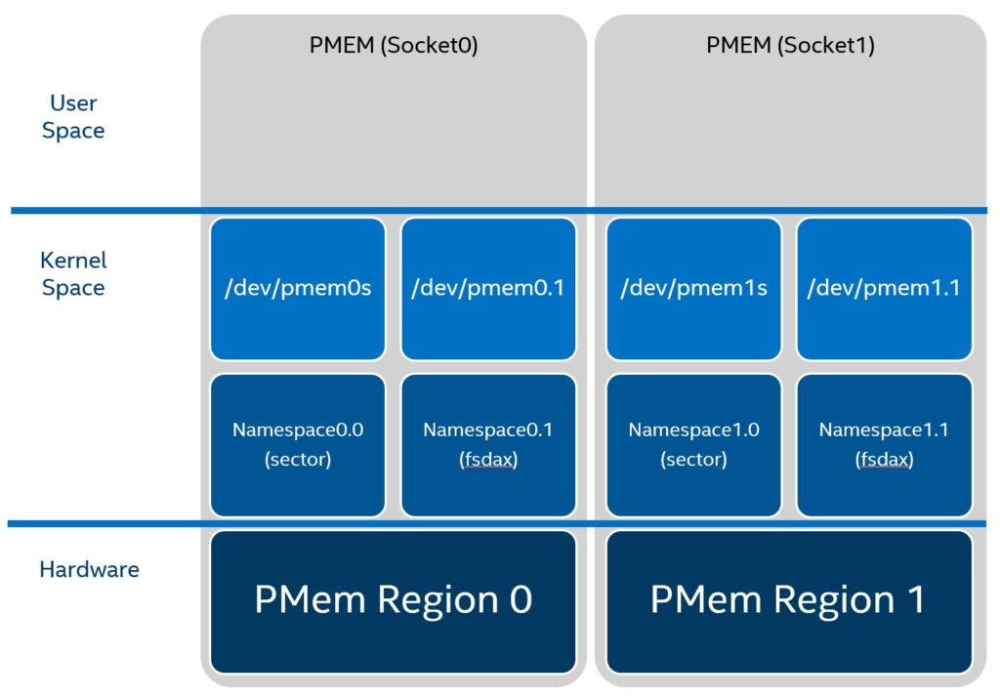
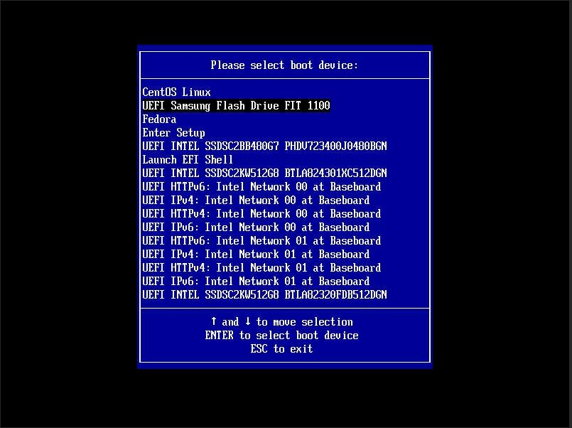
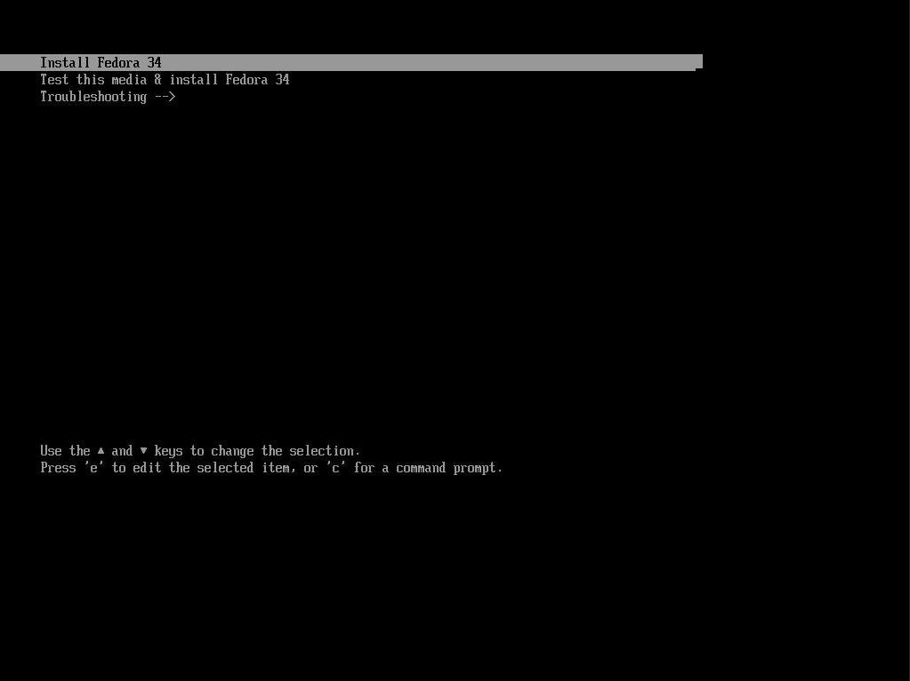
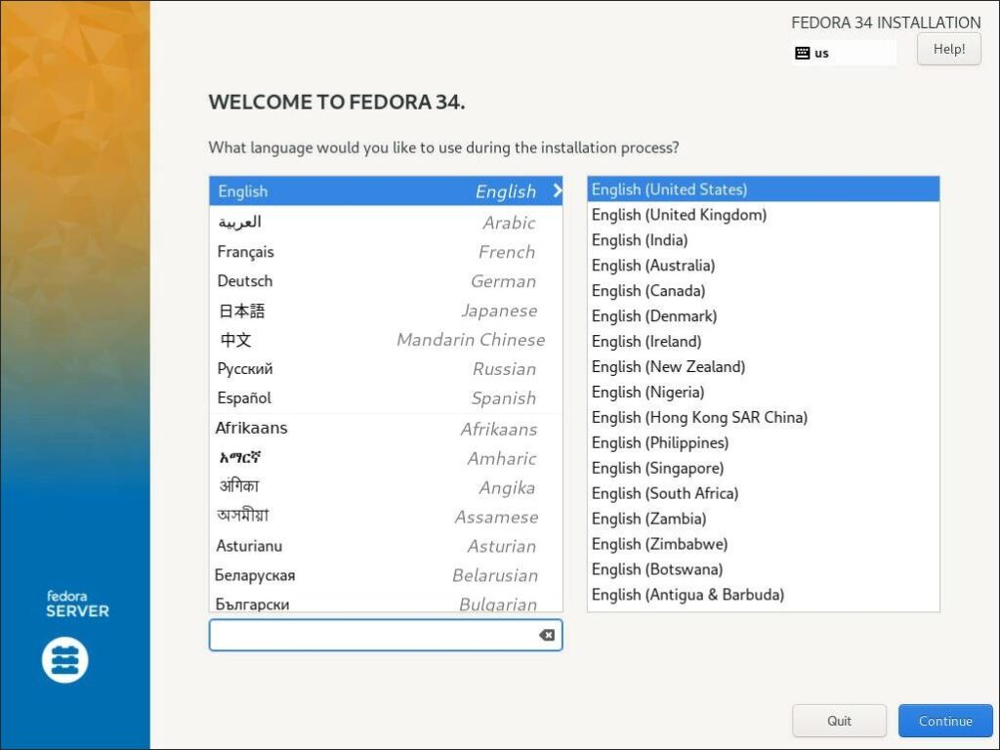
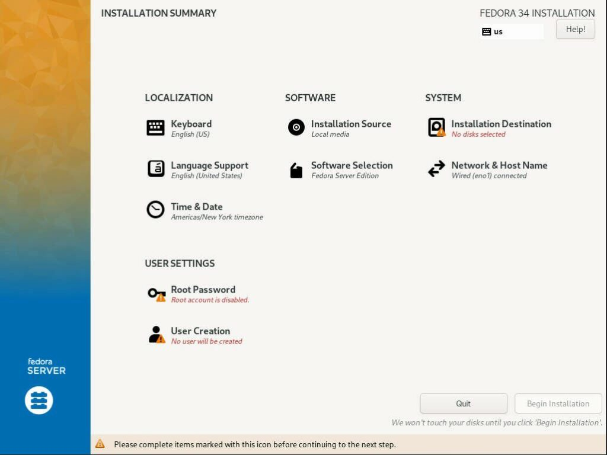
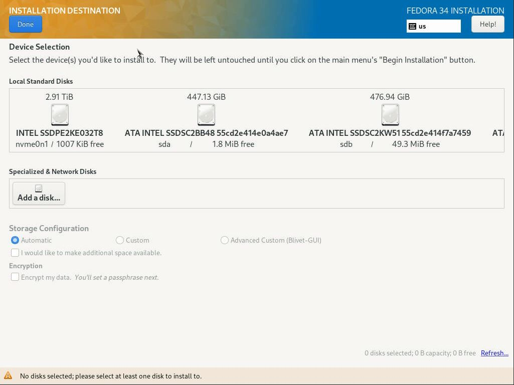
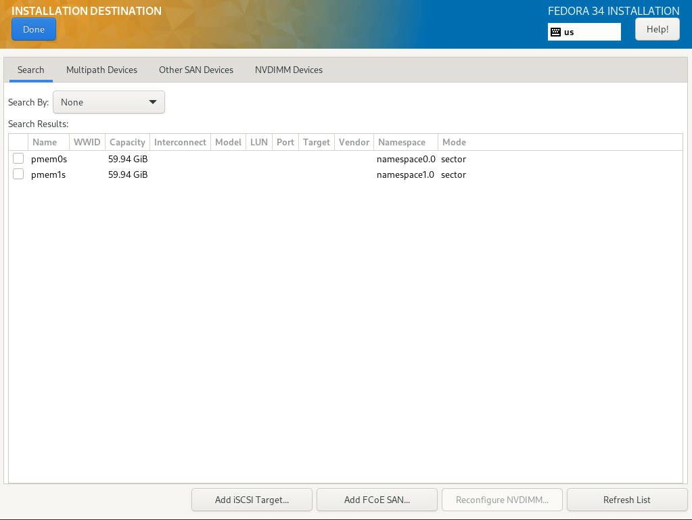
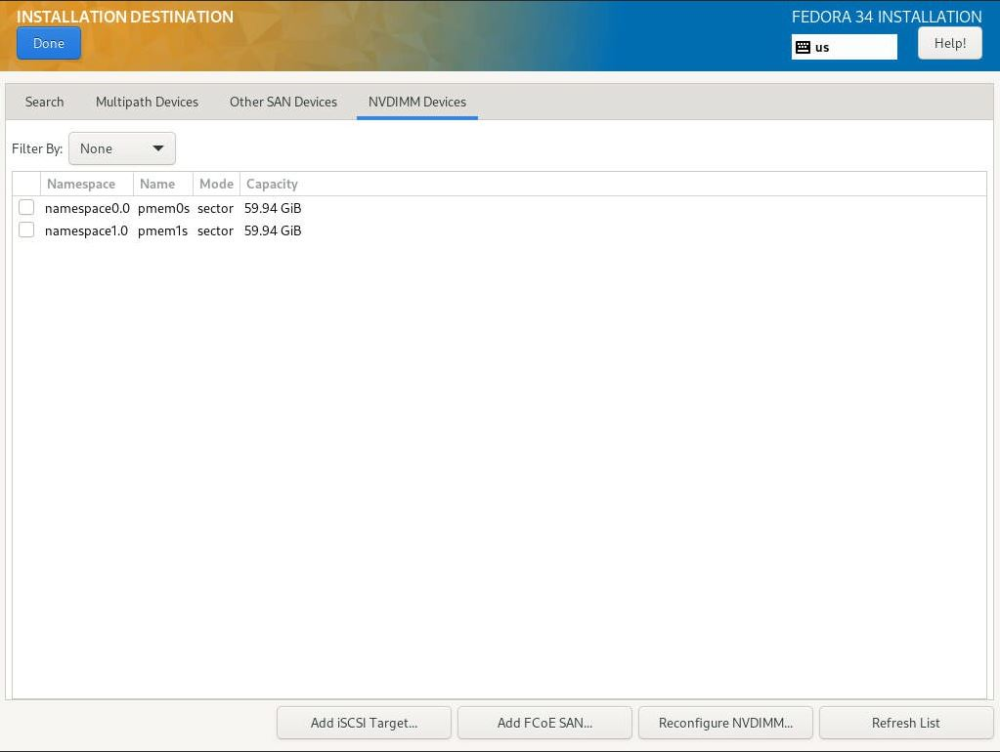
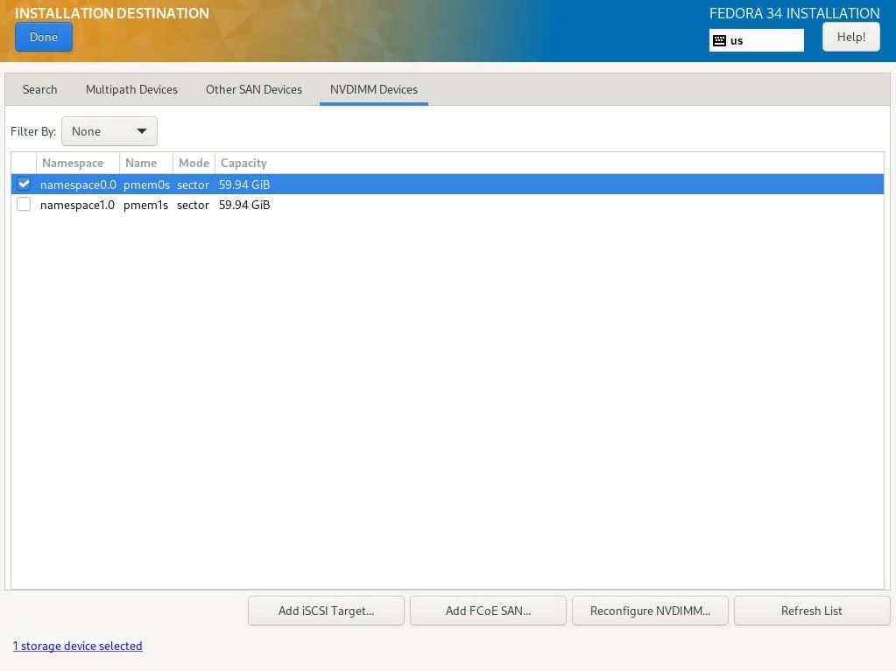
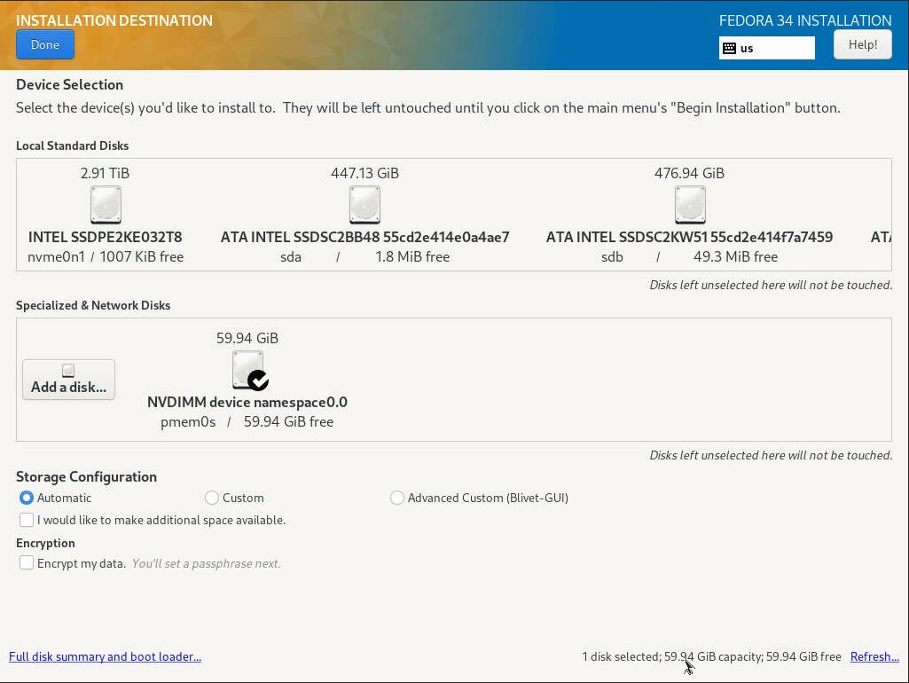

## Introduction

In this article, I will demonstrate how to configure a system with Intel Optane Persistent Memory (PMem) and use part of the PMem as a boot device. This little known feature can reduce boot times for those that need it.

The basic steps include:

- Configure the Persistent Memory in AppDirect Interleaved

- Create two small SECTOR namespaces, one per Region

- Install the OS and select one or both of the namespaces (single disk install, or mirrored LVM)

## Configure the Persistent Memory

The following figure shows how we will provision the persistent memory.



A namespace can be provisioned to operate in one of 4 modes, fsdax, devdax, sector, and raw. For a boot device, we want to use `sector` since one of its use cases is for boot devices:

> sector: Use this mode to host legacy filesystems that do not checksum metadata or applications that are not prepared for torn sectors after a crash. The expected usage for this mode is for small boot volumes. This mode is compatible with other operating systems.
> 
> Reference: ndctl-create-namespace(1) man page

There are many ways to configure persistent memory using the BIOS menus, Platform Manager (BMC, iLO, iDRAC, etc), or the `ipmctl` utility in either the UEFI Shell or Operating system if you have one currently installed. If you do not currently have an operating system installed, refer to your server documentation and follow the steps to configure Persistent Memory.

For this article, we will assume the persistent memory has no existing configuration and data. The system I will be using is an Intel S2600WFD whitebox (codename: Wolfpass) with 2 x Intel Xeon Platinum 8260L CPUs, 12 x 16GiB DDR DIMMs (384GiB total), and 12 x 256GiB Persistent Memory Modules (3TiB total). The system has 4 x Intel P545 (475GiB) and 4 x Intel P4610 (3.2TiB) internal drives.

We can use `ipmctl show -dimm` to see the persistent memory modules:

```
$ sudo ipmctl show -dimm

 DimmID | Capacity  | HealthState | ActionRequired | LockState | FWVersion
==============================================================================
 0x0001 | 252.5 GiB | Healthy     | 0              | Disabled  | 01.02.00.5417
 0x0011 | 252.5 GiB | Healthy     | 0              | Disabled  | 01.02.00.5417
 0x0021 | 252.5 GiB | Healthy     | 0              | Disabled  | 01.02.00.5417
 0x0101 | 252.5 GiB | Healthy     | 0              | Disabled  | 01.02.00.5417
 0x0111 | 252.5 GiB | Healthy     | 0              | Disabled  | 01.02.00.5417
 0x0121 | 252.5 GiB | Healthy     | 0              | Disabled  | 01.02.00.5417
 0x1001 | 252.5 GiB | Healthy     | 0              | Disabled  | 01.02.00.5417
 0x1011 | 252.5 GiB | Healthy     | 0              | Disabled  | 01.02.00.5417
 0x1021 | 252.5 GiB | Healthy     | 0              | Disabled  | 01.02.00.5417
 0x1101 | 252.5 GiB | Healthy     | 0              | Disabled  | 01.02.00.5417
 0x1111 | 252.5 GiB | Healthy     | 0              | Disabled  | 01.02.00.5417
 0x1121 | 252.5 GiB | Healthy     | 0              | Disabled  | 01.02.00.5417
```

We will start by creating an AppDirect goal (aka configuration) using the `ipmctl` utility. This creates two 1.5TiB regions, one per CPU socket and interleaves all the modules on the socket.

```
$ sudo ipmctl create -goal PersistentMemoryType=AppDirect

The following configuration will be applied:
 SocketID | DimmID | MemorySize | AppDirect1Size | AppDirect2Size
==================================================================
 0x0000   | 0x0001 | 0.0 GiB    | 252.0 GiB      | 0.0 GiB
 0x0000   | 0x0011 | 0.0 GiB    | 252.0 GiB      | 0.0 GiB
 0x0000   | 0x0021 | 0.0 GiB    | 252.0 GiB      | 0.0 GiB
 0x0000   | 0x0101 | 0.0 GiB    | 252.0 GiB      | 0.0 GiB
 0x0000   | 0x0111 | 0.0 GiB    | 252.0 GiB      | 0.0 GiB
 0x0000   | 0x0121 | 0.0 GiB    | 252.0 GiB      | 0.0 GiB
 0x0001   | 0x1001 | 0.0 GiB    | 252.0 GiB      | 0.0 GiB
 0x0001   | 0x1011 | 0.0 GiB    | 252.0 GiB      | 0.0 GiB
 0x0001   | 0x1021 | 0.0 GiB    | 252.0 GiB      | 0.0 GiB
 0x0001   | 0x1101 | 0.0 GiB    | 252.0 GiB      | 0.0 GiB
 0x0001   | 0x1111 | 0.0 GiB    | 252.0 GiB      | 0.0 GiB
 0x0001   | 0x1121 | 0.0 GiB    | 252.0 GiB      | 0.0 GiB
Do you want to continue? [y/n] y
Created following region configuration goal
 SocketID | DimmID | MemorySize | AppDirect1Size | AppDirect2Size
==================================================================
 0x0000   | 0x0001 | 0.0 GiB    | 252.0 GiB      | 0.0 GiB
 0x0000   | 0x0011 | 0.0 GiB    | 252.0 GiB      | 0.0 GiB
 0x0000   | 0x0021 | 0.0 GiB    | 252.0 GiB      | 0.0 GiB
 0x0000   | 0x0101 | 0.0 GiB    | 252.0 GiB      | 0.0 GiB
 0x0000   | 0x0111 | 0.0 GiB    | 252.0 GiB      | 0.0 GiB
 0x0000   | 0x0121 | 0.0 GiB    | 252.0 GiB      | 0.0 GiB
 0x0001   | 0x1001 | 0.0 GiB    | 252.0 GiB      | 0.0 GiB
 0x0001   | 0x1011 | 0.0 GiB    | 252.0 GiB      | 0.0 GiB
 0x0001   | 0x1021 | 0.0 GiB    | 252.0 GiB      | 0.0 GiB
 0x0001   | 0x1101 | 0.0 GiB    | 252.0 GiB      | 0.0 GiB
 0x0001   | 0x1111 | 0.0 GiB    | 252.0 GiB      | 0.0 GiB
 0x0001   | 0x1121 | 0.0 GiB    | 252.0 GiB      | 0.0 GiB
A reboot is required to process new memory allocation goals.
```

The system needs to be rebooted for the change to take effect.

```
$ sudo systemctl reboot
```

When the system comes back up, we should see two regions, one per CPU socket.

```
$ sudo ipmctl show -region

 SocketID | ISetID             | PersistentMemoryType | Capacity   | FreeCapacity | HealthState
================================================================================================
 0x0000   | 0x2d3c7f48f4e22ccc | AppDirect            | 1512.0 GiB | 1512.0 GiB   | Healthy
 0x0001   | 0xdd387f488ce42ccc | AppDirect            | 1512.0 GiB | 1512.0 GiB   | Healthy
```

## Create a sector namespace using an installed operating system

If you have an operating system already installed on an internal drive, or an image is available over the network with the `ndctl` utility already installed, we will use this to create a new `sector` namespace. We don't need the entire PMem (1.5TiB) for the operating system, so we'll create a smaller 60GiB namespace for the operating system on each Region.

```
$ sudo ndctl create-namespace --mode sector --size 60g --region 0
{
  "dev":"namespace0.0",
  "mode":"sector",
  "size":"59.94 GiB (64.36 GB)",
  "uuid":"764224fb-e8b0-41a3-ac3f-0b02832ce17f",
  "sector_size":4096,
  "blockdev":"pmem0s"
}

$ sudo ndctl create-namespace --mode sector --size 60g --region 1
{
  "dev":"namespace1.0",
  "mode":"sector",
  "size":"59.94 GiB (64.36 GB)",
  "uuid":"38b709a4-0caf-481c-bdad-0f353b2629f3",
  "sector_size":4096,
  "blockdev":"pmem1s"
}
```

The "`blockdev"` field tells us a `/dev/pmem0s` and `/dev/pmem1s` device was created. We can see these new devices using `lsblk`:

```
$ lsblk /dev/pmem0s /dev/pmem1s
NAME   MAJ:MIN RM  SIZE RO TYPE MOUNTPOINT
pmem0s 259:2    0 59.9G  0 disk
pmem1s 259:3    0 59.9G  0 disk
```

## Create a sector namespace using the BIOS or Platform Manager

You need to follow the documented procedure for configuring App Direct and Namespaces for your specific server vendor and server model. Here are some links to common server OEM documentation to help you:

- [Intel Optane persistent memory 100 series for HPE User Guide](https://support.hpe.com/hpesc/public/docDisplay?docId=a00074717en_us)

- [Dell EMC PMem 100 Series User's Guide](https://www.dell.com/support/manuals/en-us/poweredge-r940/dcpmm_ug_pub)

- Lenovo - [How to change the Intel® Optane™ DC Persistent Memory Module operating modes through UEFI](https://datacentersupport.lenovo.com/us/en/products/servers/thinksystem/sr570/7y02/solutions/ht508257-how-to-change-the-intel-optane-dc-persistent-memory-module-operating-modes-through-uefi)

## Create a bootable Fedora USB drive

For this article, we'll install Fedora Server 34, but most Linux distros that support Intel Optane Persistent Memory will work. If you have a network installation service, you can skip this section.

Grab the ISO from [https://getfedora.org/en/server/download/](https://getfedora.org/en/server/download/)

```
$ wget https://download.fedoraproject.org/pub/fedora/linux/releases/34/Server/x86_64/iso/Fedora-Server-dvd-x86_64-34-1.2.iso
```

Use the `wipefs` command to erase any existing partitions and file systems on the USB device (/dev/sde).

```
$ sudo wipefs -a /dev/sde
/dev/sde: 5 bytes were erased at offset 0x00008001 (iso9660): 43 44 30 30 31
/dev/sde: 2 bytes were erased at offset 0x000001fe (dos): 55 aa
/dev/sde: 8 bytes were erased at offset 0x00000200 (gpt): 45 46 49 20 50 41 52 54
/dev/sde: calling ioctl to re-read partition table: Success
```

Use the `dd` utility to write the ISO contents to the USB device.

```
$ sudo dd if=Fedora-Server-dvd-x86_64-34-1.2.iso of=/dev/sde bs=8M status=progress oflag=direct
```

## Install Fedora Server 34

Reboot the system and press F6 to enter the Boot Manager. Select the USB device for the installation media.



After a few seconds, a menu appears. Select 'Install Fedora 34':



Select your language from the options and click 'Continue':



Click on 'Installation Destination'



Click 'Add a disk...' under 'Specialized & Network Disks'



The `pmem0s` and `pmem1s` devices we created earlier should be listed in the default list



If you have a lot of disks, the `pmem0s` and `pmem1s` devices will also appear under the 'NVDIMM Devices' tab



Select the `pmem0s` device and click 'Done' to install Fedora to a single device, or select both `pmem0s` and `pmem1s` if you intend to use Logical Volume Manager to mirror the boot devices. Click 'Done'.



The `pmem0s` device will now be listed and checked as the installation device. You can choose whether to let the installer automatically partition the device (default), or select 'Custom' to manually define the partitions and their size.



Once the device has been partitioned, click 'Done' to return to the main installer screen where you can configure the timezone, packages to install, root password, non-root user and password, etc, then proceed with the installation.

Once the installation completes, reboot the system, Press F6 to enter the Boot Manager and select 'Fedora' or the 'UEFI Misc Device' from the Boot Manager list. You can use the BIOS to change the boot order.


Once the system boots, you can confirm the OS booted from the PMem device:

```
# df -h
Filesystem                      Size  Used Avail Use% Mounted on
devtmpfs                        189G     0  189G   0% /dev
tmpfs                           189G     0  189G   0% /dev/shm
tmpfs                            76G  2.8M   76G   1% /run
/dev/mapper/fedora_fedora-root   15G  1.3G   14G   9% /
tmpfs                           189G  4.0K  189G   1% /tmp
/dev/pmem0s2                   1014M  177M  838M  18% /boot
/dev/pmem0s1                    599M  6.1M  593M   2% /boot/efi
tmpfs                            38G     0   38G   0% /run/user/0
```

## What about the other Linux Distros?

I need to experiment with other popular Linux Distros such as CentOS/RHEL 7.x and 8.x, Ubuntu, SUSE, etc to see if they behave in the same way. I performed some early experiments on Ubuntu 19.04 and found the OS couldn't boot as it was missing PMem drivers in the initramfs, but this may have been resolved in later versions.

## How Fast is the Boot?

To check how fast the boot is, we use the `systemd-analyze` utility that is installed on all systemd Linux Distro's. To confirm:

```
# which systemd-analyze
/usr/bin/systemd-analyze
```

To find out the actual boot time of the machine, use the `systemd-analyze` command with no arguments:

```
$ sudo systemd-analyze
Startup finished in 5.735s (kernel) + 13.825s (initrd) + 13.562s (userspace) = 33.123s
multi-user.target reached after 13.541s in userspace
```

To better understand where the time is spent, use the `systemd-analyze blame` command:

```
$ sudo systemd-analyze blame
6.177s NetworkManager-wait-online.service
6.112s systemd-udev-settle.service
1.033s lvm2-monitor.service
 430ms initrd-switch-root.service
 357ms sshd-keygen@rsa.service
 334ms systemd-hwdb-update.service
 326ms lvm2-pvscan@8:19.service
 323ms lvm2-pvscan@8:3.service
 312ms lvm2-pvscan@8:35.service
 306ms dracut-initqueue.service
 249ms firewalld.service
 220ms initrd-parse-etc.service
 216ms user@0.service
 148ms sysroot.mount
 148ms systemd-udev-trigger.service
 142ms dracut-cmdline.service
 126ms lvm2-pvscan@259:6.service
 110ms sssd.service
 109ms systemd-resolved.service
  96ms abrtd.service
  73ms systemd-vconsole-setup.service
  70ms dracut-pre-pivot.service
  [...snip...]
```

You can also have the systemd-analyze command print the results in a chain (tree) of events style with the command:

```
$ sudo systemd-analyze critical-chain
The time when unit became active or started is printed after the "@" character.
The time the unit took to start is printed after the "+" character.

multi-user.target @13.541s
└─getty.target @13.541s
  └─getty@tty1.service @13.540s
    └─plymouth-quit-wait.service @13.507s +28ms
      └─systemd-user-sessions.service @13.475s +21ms
        └─remote-fs.target @13.467s
          └─remote-fs-pre.target @13.466s
            └─nfs-client.target @7.302s
              └─gssproxy.service @7.286s +14ms
                └─network.target @7.279s
                  └─NetworkManager.service @7.252s +26ms
                    └─network-pre.target @7.249s
                      └─firewalld.service @6.999s +249ms
                        └─polkit.service @7.902s +51ms
                          └─basic.target @6.990s
                            └─dbus-broker.service @6.953s +33ms
                              └─dbus.socket @6.943s
                                └─sysinit.target @6.928s
                                  └─systemd-update-utmp.service @6.913s +14ms
                                    └─auditd.service @6.840s +69ms
                                      └─systemd-tmpfiles-setup.service @6.780s +53ms
                                        └─import-state.service @6.720s +56ms
                                          └─local-fs.target @6.713s
                                            └─boot-efi.mount @6.685s +27ms
                                              └─systemd-fsck@dev-disk-by\x2duuid-3557\x2dFDD8.service @6.643s +38ms
                                                └─local-fs-pre.target @6.635s
                                                  └─lvm2-monitor.service @358ms +1.033s
                                                    └─dm-event.socket @341ms
                                                      └─-.mount
                                                        └─-.slice
```

You can produce a Scalable Vector diagram of the entire boot process using:

```
$ sudo systemd-analyze plot > pmem0_boot.svg
```

Here's the output from my system:

And that's how you can use the `systemd-analyze` tool to help you observe boot times and behavior. To learn more about the systemd-analyze tool, issue the command _man systemd-analyze_ and read all about it.
