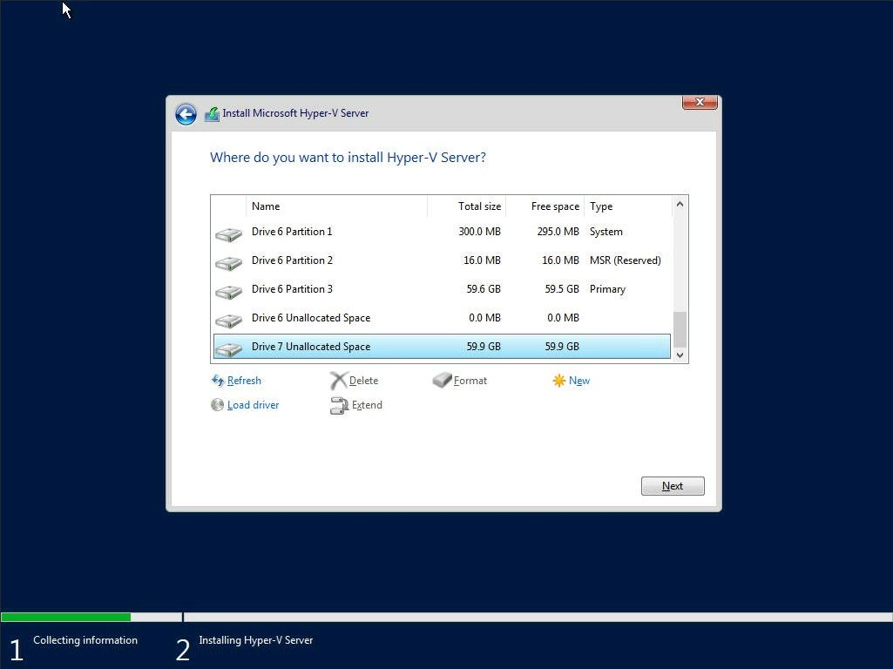

In a [previous post](https://stevescargall.com/2021/06/07/how-to-boot-linux-from-intel-optane-persistent-memory/) I described how to install and boot Fedora Linux using only Persistent Memory, no SSDs are required. For this follow on post, I attempted to install Microsoft Windows Server 2022 onto the persistent memory.

**TL;DR** - I was able to select the PMem devices as the install disk, but when the installer begins to write data, we get an "Error code: 0xC0000005". I haven't found a solution to this problem (yet).

### Create a Bootable USB

Follow the instructions in my previous blog where I document [How to Create a Bootable Windows USB in Fedora Linux](https://stevescargall.com/2019/05/20/how-to-create-a-bootable-windows-usb-in-fedora-linux/).

### Install Hyper-V 2019

The first setup screen you'll see when booting from the ISO or USB image allows you to select the installation language, Time and keyboard layout. Click “Next“ once you have confirmed your choices.

Click "Install Now" to begin the installation process

Read and accept the EULA License terms

Select 'Custom: Install the newer version of Hyper-V Server only (advanced)'

Select a disk or partition to install Windows Server, you can optionally create a new one from the available capacity or use all the available capacity by clicking “Next“. I found the 60GB PMem Devices listed as 'Drive 6' and 'Drive 7'. Unfortunately, there's no way to obtain information about the device, so you have to identify using the capacity.

Shortly into the installation, I encountered error code 0xC0000005 - "Windows installation encountered an unexpected error. Verify that the installation sources are accessible, and restart the installation."

Most search results for this error during install indicate "The error halts the Windows OS installation and is mostly related to temporary hardware issues with the RAM or corrupt hard drive due to bad sectors." I know the RAM and PMem is good, and I verified the USB image installs to an SSD without any issues.

I encountered the same problem while installing [Windows Server 2019](https://stevescargall.com/2021/06/14/how-to-install-and-boot-microsoft-windows-server-2019-from-persistent-memory/) and [2022](https://stevescargall.com/2021/06/14/how-to-install-and-boot-microsoft-windows-server-2019-from-persistent-memory/). If I get some free cycles, I’ll continue to debug the problem. If you have any suggestions, please leave me a comment.
