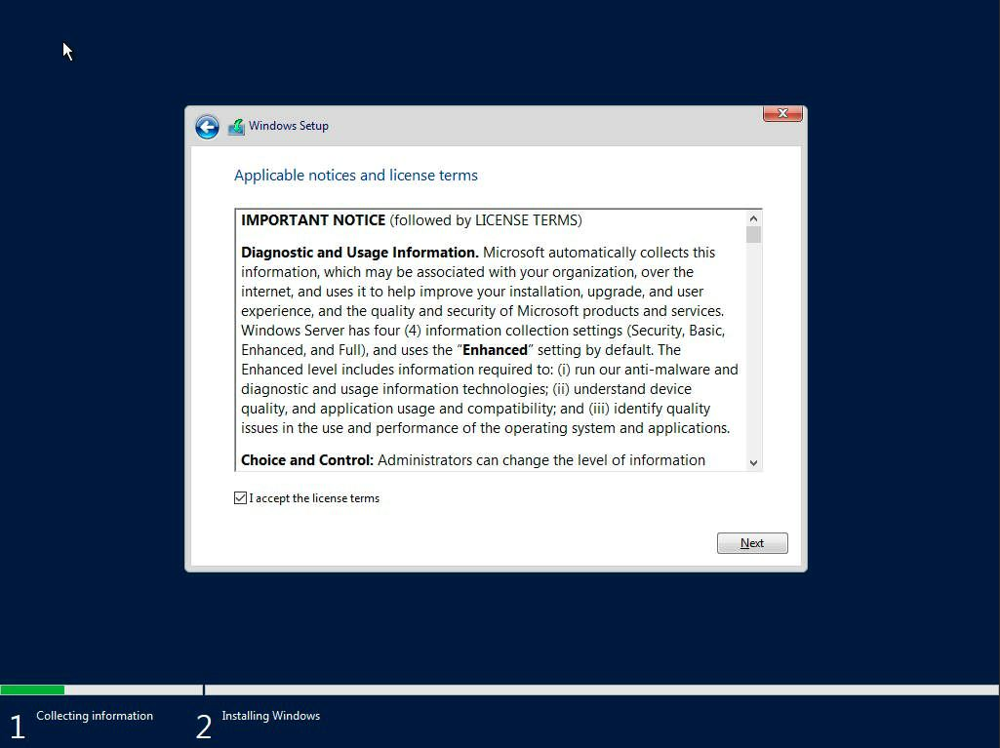

In a [previous post](https://stevescargall.com/2021/06/07/how-to-boot-linux-from-intel-optane-persistent-memory/) I described how to install and boot Fedora Linux using only Persistent Memory, no SSDs are required. For this follow on post, I attempted to install Microsoft Windows Server 2019 and 2022 onto the persistent memory.

**TL;DR** - I was able to select the PMem devices as the install disk, but when the installer begins to write data, we get an "Error code: 0xC0000005". I haven't found a solution to this problem (yet).

### Create a Bootable USB

Follow the instructions in my previous blog where I document [How to Create a Bootable Windows USB in Fedora Linux](https://stevescargall.com/2019/05/20/how-to-create-a-bootable-windows-usb-in-fedora-linux/).

### Install Windows 2019

The first setup screen you'll see when booting from the ISO or USB image allows you to select the installation language, Time and keyboard layout. Click “Next“ once you have confirmed your choices.


Click "Install Now" to begin the installation process


Select the Windows Server 2019 edition to install and click **Next**. If you're not sure what edition you need, read the [Comparison of Standard and Datacenter editions of Windows Server 2019](https://docs.microsoft.com/en-us/windows-server/get-started-19/editions-comparison-19).


Read and accept the EULA License terms



Select 'Custom: Install Windows only (Advanced)'


Select a disk or partition to install Windows Server, you can optionally create a new one from the available capacity or use all the available capacity by clicking “Next“. I found the 60GB PMem Devices listed towards the end as 'Drive 6' and 'Drive 7'. Unfortunately, there's no way to obtain information about the device, so you have to identify using the capacity.


Shortly into the installation, I encountered error 0xC0000005.


Most search results for this error during install indicate "The error halts the Windows OS installation and is mostly related to temporary hardware issues with the RAM or corrupt hard drive due to bad sectors." I know the RAM and PMem is good, and I verified the USB image installs to an SSD without any issues.

### Debugging the Install Error

To get a command prompt, press 'OK' in the error message -> Repair PC -> Troubleshoot -> Command Prompt.

I found a [Microsoft Document](https://docs.microsoft.com/en-us/troubleshoot/windows-client/deployment/windows-setup-log-file-locations) that gave me some folders to look at for install/setup error. The following error was reported in X:\\Windows\\panther\\setuperr.log

```
2021-06-14 18:12:22, Error [0x060126] IBS CallBack_ImageWasSelectedInUI: An error occurred while removing the MultiEdition key from the blackboard.[gle=0x000000490]
2021-06-14 18:13:35, FatalError [0x090001] PANTHR Exception (code 0xC0000005: ACCESS_VIOLATION) occurred at 0x00007FFF19A1CB96 in X:\Sources\Winsetup.dll (+000000000009CB96). Minidump attached (86929 bytes) to diagerr.xml and X:\windows\panther\mndD4C3.diagerr.mdmp.
```


If I get some free cycles, I'll continue to debug the problem. If you have any suggestions, please leave me a comment.
