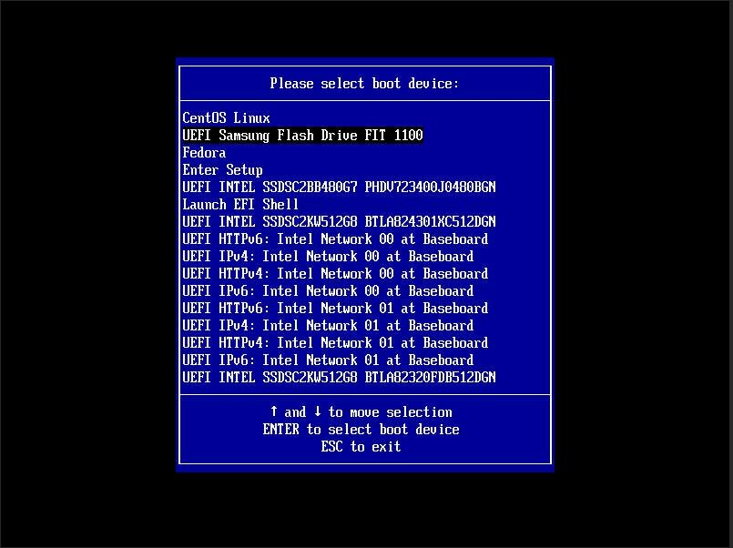
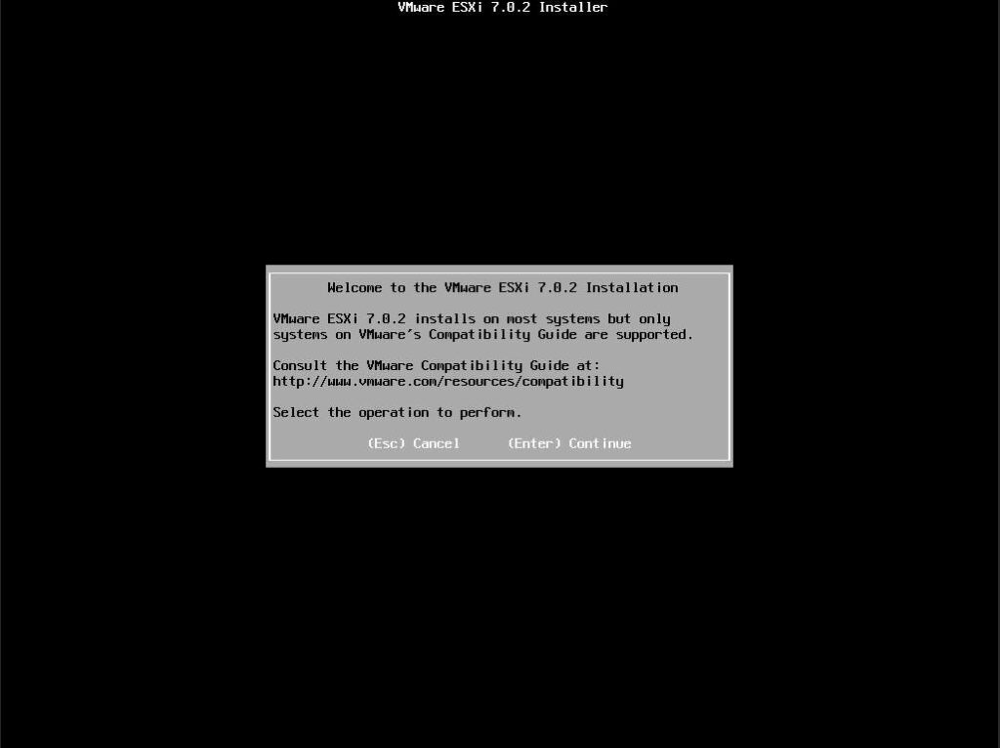
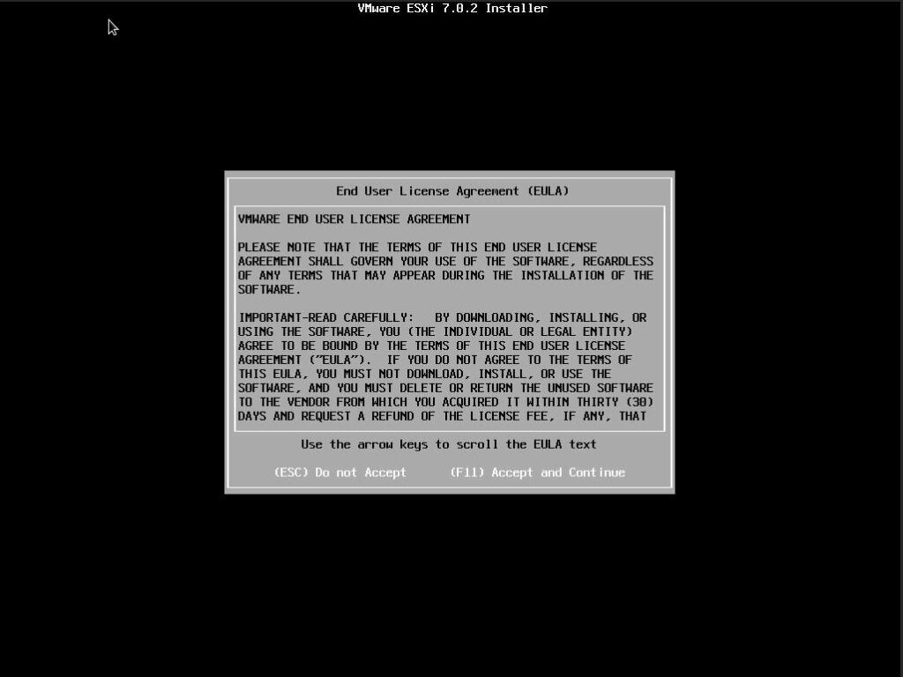
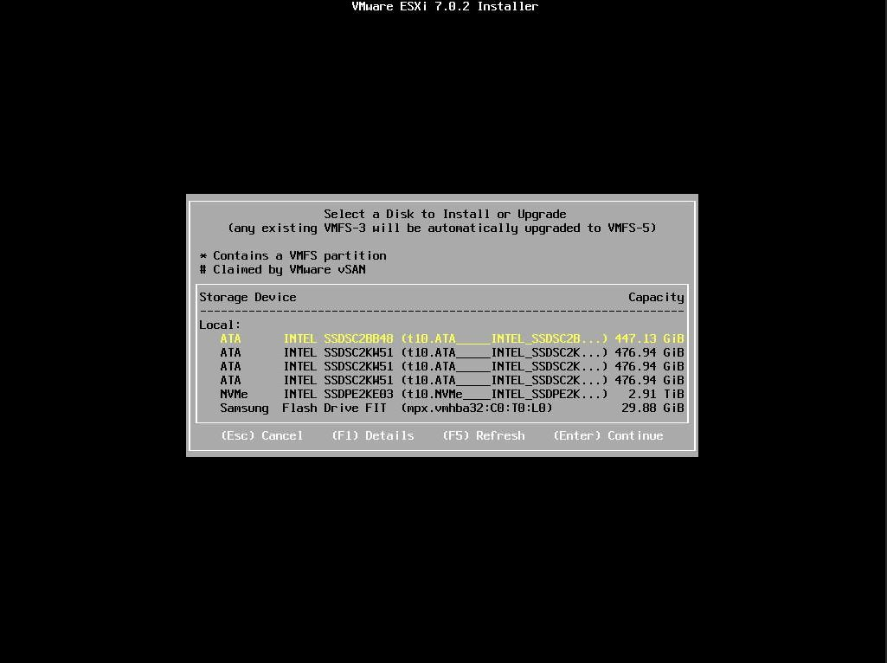

In a [previous post](https://stevescargall.com/2021/06/07/how-to-boot-linux-from-intel-optane-persistent-memory/) I described how to install and boot Linux using only Persistent Memory, no SSDs are required. For this follow on post, I attempted to install VMWare VSphere/ESXi v7.0u2 onto the persistent memory.

**TL;DR** \- It doesn't work. The installer doesn't list the PMem devices, and I was unable to find a way to manually select the PMem device(s).

I assume you followed the [previous post](https://stevescargall.com/2021/06/07/how-to-boot-linux-from-intel-optane-persistent-memory/) to configure sector namespaces that we'll use to install ESXi.

## Create a Bootable VMWare VSphere/ESXi USB Drive

You can download an evaluation copy of VMWare VSphere/ESXi from [https://www.vmware.com/go/get-free-esxi](https://www.vmware.com/go/get-free-esxi). You will need to login or create a new account before downloading.

Once the ISO has been downloaded, identify and wipe the USB drive:

```
$ sudo lsblk -o +model
NAME                     MAJ:MIN RM   SIZE RO TYPE MOUNTPOINT MODEL
sda                        8:0    1  29.9G  0 disk            Flash Drive FIT

$ sudo wipefs -a /dev/sda
/dev/sda: 5 bytes were erased at offset 0x00008001 (iso9660): 43 44 30 30 31
/dev/sda: 2 bytes were erased at offset 0x000001fe (dos): 55 aa
/dev/sda: 8 bytes were erased at offset 0x00000200 (gpt): 45 46 49 20 50 41 52 54
/dev/sda: calling ioctl to re-read partition table: Success
```

Use the `dd` utility to write the ISO contents to the USB device.

```
$ sudo dd if=VMware-VMvisor-Installer-7.0U2a-17867351.x86_64.iso of=/dev/sda bs=8M status=progress oflag=direct

```

## Install VMWare vSphere/ESXi

Reboot the system and press F6 to enter the Boot Manager. Select the USB device for the installation media.



After a few moments, you should be presented with the Welcome screen.



Press Enter to continue and accept the EULA agreement using F11



Unfortunately, none of the PMem devices are listed in the available drives to install vSphere/ESXI, and I see no way to manually add them.



Since I can't select the PMem device(s), there's no way to continue with the installation. My experiment ended here.
