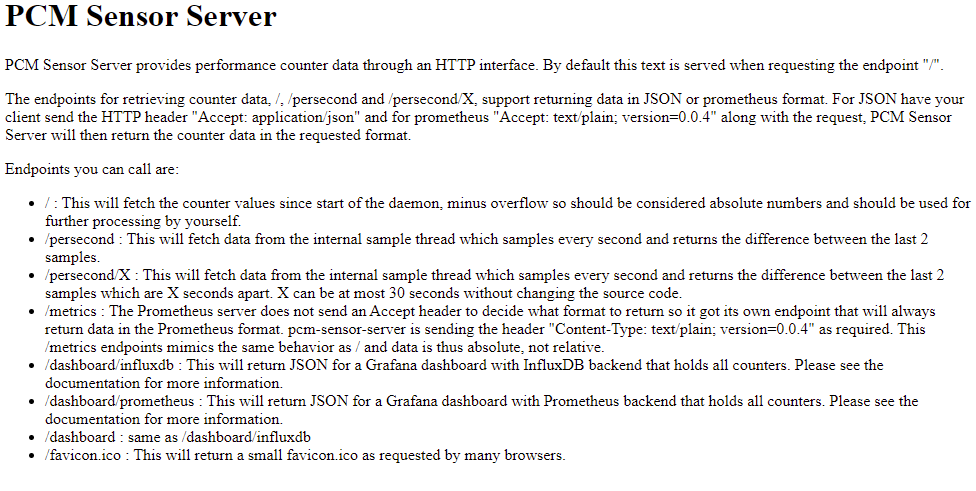
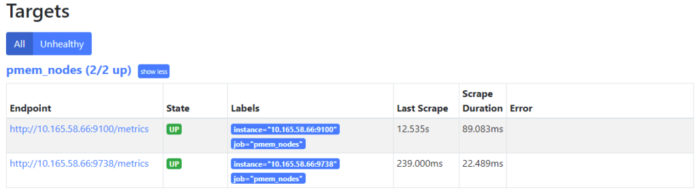
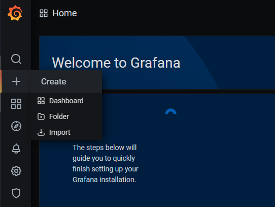
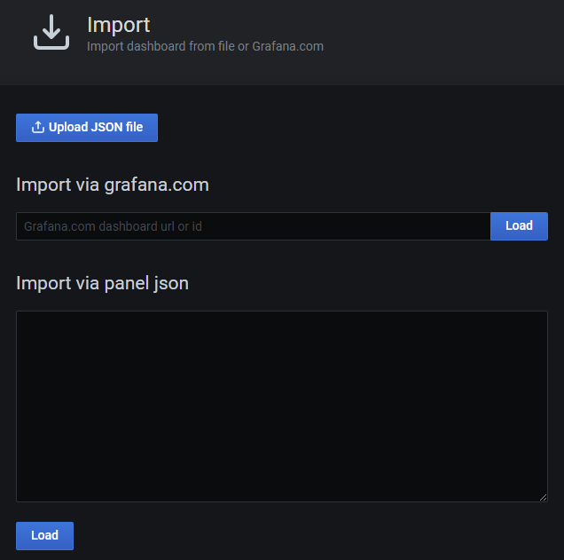
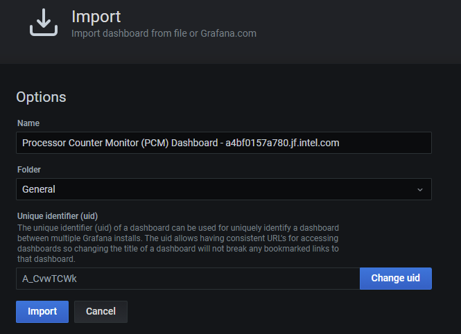

In a previous article, I showed [How To Install Prometheus and Grafana on Fedora Server](https://stevescargall.com/2020/05/13/how-to-install-prometheus-and-grafana-on-fedora-server/). This article demonstrates how to use the open-source [Process Counter Monitor](https://github.com/opcm/pcm) (PCM) utility to collect DRAM and Intel® Optane™ Persistent Memory statistics, and visualize the data in Grafana.

Processor Counter Monitor is an application programming interface (API) and a set of tools based on the API to monitor performance and energy metrics of Intel® Core™, Xeon®, Atom™ and Xeon Phi™ processors. It can also show memory bandwidth for DRAM and Intel Optane Persistent Memory devices. PCM works on Linux, Windows, Mac OS X, FreeBSD and DragonFlyBSD operating systems.

PCM provides a number of command-line utilities for real-time monitoring. This article will focus on the **`pcm-sensor-server`** which is a pcm collector exposing metrics over http in JSON or Prometheus (exporter text based) format.

## Install PCM

PCM can be built from source or installed using the [RPM or DEB files](https://download.opensuse.org/repositories/home:/opcm/) available for RHEL, CentOS, Ubuntu, Debian, SLE, and openSUSE.

### Build PCM from Source

Building the PCM utility from source is very simple. First, we need to create a directory to work in:

```bash
$ mkdir ~/downloads
$ cd ~/downloads/
```

Clone the git repository

```bash
$ git clone https://github.com/opcm/pcm
$ cd pcm
```

Build pcm

```bash
$ make
```

By default, pcm will install to `/usr`. You can override this, say to `/usr/local`, or `/opt`, by setting the DESTDIR environment variable

```bash
// Install to /usr (default)
$ sudo make install

// Install to another directory
$ export DESTDIR=/usr/local
$ sudo --preserve-env=DESTDIR make install
```

Confirm PCM is working by running `pcm-memory`. The following will collect three samples every second and exit.

```bash
$ sudo pcm-memory -i=3 1
```

Example:

```bash
$ sudo pcm-memory -i=3 1
[...snip...]
|---------------------------------------||---------------------------------------|
|-- Socket  0             --||-- Socket  1             --|
|---------------------------------------||---------------------------------------|
|-- Memory Channel Monitoring     --||-- Memory Channel Monitoring     --|
|---------------------------------------||---------------------------------------|
|-- Mem Ch  0: Reads (MB/s):     0.42 --||-- Mem Ch  0: Reads (MB/s):     0.43 --|
|-- Writes(MB/s):     0.50 --||-- Writes(MB/s):     0.52 --|
|-- PMM Reads(MB/s)   :     0.00 --||-- PMM Reads(MB/s)   :     0.00 --|
|-- PMM Writes(MB/s)  :     0.00 --||-- PMM Writes(MB/s)  :     0.00 --|
|-- Mem Ch  1: Reads (MB/s):     0.41 --||-- Mem Ch  1: Reads (MB/s):     0.42 --|
|-- Writes(MB/s):     0.49 --||-- Writes(MB/s):     0.50 --|
|-- PMM Reads(MB/s)   :     0.00 --||-- PMM Reads(MB/s)   :     0.00 --|
|-- PMM Writes(MB/s)  :     0.00 --||-- PMM Writes(MB/s)  :     0.00 --|
|-- Mem Ch  2: Reads (MB/s):     0.42 --||-- Mem Ch  2: Reads (MB/s):     0.44 --|
|-- Writes(MB/s):     0.49 --||-- Writes(MB/s):     0.53 --|
|-- PMM Reads(MB/s)   :     0.00 --||-- PMM Reads(MB/s)   :     0.00 --|
|-- PMM Writes(MB/s)  :     0.00 --||-- PMM Writes(MB/s)  :     0.00 --|
|-- Mem Ch  3: Reads (MB/s):     0.38 --||-- Mem Ch  3: Reads (MB/s):     0.43 --|
|-- Writes(MB/s):     0.40 --||-- Writes(MB/s):     0.51 --|
|-- PMM Reads(MB/s)   :     0.00 --||-- PMM Reads(MB/s)   :     0.00 --|
|-- PMM Writes(MB/s)  :     0.00 --||-- PMM Writes(MB/s)  :     0.00 --|
|-- Mem Ch  4: Reads (MB/s):     0.38 --||-- Mem Ch  4: Reads (MB/s):     0.43 --|
|-- Writes(MB/s):     0.39 --||-- Writes(MB/s):     0.51 --|
|-- PMM Reads(MB/s)   :     0.00 --||-- PMM Reads(MB/s)   :     0.00 --|
|-- PMM Writes(MB/s)  :     0.00 --||-- PMM Writes(MB/s)  :     0.00 --|
|-- Mem Ch  5: Reads (MB/s):     0.37 --||-- Mem Ch  5: Reads (MB/s):     0.43 --|
|-- Writes(MB/s):     0.39 --||-- Writes(MB/s):     0.50 --|
|-- PMM Reads(MB/s)   :     0.00 --||-- PMM Reads(MB/s)   :     0.00 --|
|-- PMM Writes(MB/s)  :     0.00 --||-- PMM Writes(MB/s)  :     0.00 --|
|-- NODE 0 Mem Read (MB/s) :     2.40 --||-- NODE 1 Mem Read (MB/s) :     2.59 --|
|-- NODE 0 Mem Write(MB/s) :     2.66 --||-- NODE 1 Mem Write(MB/s) :     3.08 --|
|-- NODE 0 PMM Read (MB/s):      0.00 --||-- NODE 1 PMM Read (MB/s):      0.00 --|
|-- NODE 0 PMM Write(MB/s):      0.00 --||-- NODE 1 PMM Write(MB/s):      0.00 --|
|-- NODE 0.0 NM read hit rate :  0.48 --||-- NODE 1.0 NM read hit rate :  0.53 --|
|-- NODE 0.1 NM read hit rate :  0.45 --||-- NODE 1.1 NM read hit rate :  0.53 --|
|-- NODE 0 Memory (MB/s):        5.05 --||-- NODE 1 Memory (MB/s):        5.67 --|
|---------------------------------------||---------------------------------------|
|---------------------------------------||---------------------------------------|
|-- System DRAM Read Throughput(MB/s):          4.99                --|
|-- System DRAM Write Throughput(MB/s):          5.73                --|
|-- System PMM Read Throughput(MB/s):          0.00                --|
|-- System PMM Write Throughput(MB/s):          0.00                --|
|-- System Read Throughput(MB/s):          4.99                --|
|-- System Write Throughput(MB/s):          5.73                --|
|-- System Memory Throughput(MB/s):         10.72                --|
|---------------------------------------||---------------------------------------|
```

Add a port rule to the firewall for the PCM web server. The default port is `9738`, though it can be changed using the `-p <port>` option described in the help:

```bash
$ pcm-sensor-server --help
Usage: pcm-sensor-server [OPTION]

Valid Options:
    -d                   : Run in the background
    -p portnumber        : Run on port <portnumber> (default port is 9738)
    -r|--reset           : Reset programming of the performance counters.
    -D|--debug level     : level = 0: no debug info, > 0 increase verbosity.
    -R|--real-time       : If possible the daemon will run with real time
                           priority, could be useful under heavy load to
                           stabilize the async counter fetching.
    -h|--help            : This information
```

```bash
$ sudo firewall-cmd --permanent --add-port=9738/tcp
$ sudo firewall-cmd --reload
```

Start the `pcm-sensor-server` and confirm it works by navigating to http://<ip-address|hostname>:9738 in your browser

```bash
$ sudo pcm-sensor-server
[...snip...]
Starting plain HTTP server on http://localhost:9738/
```

You should see a simple web page that looks similar to the following:



## Create a PCM-Sensor-Server Systemd Service

To run pcm-sensor-server as a systemd service, you need to create a service file, `/etc/systemd/system/pcm-sensor-server.service`, with the following content. Make any necessary changes for your environment.

```bash
$ sudo vi /etc/systemd/system/pcm-sensor-server.service
```

```bash
[Unit]
Description=Process Counter Monitor (PCM) Sensor Service
Wants=network-online.target
After=network-online.target

[Service]
User=root
Group=root
Type=simple
ExecStart=/usr/sbin/pcm-sensor-server

[Install]
WantedBy=multi-user.target
```

Reload systemd daemon configuration.

```bash
$ sudo systemctl daemon-reload
```

Start and Enable the pcm-sensor-service service to run at boot time.

```bash
$ sudo systemctl start pcm-sensor-server
$ sudo systemctl enable pcm-sensor-server
```

Confirm the service is running

```bash
$ systemctl status pcm-sensor-server
● pcm-sensor-server.service - Process Counter Monitor (PCM) Sensor Service
     Loaded: loaded (/etc/systemd/system/pcm-sensor-server.service; disabled; vendor preset: disabled)
     Active: active (running) since Sat 2021-03-13 14:08:35 PST; 4s ago
   Main PID: 82447 (pcm-sensor-serv)
      Tasks: 549 (limit: 629145)
     Memory: 24.3M
        CPU: 952ms
     CGroup: /system.slice/pcm-sensor-server.service
             └─82447 /usr/sbin/pcm-sensor-server

[...]
Mar 13 14:08:35 a4bf0157a780.jf.intel.com pcm-sensor-server[82447]: Starting plain HTTP server on http://localhost:9738/
```

## Add the PCM Node to Prometheus

We need to add the target host running the `pcm-sensor-server` to the list of known hosts for Prometheus to scrape.

Edit `/etc/prometheus.yml` and add the following content to the `scrape_config` section of the file, or add the new target to an existing job\_name group. This example includes our node\_exporter on port 9100 (see the [previous article](https://stevescargall.com/2020/05/13/how-to-install-prometheus-and-grafana-on-fedora-server/)), and pcm-sensor-server on port 9738.

```bash
scrape_configs:
  [...]
  - job_name: pmem_nodes
    static_configs:
    - targets: ['10.100.118.43:9738','10.100.118.43:9100']
```

Restart Prometheus to pick up the new changes

```bash
$ sudo systemctl restart prometheus
$ sudo systemctl status prometheus
```

Navigate to `http://<prometheus-ip>:9090/targets` in your browser, and you should now see both targets under the 'pmem\_nodes' header.



## Import the Grafana Dashboard for PCM

PCM does not upstream the dashboard to [https://grafana.com/grafana/dashboards](https://grafana.com/grafana/dashboards), so we must download the dashboard from the running pcm-sensor-server by navigating to http://<pcm-sensor-server-ip>:9738/dashboard/prometheus -> Right Click -> Save As, then save the `prometheus.json` file to your desktop.

Edit `prometheus.json` and replace all instances of `"datasource": null,` with `"datasource": "-- Grafana --",`.

Login to Grafana by navigating to `[http://<server-ip](http://%3Cserver-ip/)|hostname>:3000` in your web browser. From the menu on the left, select '+' -> Import.



Import a Grafana Dashboard

Click 'Upload' and select the `prometheus.json` file.



Upload a JSON file to Import it

Once the JSON file is processed, you'll be sent to the next screen to confirm the information. Click `Import` to continue.



TODO: Complete the procedure. The grafana dashboard is intended for a single host, so I want to modify it to support multiple hosts, like the node\_exporter dashboard which has a drop-down.
