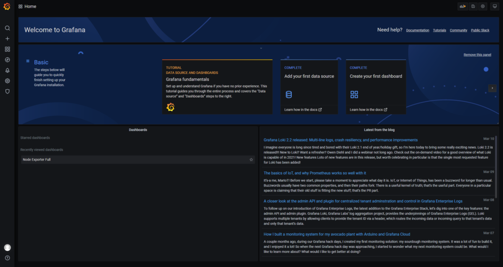

\[Updated\] This article was updated on 03/13/2021 using Fedora Server 33, [Prometheus](https://prometheus.io/download/) v2.25.0, [Grafana](https://grafana.com/) v7.4.3, and [Node Exporter](https://github.com/prometheus/node_exporter) v1.1.2.

In this article, we will show how to install Prometheus and Grafana to collect and display system performance metrics.

[Prometheus](https://prometheus.io/) is an open source monitoring and alerting toolkit for bare metal systems, virtual machines, containers, and microservices. [Grafana](https://grafana.com/grafana/) allows you to query, visualize, and alert on metrics using fully customizable [dashboards](https://grafana.com/grafana/dashboards).

We will install Prometheus and Grafana on a dedicated bare-metal host (10.100.118.43) and the Prometheus Node Exporter on the bare-metal system(s) we want to collect data from (10.100.118.42). We will not cover installing the components in Docker containers. There are instructions in the documentation for this. Additionally, we will not cover how to secure the environment

## Install Prometheus

Before we proceed, it's good to note that the Prometheus server listens on TCP Port 9090. This is the same port that Fedora Cockpit listens on. As a result, if you are not using the Cockpit Web Service Manager, disable and stop both the service and socket to free port 9090.

```
$ sudo netstat -tulpn | grep -i 9090
tcp6       0      0 :::9090                 :::*                    LISTEN      1/systemd

$ sudo systemctl stop cockpit cockpit.socket
$ sudo systemctl disable --now cockpit cockpit.socket

$ sudo netstat -tulpn | grep -i 9090
$
```

### Create Prometheus System User and Group

To create `prometheus` system user and group, run:

```
$ sudo useradd -M -r -s /bin/false prometheus
$ sudo getent passwd prometheus
```

### Download and Configure Prometheus

On the monitoring master node download and install the Linux bundle. Use the latest version available from [https://prometheus.io/download/](https://prometheus.io/download/) and install it in /opt. Obtain the download URL for the Linux release:


Download Prometheus for Linux

```
$ sudo wget -P /opt/ https://github.com/prometheus/prometheus/releases/download/v2.25.0/prometheus-2.25.0.linux-amd64.tar.gz
$ cd /opt/
$ sudo tar xf prometheus-2.25.0.linux-amd64.tar.gz
$ sudo ln -s prometheus-2.25.0.linux-amd64 prometheus
$ sudo chown -R prometheus:prometheus /opt/prometheus*
```

Start prometheus to confirm it works. This will run in the foreground, so use Ctrl-C to stop it once you've confirmed no errors are reported

```
$ sudo /opt/prometheus/prometheus
```

If needed, you can start prometheus listening on a different port using:

```
$ sudo /opt/prometheus/prometheus --web.listen-address=10.100.118.43:9060
```

If the server starts, you should see a message similar to the following:

```
level=info ts=2021-03-13T18:19:10.310Z caller=main.go:751 msg="Server is ready to receive web requests."
```

Copy the `prometheus.yaml` file to /etc/. This will allow us to make configuration changes.

```
$ sudo cp /opt/prometheus/prometheus.yml /etc/prometheus.yml
$ sudo chown -R prometheus:prometheus /etc/prometheus.yml
```

Edit the /etc/prometheus.yml file and make any necessary change(s). For example, to change the default listening port from 9090 to 9060 change

```
# A scrape configuration containing exactly one endpoint to scrape:
# Here it's Prometheus itself.
scrape_configs:
  # The job name is added as a label `job=<job_name>` to any timeseries scraped from this config.
  - job_name: 'prometheus'

    # metrics_path defaults to '/metrics'
    # scheme defaults to 'http'.

    static_configs:
    - targets: ['localhost:9060']
```

Open the firewall

```
$ sudo firewall-cmd --permanent --add-port=9090/tcp
$ sudo firewall-cmd --reload
```

Test the connection by going to http://10.100.118.43:9090 in your browser. If you stopped Prometheus in a previous step, start it again, otherwise, you'll get "This site can’t be reached" errors in your browser. If all goes well, you should now see the Prometheus home page.


Prometheus Home Page

Note: Modern browsers such as Chrome, Edge, etc default to forcing HTTPS. If you get 'Connection Refused', this is likely the cause since Prometheus does not listen for HTTPS requests by default.

### Create a Prometheus Systemd Service

To run Prometheus as a systemd service, you need to create a service file, `/etc/systemd/system/prometheus.service`, with the following content. Make any necessary changes for your environment.

```
$ sudo vim /etc/systemd/system/prometheus.service
```

```
[Unit]
Description=Prometheus Time Series Collection and Processing Server
Wants=network-online.target
After=network-online.target

[Service]
User=prometheus
Group=prometheus
Type=simple
ExecStart=/opt/prometheus/prometheus \
    --config.file /etc/prometheus.yml \
    --storage.tsdb.path /opt/prometheus/data/ \
    --web.console.templates=/opt/prometheus/consoles \
    --web.console.libraries=/opt/prometheus/console_libraries \
    --web.listen-address=0.0.0.0:9090

[Install]
WantedBy=multi-user.target
```

Reload systemd daemon configuration.

```
$ sudo systemctl daemon-reload
```

Start and Enable Prometheus service to run at boot time.

```
$ sudo systemctl start prometheus
$ sudo systemctl enable prometheus
```

Confirm the service is running

```
# systemctl status prometheus
● prometheus.service - Prometheus Time Series Collection and Processing Server
     Loaded: loaded (/etc/systemd/system/prometheus.service; enabled; vendor preset: disabled)
     Active: active (running) since Sat 2021-03-13 11:51:19 MST; 1min 40s ago
   Main PID: 4818 (prometheus)
      Tasks: 35 (limit: 460904)
     Memory: 32.4M
        CPU: 473ms
     CGroup: /system.slice/prometheus.service
             └─4818 /opt/prometheus/prometheus --config.file /etc/prometheus.yml --storage.tsdb.path /opt/prometheus/data/ --web.console.templates=/opt/prometheus/consoles --web.console.libraries=/opt/prometheus/console_libraries --web.listen-address=0.0.0.0:9090

Mar 13 11:51:19 pmemdev2.lm.intel.com prometheus[4818]: level=info ts=2021-03-13T18:51:19.592Z caller=head.go:740 component=tsdb msg="WAL segment loaded" segment=1 maxSegment=4
Mar 13 11:51:19 pmemdev2.lm.intel.com prometheus[4818]: level=info ts=2021-03-13T18:51:19.597Z caller=head.go:740 component=tsdb msg="WAL segment loaded" segment=2 maxSegment=4
Mar 13 11:51:19 pmemdev2.lm.intel.com prometheus[4818]: level=info ts=2021-03-13T18:51:19.602Z caller=head.go:740 component=tsdb msg="WAL segment loaded" segment=3 maxSegment=4
Mar 13 11:51:19 pmemdev2.lm.intel.com prometheus[4818]: level=info ts=2021-03-13T18:51:19.604Z caller=head.go:740 component=tsdb msg="WAL segment loaded" segment=4 maxSegment=4
Mar 13 11:51:19 pmemdev2.lm.intel.com prometheus[4818]: level=info ts=2021-03-13T18:51:19.604Z caller=head.go:745 component=tsdb msg="WAL replay completed" checkpoint_replay_duration=55.376µs wal_replay_duration=27.989074ms total_replay_duration=28.086402ms
Mar 13 11:51:19 pmemdev2.lm.intel.com prometheus[4818]: level=info ts=2021-03-13T18:51:19.607Z caller=main.go:799 fs_type=XFS_SUPER_MAGIC
Mar 13 11:51:19 pmemdev2.lm.intel.com prometheus[4818]: level=info ts=2021-03-13T18:51:19.607Z caller=main.go:802 msg="TSDB started"
Mar 13 11:51:19 pmemdev2.lm.intel.com prometheus[4818]: level=info ts=2021-03-13T18:51:19.607Z caller=main.go:928 msg="Loading configuration file" filename=/etc/prometheus.yml
Mar 13 11:51:19 pmemdev2.lm.intel.com prometheus[4818]: level=info ts=2021-03-13T18:51:19.609Z caller=main.go:959 msg="Completed loading of configuration file" filename=/etc/prometheus.yml totalDuration=1.815961ms remote_storage=2.439µs web_handler=607ns query_engine=1.057µs scrape=1.114593ms scra>
Mar 13 11:51:19 pmemdev2.lm.intel.com prometheus[4818]: level=info ts=2021-03-13T18:51:19.609Z caller=main.go:751 msg="Server is ready to receive web requests."
```

Prometheus is now running as a service.

## Install Node Exporter

Node\_Exporter is a Prometheus exporter plugin that collects data from a target system and pushes the information to the Prometheus server. Obtain the download URL from [https://prometheus.io/download/](https://prometheus.io/download/).


Download Node\_Exporter for Prometheus

### Create a Node Exporter System User and Group

We need to create a user and group. The [instructions](https://github.com/prometheus/node_exporter/tree/master/examples/systemd) say the systemd service needs a user named `node_exporter`, whose shell should be `/sbin/nologin` and should not have any special privileges.

```
$ sudo useradd -M -r -s /sbin/nologin node_exporter
$ sudo getent passwd node_exporter
```

### Download and Install Node Exporter

Install node\_exporter to /opt on the target system.

```
$ sudo wget -P /opt/ https://github.com/prometheus/node_exporter/releases/download/v1.1.2/node_exporter-1.1.2.linux-amd64.tar.gz
$ cd /opt/
$ sudo tar xf node_exporter-1.1.2.linux-amd64.tar.gz
$ sudo ln -s /opt/node_exporter-1.1.2.linux-amd64 /opt/prometheus_node_exporter
$ sudo chown -R node_exporter:node_exporter /opt/prometheus_node_exporter node_exporter*
$ sudo /opt/prometheus_node_exporter/node_exporter --web.listen-address="0.0.0.0:9100"
```

Open port 9100 in the firewall

```
$ sudo firewall-cmd --permanent --add-port=9100/tcp
$ sudo firewall-cmd --reload
```

Use a web browser to verify the connection is working - http://10.100.118.42:9100/metrics. This will return the metrics which looks like this:

```
# HELP go_gc_duration_seconds A summary of the pause duration of garbage collection cycles.
# TYPE go_gc_duration_seconds summary
go_gc_duration_seconds{quantile="0"} 0.000108763
go_gc_duration_seconds{quantile="0.25"} 0.000173862
go_gc_duration_seconds{quantile="0.5"} 0.000240759
go_gc_duration_seconds{quantile="0.75"} 0.000272835
go_gc_duration_seconds{quantile="1"} 0.000307421
go_gc_duration_seconds_sum 0.001686148
go_gc_duration_seconds_count 8
# HELP go_goroutines Number of goroutines that currently exist.
# TYPE go_goroutines gauge
go_goroutines 9
[...snip...]
```

Note: Modern browsers such as Chrome, Edge, etc default to forcing HTTPS. If you get 'Connection Refused', this is likely the cause.

Use Ctrl-C to stop the process and we'll create a systemd service to manage Node Exporter.

### Create a Node Exporter Systemd Service

To be able to run the Node Exporter as a service, you need to create a systemd service file, `/etc/systemd/system/node_exporter.service`, configured as follows.

```
$ sudo vi /etc/systemd/system/node_exporter.service
```

```
[Unit]
Description=Node Exporter

[Service]
User=node_exporter
Group=node_exporter
EnvironmentFile=/etc/sysconfig/node_exporter
ExecStart=/opt/prometheus_node_exporter/node_exporter --web.listen-address="0.0.0.0:9100"\
        --collector.textfile.directory /var/lib/node_exporter/textfile_collector

[Install]
WantedBy=multi-user.target
```

Create the required directories

```
$ sudo mkdir -p /var/lib/node_exporter/textfile_collector
$ sudo chown node_exporter:node_exporter /var/lib/node_exporter/textfile_collector
$ sudo touch /etc/sysconfig/node_exporter
$ sudo chown node_exporter:node_exporter /etc/sysconfig/node_exporter
```

Reload systemd daemon configuration.

```
$ sudo systemctl daemon-reload
```

Start and Enable Prometheus service to run at boot time.

```
$ sudo systemctl start node_exporter
$ sudo systemctl enable node_exporter
```

Confirm the service is running

```
$sudo systemctl status node_exporter
● node_exporter.service - Node Exporter
     Loaded: loaded (/etc/systemd/system/node_exporter.service; enabled; vendor preset: disabled)
     Active: active (running) since Sat 2021-03-13 12:16:04 MST; 15s ago
   Main PID: 5662 (node_exporter)
      Tasks: 5 (limit: 460904)
     Memory: 3.6M
        CPU: 21ms
     CGroup: /system.slice/node_exporter.service
             └─5662 /opt/prometheus_node_exporter/node_exporter --web.listen-address=0.0.0.0:9100 --collector.textfile.directory /var/lib>


```

## Add the Target Node to Prometheus

We need to add the target host running the node\_exporter to the list of known hosts for Prometheus to scrape.

Edit /etc/prometheus.yml and add the following content to the scrape\_config section of the file

```
$ sudo vi /etc/prometheus.yml
scrape_configs:
[...]
  - job_name: node
    static_configs:
    - targets: ['10.100.118.43:9100']
```

Restart Prometheus to pick up the new changes

```
$ sudo systemctl restart prometheus
$ sudo systemctl status prometheus
```

In a browser, navigate to http://<server-ip|hostname>:9090/targets and you will now see the 'node' listed, confirming Prometheus is scraping data from that host.


Prometheus Targets

## Install Grafana

See the instructions here - [https://grafana.com/docs/grafana/latest/installation/rpm/#install-from-yum-repository](https://grafana.com/docs/grafana/latest/installation/rpm/#install-from-yum-repository).

Add the Grafana package repository:

```
$ cat <<EOF | sudo tee /etc/yum.repos.d/grafana.repo
[grafana]
name=grafana
baseurl=https://packages.grafana.com/oss/rpm
repo_gpgcheck=1
enabled=1
gpgcheck=1
gpgkey=https://packages.grafana.com/gpg.key
sslverify=1
sslcacert=/etc/pki/tls/certs/ca-bundle.crt
EOF
```

Install Grafana:

```
$ sudo dnf -y install grafana
```

To start grafana service and enable it to start on boot, run:

```
$ sudo systemctl start grafana-server
$ sudo systemctl enable grafana-server
```

Confirm the service state:

```
$ sudo systemctl status grafana-server
● grafana-server.service - Grafana instance
     Loaded: loaded (/usr/lib/systemd/system/grafana-server.service; enabled; vendor preset: disabled)
     Active: active (running) since Sat 2021-03-13 12:18:09 MST; 11s ago
       Docs: http://docs.grafana.org
   Main PID: 5769 (grafana-server)
      Tasks: 25 (limit: 460904)
     Memory: 121.5M
        CPU: 995ms
     CGroup: /system.slice/grafana-server.service
             ├─5769 /usr/sbin/grafana-server --config=/etc/grafana/grafana.ini --pidfile=/var/run/grafana/grafana-server.pid --packaging=>
             └─5788 /var/lib/grafana/plugins/grafana-image-renderer/plugin_start_linux_amd64
```

The default HTTP port is **3000.** You can change this by editing the configuration file in `/etc/grafana/grafana.ini`. By default Grafana will log to _/var/log/grafana_.

Open port 3000 in the firewall

```
$ sudo firewall-cmd --permanent --add-port=3000/tcp
$ sudo firewall-cmd --reload
```

Verify you can access the Grafana server using your browser to `http://<server-ip|hostname>:3000`


Grafana Login Screen

The default login credentials is:

```
username: admin
Password: admin
```

Don’t forget to change the admin password during the first login. Grafana will prompt you to change the password each time if it detects the username and password are the defaults:


Change Password on initial login

After logging in and change the Admin password, you will be greeted with the home page.



Grafana Home Page

Along the top of the home page is a step-by-step guide to complete the install and setup of Grafana. Click 'Add your first data source' and you'll be presented with a long list of sources we can configure. At the bottom is a an option to "Find more data source plugins on grafana.com".


Add a Grafana Data Source Plugin

For our purposes, click 'Prometheous' and you'll see the configuration options for this plugin.


Configure the Prometheus Data Source Plugin

For an initial test, we only need to specify the URL of the Prometheus instance and click 'Save & Test'. For production, we would want to configure security and use HTTPS.


Successfully Configured and Tested the Prometheus Data Source Plugin

Now that we have the data source configured, we need to create a dashboard to visualize the data. Creating a dashboard from scratch is a lot of work, so I recommend using one that has been created by the community to begin with. We can customize it later.

You can find a lot of community created dashboards at [https://grafana.com/grafana/dashboards](https://grafana.com/grafana/dashboards). For this article, we will use '[Node Exporter Full](https://grafana.com/grafana/dashboards/1860)' Dashboard by rfraile.


Node Exporter Full Grafana Dashboard

Make a note of the Dashboard ID (1860) or click 'Copy ID to Clipboard'.

We are going to Import the 'Node Exporter Full' dashboard. You can either click the 'New Dashboard' drop down in the top left, or select the '+' from the options on the left, then select 'Import' from the popup menu. Both methods will get you to the Import page where we enter the Dashboard ID (1080) or URL [https://grafana.com/grafana/dashboards/1860](https://grafana.com/grafana/dashboards/1860). Alternatively, if you want to make changes to to the dashboard, you can download the dashboard JSON file, make the change(s), then upload it.


Import the Node Exporter Full Dashboard

On the next screen, we need to complete a couple of drop-down fields and hit 'Import' to complete the process.


Configure the Node Exporter Full Dashboard

You will be redirected back to the Dashboard where you'll see the many stats reported by this dashboard.


Node Exporter Full Dashboard showing statistics from one host

That's all Folks! Navigate around and enjoy looking at the metrics.
