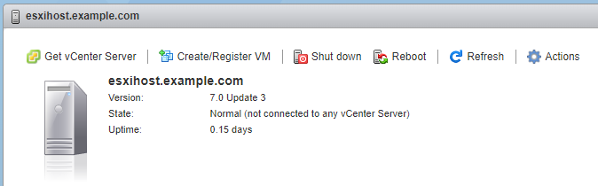
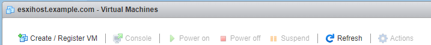
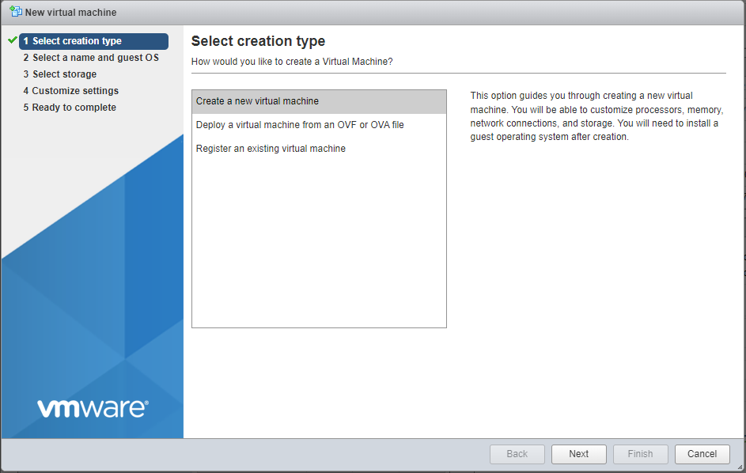
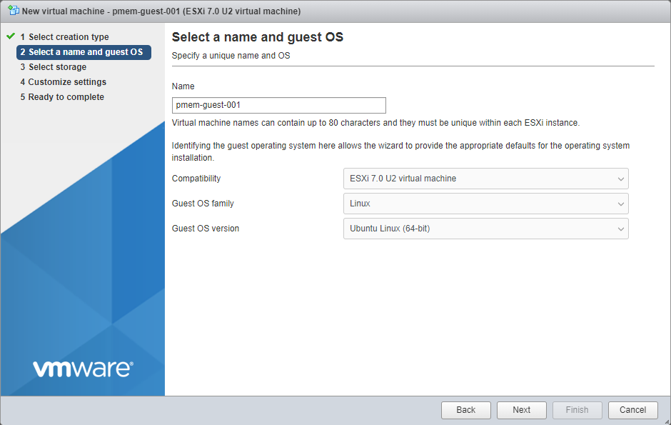
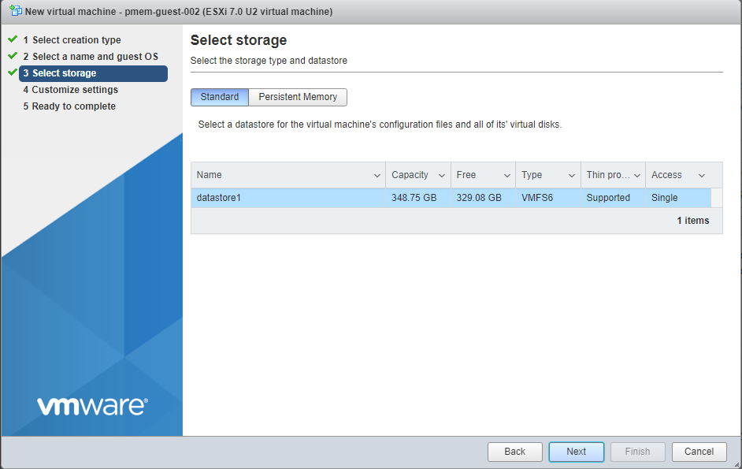
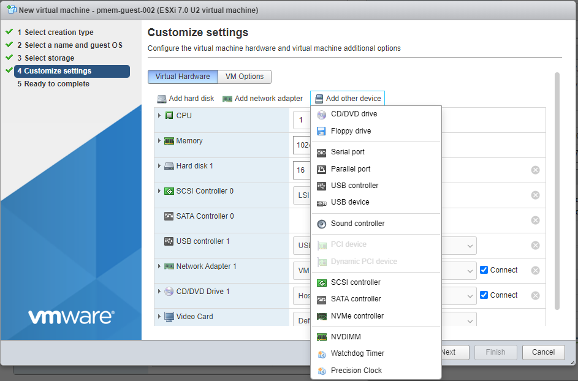
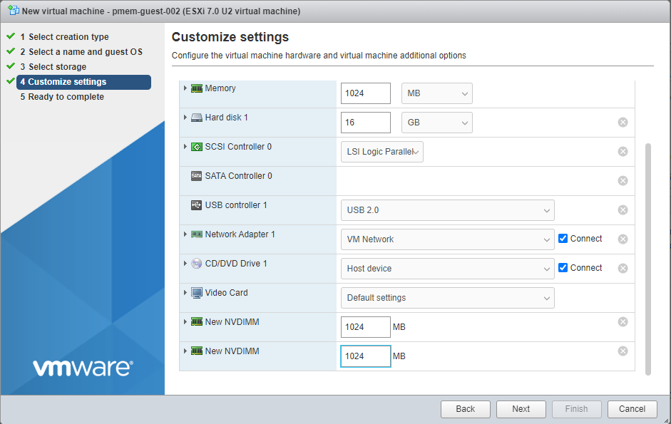
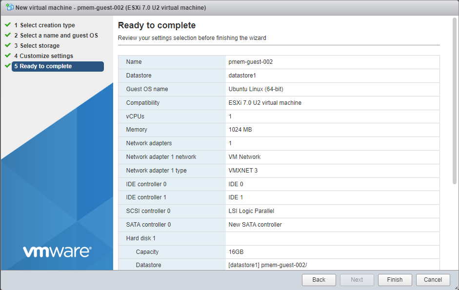

In this post, we'll use VMWare ESXi 7.0u3 to create a Guest VM running Ubuntu 21.10 with two Virtual Persistent Memory (vPMem) devices, then show how we can map the vPMem device in the host (ESXi) to "nmem" devices in the guest VM as shown by the `ndctl` utility.

If you're new to using vPMem or need a refresher, start with the VMWare [Persistent Memory](https://docs.vmware.com/en/VMware-vSphere/7.0/com.vmware.vsphere.resmgmt.doc/GUID-EB72D358-9C2C-4FBD-81A9-A145E155CE31.html) documentation.

## Table of Contents

- [Create a Guest VM with vPMem Devices](#create-a-guest-vm-with-vpmem-devices)
- [Install the Guest OS](#install-the-guest-os)
- [Install ndctl](#install-ndctl)
- [Mapping the NVDIMMs in the guest to devices in the ESXi Host](#mapping-the-nvdimms-in-the-guest-to-devices-in-the-esxi-host)
- [Summary](#summary)

## Create a Guest VM with vPMem Devices

The procedure you use may be different from the one shown below if you use vSphere or an automated procedure.

1. In a web browser, navigate to the IP Address of the ESXi host and login
2. On the home page, click the "Create/Register VM"



Click "Create/Register VM"

Alternatively, click "Virtual Machines" on the left, then click "Create/Register VM"



Click "Create/Register VM"

3. Select "Create a new virtual machine", then click "Next"



Select "Create a new virtual machine"

4. Enter a "Name" for the Guest VM, then select the "Guest OS Family", and "Guest OS version"



5. Select a disk datastore for the OS image



6. In the "Customize settings" window, set the number of CPUs, Memory, OS disk size, Network, etc. To add vPMem devices, click "Add other device" and select "NVDIMM" from the list. Repeat adding NVDIMMs for the required quantity. Set the size for each vPMem/NVDIMM.




Add an NVDIMM to the guest



Create 2 x 1GiB vPMem devices

Click "Next" when you're done defining the configuration of the guest.

7. Review the configuration and click "Finish"



Review the configuration and click "Finish"

## Install the Guest OS

I chose to manually install and configure the guest OS using an ISO, but you may have PXE servers available, or choose an OS from an existing VM to clone.

## Install ndctl

The `ndctl` utility is used to create and manage namespaces within Linux. Packages exist for most common Linux distributions and should be installed using the package manager for your Linux distro. We'll use `apt` since we are using Ubuntu. Instructions for other Linux distros or how to build the latest ndctl release from the source code can be found in the [NDCTL User Guide](https://docs.pmem.io/ndctl-user-guide/installing-ndctl).

```bash
$ sudo apt install ndctl
```

## Mapping the NVDIMMs in the guest to devices in the ESXi Host

VMWare doesn't pass through the physical PMem modules to the guests. Instead, VMWare uses a Virtual Memory File System (VMFS) on which Virtual Machine Disk (VMDK) files are created based on the size specified when creating the guest. It is these vmdk files passed to the guest that are managed as PMem/NVDIMMs (nmem) within the guest using the ndctl utility.

If we create a single vPMem device for the guest, mapping is trivial, but if we have two or more of the same size - which is the most common scenario - how does one know which vmdk file maps to which nmem within the guest? We should not rely simply on the creation order. If a vPMem device is removed in the ESXi host, the next \[re\]boot of the guest will re-enumerate the nmem devices, starting at zero.

The correct approach is to use the UUID (unique identifier) since it won't change unless the vPMem is deleted and re-created.

1. From the GuestVM, run the following to list the available NVDIMMs/PMem devices:

```bash
guestvm $ sudo ndctl list -D
[
  {
    "dev":"nmem1",
    "id":"8902-a2ebf260",
    "handle":1,
    "phys_id":103
  },
  {
    "dev":"nmem0",
    "id":"8902-206b080c",
    "handle":0,
    "phys_id":102
  }
]
```

The "ID' field is the UUID we need.

2. SSH into the ESXi host. **Note:** SSH is disabled by default, so you'll need to enable it. I found [How to Enable SSH on VMWare ESXi7.0](http://How to Enable SSH on VMware ESXi 7.0) to be useful in thie endevour.
3. Identify the mount point for the PMem Virtual Filesystem

```bash
esxi_host>$ df -h
Filesystem   Size   Used Available Use% Mounted on
VMFS-6     348.8G  19.7G    329.1G   6% /vmfs/volumes/datastore1
VFFS       119.8G  55.8G     64.0G  47% /vmfs/volumes/OSDATA-620d5bc1-298adcee-3482-a4bf01361b90
vfat         4.0G 203.8M      3.8G   5% /vmfs/volumes/BOOTBANK1
vfat         4.0G  64.0K      4.0G   0% /vmfs/volumes/BOOTBANK2
PMEM         5.9T   3.4G      5.9T   0% /vmfs/volumes/PMemDS-2ab23afe-ef87-eb45-9e0d-8db94ea7740d
```

4. Change directory to the mount point and find the Guest VM.

```bash
esxi_host>$ cd /vmfs/volumes/PMemDS-2ab23afe-ef87-eb45-9e0d-8db94ea7740d
esxi_host>$ ls
pmem-guest-001
esxi_host>$ cd pmem-guest-001
esxi_host>$  ls
pmem-guest-001.vmdk    pmem-guest-001_1.vmdk
```

5. Use the `vmkfstools` utility to extract the UUID from the vmdk files

```bash
esxi_host>$ vmkfstools -J getuuid pmem-guest-001.vmdk
UUID is 60 00 C2 98 42 c7 54 f8-02 c2 d4 9b 20 6b 08 0c

esxi_host>$ vmkfstools -J getuuid pmem-guest-001_1.vmdk
UUID is 60 00 C2 9d 90 45 42 66-d7 cf ed f7 a2 eb f2 60
```

Use the last 8 characters (Dword or 32-bits) from vmkfstools and map it to the "ID" from ndctl.

- \[ESXi Host\] pmem-guest-001.vmdk (**20 6b 08 0c**) == \[Guest\] nmem0 (8902-**206b080c**)
- \[ESXi Host\] pmem-guest-001\_1.vmdk (**a2 eb f2 60**) == \[Guest\] nmem1(8902-**a2ebf260**)

## Summary

In this post, we show a method for identifying which vPMem (vmdk) devices on an ESXi host maps to which nmem devices as seen in a Guest VM.
