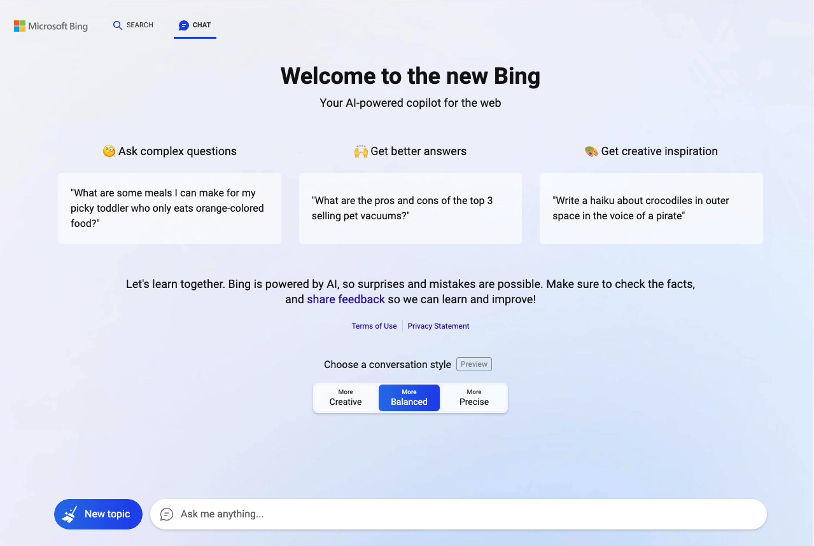
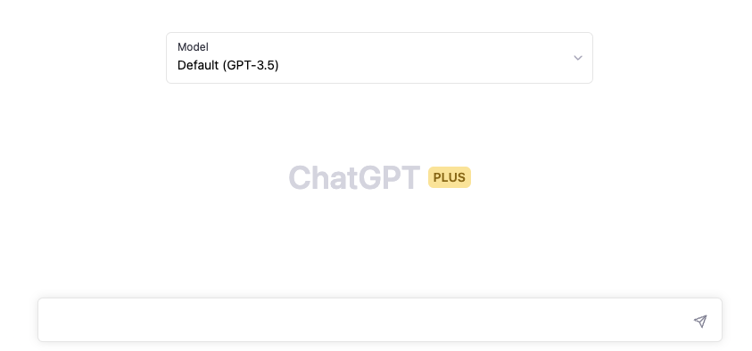

+++
# Post Title - Auto-generated from the file name
title = "An Introduction to Generative Prompt Engineeering"

# Post creation date
date = 2023-03-29T00:20:10Z

# Post is a Draft = True|False
draft = false

# Authors. Comma separated list, e.g. `["Bob Smith", "David Jones"]`.
authors = ["Steve Scargall"]

# Tags and categories
# For example, use `tags = []` for no tags, or the form `tags = ["A Tag", "Another Tag"]` for one or more tags.
tags = ["gpt", "gpt-3", "gpt-4", "chatgpt", "prompt engineering", "generative prompt engineering", "AI", "artificial intelligence", "machine learning"]
categories = ["AI"]

# Featured Image
image = "images/95d33778-4653-4b03-b927-e91884440d9b.jpeg"
+++

## Introduction

Over the past few years, there has been a significant explosion in the use and development of large language models (LLMs). An LLM is a [language model](https://en.wikipedia.org/wiki/Language_model "Language model") consisting of a [neural network](https://en.wikipedia.org/wiki/Artificial_neural_network "Artificial neural network") with many parameters (commonly multi-billions of weights), trained on large quantities of text. Some of the most popular large language models are: [GPT-3](https://github.com/openai/gpt-3) (Generative Pretrained Transformer 3) – developed by [OpenAI](https://openai.com/); [BERT](https://huggingface.co/blog/bert-101) (Bidirectional Encoder Representations from Transformers) – developed by Google; [RoBERTa](https://ai.facebook.com/blog/roberta-an-optimized-method-for-pretraining-self-supervised-nlp-systems/) (Robustly Optimized BERT Approach) – developed by Facebook AI; [T5](https://ai.googleblog.com/2020/02/exploring-transfer-learning-with-t5.html) (Text-to-Text Transfer Transformer) – developed by Google. Many others exist and continue to emerge.  These language models are designed to understand and generate natural language text, allowing for a wide range of applications such as chatbots, content creation, language translation, and more.

One of the key drivers of the explosion in LLMs is the significant advances in deep learning and natural language processing research. The development of powerful neural network architectures and the availability of vast amounts of training data have enabled the creation of larger and more sophisticated language models that can perform a wide range of tasks. Advancements in server hardware, especially GPUs, has drammatically acelerated the research and ability to train bigger models with huge datasets. 

The introduction of [ChatGPT](https://chat.openai.com/chat) in late 2022 and [Bing AI Search](https://www.bing.com/search?q=Bing%20AI&showconv=1&FORM=hpcodx) in early 2023, allows anyone to interact with the LLMs through a web browser. APIs exist for developers to add chatbot features to their own applications. This is an exciting development has the potential to transform the way we interact with this technology and each other. As these models continue to improve and become more widely adopted, we can expect to see even more innovative and powerful natural language processing applications in the future.

The following screenshots show the browser user interface (BUI) of Bing AI Search and OpenAI's ChatGPT.

Both provide a text box where the user can input the search. This is known as the *prompt*. The session is iterative, meaning previous responses are kept in context so we can continue the conversation to ask about new things, clarify what was returned previously, or expand upon an idea. 

## What is Generative Prompt Engineering?

Generative prompt engineering is a technique in natural language processing (NLP) that involves creating or fine-tuning prompts to generate high-quality text using a language model. The process involves inputting a prompt or a seed text, and the language model generates output based on the prompt. The goal of generative prompt engineering is to improve the quality of generated text, make it more diverse, and reduce bias.

In other words, generative prompt engineering is the process of designing and optimizing the prompts that are used to generate text with a language model. The quality of the results depends heavily on the quality of the prompt. By carefully crafting the prompt, developers can guide the language model to produce more accurate, relevant, and coherent text.

Generative prompt engineering involves different techniques such as prompt programming and prompt tuning. Prompt programming involves designing structured prompts that are specific to a particular task or domain, while prompt tuning involves modifying or fine-tuning existing prompts to adapt to specific domains or tasks. The ultimate goal of generative prompt engineering is to create language models that can generate high-quality, accurate, and relevant text for a specific task or application.

### A Brief History of Prompt Engineering

Generative prompt engineering has its roots in the field of natural language processing (NLP), which has a long history of research dating back to the 1950s. The first NLP systems were rule-based, meaning they relied on a set of handcrafted rules to generate text. However, these systems were limited in their ability to handle complex language structures and did not perform well in real-world applications.

In the 1980s and 1990s, statistical language modeling techniques began to emerge, which used probabilistic models to generate text based on patterns learned from data. These models could generate more natural-sounding text than rule-based systems and performed better in real-world applications. However, they still had limitations in their ability to handle complex language structures and generate coherent and diverse text.

In the early 2010s, deep learning techniques such as neural networks began to be applied to language modeling. These models were trained on large datasets using unsupervised learning techniques and could generate text that was more coherent, relevant, and diverse than earlier models. However, the quality of the generated text was heavily dependent on the quality of the input prompt.

Generative prompt engineering emerged as a way to improve the quality of generated text by optimizing the prompts used to guide language models. The idea was to create or fine-tune prompts that would provide more specific information to the language model and guide it to generate more accurate, relevant, and diverse text.

Today, generative prompt engineering has become a critical technique in natural language processing, enabling developers to create language models that can generate human-like responses to prompts. With the explosion of large language models such as GPT-3, T5, and BERT, the importance of generative prompt engineering is more important than ever, as it can help to improve the accuracy, relevance, and diversity of generated text in real-world applications such as chatbots, content generation, and language translation.

## How Does Generative Prompt Engineering Work?

The process of generative prompt engineering involves designing or fine-tuning prompts to improve the quality of text generated by language models. The process typically involves the following steps:

1.  **Defining the task:** The first step in generative prompt engineering is to define the task or application for which the language model will be used. I.e: what do you want the system to do?
    
2.  **Designing the prompt:** The next step is to design a prompt that provides the language model with enough information to generate high-quality text. The prompt should be structured, specific, and relevant to the task.
    
3.  **Evaluating the prompt:** Once the prompt is designed, it needs to be evaluated to ensure that it is generating high-quality text. This may involve testing the language model with different prompts and evaluating the quality of the output.
    
4.  **Fine-tuning the prompt:** If the prompt is not generating high-quality text, it may need to be fine-tuned. This could involve modifying the prompt to include more specific information or tweaking the prompt based on the output of the language model.
    
5.  **Iterating the process:** The process of generative prompt engineering is iterative, with developers testing and fine-tuning the prompts until they generate high-quality text consistently.

### The Importance of Generative Prompt Engineering in Language Models

The quality of response heavily depends on the user provided prompt. A well-crafted prompt can help the language model generate more accurate, coherent, and relevant text. In contrast, a poorly crafted prompt can lead to irrelevant or inaccurate responses. 

A good prompt includes context and a goal (what output do you want, and in what format). Be as specific and consice as possible. For example "Write an article summarising Goldilocks and the three bears" has minimal context ('Golidlocks and the three bears') and a task ('write an article'). Whereas "Write a 300 word article about the relationship between goldilocks and the three bears. Include how they met and how their relationship developed over time. Consider the potential challenges of a young girl living with three bears." has a more detailed goal.

The importance of generative prompt engineering in language models lies in its ability to improve the accuracy and relevance of generated text. By designing and optimizing prompts, developers can create language models that are more useful and effective for specific applications. This can lead to significant improvements in applications such as chatbots, content creation, and language translation, where high-quality text generation is critical for success.

### Prompt Programming and Prompt Tuning Techniques

Prompt programming involves designing structured prompts that are specific to a particular task or domain. These prompts provide the language model with more specific information about what kind of text to generate. For example, in a chatbot application, the prompt could include information about the user's previous messages, their preferences, and the context of the conversation. This information can help the language model generate more accurate, relevant, and coherent responses.

Different strategies such as template-based prompts, keyword-based prompts, and conditional prompts can be used to control the output. Template-based prompts involve designing a prompt that follows a specific format, such as a question-answer format. Keyword-based prompts involve designing prompts that include specific keywords or phrases that the language model should include in the generated text. Conditional prompts involve designing prompts that include conditional statements that guide the language model to generate text based on certain conditions.

Prompt tuning, on the other hand, involves modifying or fine-tuning existing prompts to adapt to specific domains or tasks. This process involves tweaking the existing prompts based on the specific needs of the application or domain. For example, in sentiment analysis, the prompt may be fine-tuned to include words or phrases that are indicative of positive or negative sentiment. Prompt tuning can help to improve the accuracy, relevance, and diversity of generated text.

The choice of prompt engineering technique depends on the specific application or task. In some cases, prompt programming may be more effective, while in other cases, prompt tuning may be more appropriate. Ultimately, the goal of both techniques is to create prompts that provide the language model with enough information to generate high-quality, accurate, and relevant text for a specific task or application.

Both prompt programming and prompt tuning techniques have their own advantages and disadvantages.

Advantages of prompt programming:

-   Specific: Prompt programming allows developers to create highly specific prompts that provide the language model with more detailed information about what kind of text to generate.
-   Control: Prompt programming gives developers more control over the output of the language model, as they can guide the model to generate specific types of text.
-   Efficiency: Once a template-based prompt is designed, it can be reused for similar tasks, which can save time and effort.

Disadvantages of prompt programming:

-   Limited flexibility: Prompt programming is not well-suited for tasks where the prompts need to be highly variable, such as content creation or language translation.
-   Limited adaptability: Template-based prompts may not be adaptable to different domains or tasks, which can limit the effectiveness of the language model.
-   Complexity: Creating highly structured prompts can be time-consuming and require significant expertise.

Advantages of prompt tuning:

-   Flexibility: Prompt tuning allows developers to fine-tune existing prompts to adapt to specific domains or tasks.
-   Adaptability: Fine-tuned prompts can be more adaptable to different domains or tasks than template-based prompts.
-   Diversity: Prompt tuning can help to increase the diversity of generated text, which can be useful in applications such as content creation or language translation.

Disadvantages of prompt tuning:

-   Less control: Fine-tuning prompts may result in less control over the output of the language model, as it may generate text that is not consistent with the developer's expectations.
-   Complexity: Fine-tuning prompts can be complex and require significant expertise in NLP and machine learning.
-   Time-consuming: Fine-tuning prompts can be time-consuming, especially for complex tasks or domains.

In summary, the choice of prompt engineering technique depends on the specific task or application. While prompt programming can be more specific and efficient, it may not be adaptable to different domains or tasks. In contrast, prompt tuning can be more flexible and adaptable, but may require more expertise and be more time-consuming.

## Applications of Generative Prompt Engineering

Generative prompt engineering is used in a variety of real-world applications to generate high-quality text that is relevant and accurate for a specific task. Here are some examples of how generative prompt engineering is used in different applications:

1.  Chatbots: Chatbots are computer programs that simulate human conversation, typically used for customer service or support. Generative prompt engineering is used to generate responses to user inputs that are relevant and accurate. By fine-tuning prompts to include information about the user's previous messages or preferences, chatbots can generate responses that are tailored to the user's needs.
    
2.  Language translation: Language translation involves translating text from one language to another. Generative prompt engineering is used to generate translations that are accurate and relevant. By fine-tuning prompts to include information about the context of the text or the target audience, language translation models can generate translations that are tailored to specific needs.
    
3.  Content generation: Content generation involves creating text for various purposes, such as marketing, advertising, or social media. Generative prompt engineering is used to generate high-quality text that is relevant and engaging. By designing prompts that include specific keywords or phrases, content generation models can generate text that is optimized for search engines or social media platforms.
    
4.  Text summarization: Text summarization involves generating a summary of a longer text, such as an article or a report. Generative prompt engineering is used to generate summaries that are accurate and relevant. By designing prompts that include specific keywords or phrases, text summarization models can generate summaries that are tailored to specific needs or audiences.
    
In each of these applications, generative prompt engineering is used to optimize the prompts used to generate text. By designing or fine-tuning prompts, developers can create language models that generate text that is accurate, relevant, and tailored to specific needs or audiences.

Generative prompt engineering has the potential to be used in various industries to generate high-quality text that is accurate, relevant, and tailored to specific needs. Here are some examples of how generative prompt engineering can be used in different industries:

1.  Healthcare: In the healthcare industry, generative prompt engineering can be used to generate text for electronic health records, patient education materials, and chatbots for patient support. For example, prompts can be fine-tuned to generate patient education materials that are easy to understand and tailored to specific conditions or treatments.
    
2.  Finance: In the finance industry, generative prompt engineering can be used to generate text for customer service chatbots, financial reports, and investment recommendations. For example, prompts can be designed to generate investment recommendations based on specific criteria, such as risk tolerance or investment goals.
    
3.  Education: In the education industry, generative prompt engineering can be used to generate text for educational materials, student assessments, and chatbots for student support. For example, prompts can be fine-tuned to generate educational materials that are tailored to specific learning styles or student needs.
    

Generative prompt engineering can provide significant benefits in each of these industries. By generating text that is accurate, relevant, and tailored to specific needs, generative prompt engineering can improve efficiency, reduce costs, and improve the overall quality of services provided. For example, chatbots can provide 24/7 support to patients or students, while investment recommendations can be generated quickly and accurately based on specific criteria.

However, there are also potential risks and challenges associated with the use of generative prompt engineering in these industries. For example, there is a risk of bias in generated text, which can have serious consequences in healthcare or finance. Additionally, the quality of generated text can be heavily dependent on the quality of the prompts used, which requires expertise in NLP and machine learning. Despite these challenges, the potential benefits of generative prompt engineering in these industries make it an area of significant interest and investment.

## Learning Generative Prompt Engineering

Learning generative prompt engineering requires a combination of technical skills and knowledge of natural language processing (NLP) and machine learning. Here is an overview of the key skills and knowledge required to learn generative prompt engineering:

1.  NLP Fundamentals: To learn generative prompt engineering, it is important to have a solid understanding of the fundamentals of NLP, including concepts such as language models, tokenization, and part-of-speech tagging.
    
2.  Machine Learning: Generative prompt engineering involves using machine learning techniques to optimize the prompts used by language models. A strong foundation in machine learning is, therefore, essential, including concepts such as supervised and unsupervised learning, neural networks, and optimization algorithms.
    
3.  Programming: Proficiency in programming languages such as Python is critical for working with NLP and machine learning libraries, as well as for designing and testing prompts.
    
4.  Natural Language Generation: Generative prompt engineering is a type of natural language generation (NLG) that involves generating text based on specific prompts. Understanding the different techniques and approaches to NLG is essential for developing effective prompts.
    
5.  Data Analysis: Generative prompt engineering involves working with large datasets to optimize prompts and language models. A solid foundation in data analysis, including concepts such as data cleaning, data preprocessing, and statistical analysis, is critical for effective generative prompt engineering.
    
6.  Creativity and Critical Thinking: Effective generative prompt engineering requires creativity and critical thinking skills to design prompts that are relevant, accurate, and tailored to specific needs or audiences.

In summary, learning generative prompt engineering requires a combination of technical skills and knowledge of NLP, machine learning, programming, natural language generation, data analysis, and creativity. By developing these skills and knowledge, developers can create language models that generate high-quality, accurate, and relevant text for a variety of applications.

###  Tips for Beginners

If you are a beginner interested in learning generative prompt engineering, here are some tips to help you get started:

1.  Start with the basics: Begin by learning the fundamentals of NLP and machine learning. There are many online resources available that provide a comprehensive introduction to these topics.
    
2.  Learn Python: Python is the most popular programming language used in NLP and machine learning. Learn Python and become familiar with popular Python libraries such as TensorFlow, PyTorch, and Scikit-learn.
    
3.  Work on small projects: Start with small projects that focus on specific tasks such as sentiment analysis, text classification, or text summarization. This will allow you to gain experience and build your skills gradually.
    
4.  Learn from others: Join NLP and machine learning communities, attend meetups, and participate in online forums such as Stack Overflow. This will allow you to learn from others and get help when you encounter difficulties.
    
5.  Use online resources and tools: There are many online resources and tools available for NLP and machine learning, including tutorials, code examples, and pre-trained language models such as GPT-3. Some popular resources and tools include TensorFlow Hub, Hugging Face, and AllenNLP.
    
6.  Read research papers: Keep up-to-date with the latest research in NLP and machine learning by reading research papers from conferences such as ACL, EMNLP, and NeurIPS. This will help you stay current with the latest trends and techniques in generative prompt engineering.
    
In summary, learning generative prompt engineering requires a combination of technical skills, hands-on experience, and access to online resources and tools. By starting with the basics, working on small projects, and learning from others, beginners can develop the skills and knowledge needed to build effective prompts for language models.

## Where to go next

If you are interested in learning more about generative prompt engineering, there are many resources available online to help you continue your learning journey. Here are some websites and resources that you may find helpful:

1.  [Hugging Face](https://huggingface.co/): This is a popular NLP library that provides pre-trained language models, including GPT-3. They also have a large community that provides tutorials, code examples, and other resources to help you get started.
2.  [TensorFlow Hub](https://www.tensorflow.org/hub): This is a library of pre-trained machine learning models, including NLP models, that you can use in your projects. They also provide tutorials and other resources to help you learn more about generative prompt engineering.
3.  [AllenNLP](https://allenai.org/allennlp): This is an open-source NLP library that provides tools and resources for natural language understanding and generation. They offer tutorials and code examples to help you get started with generative prompt engineering.
4.  [Papers with Code](https://paperswithcode.com/): This is a website that provides code implementations and papers related to machine learning and NLP. You can search for papers related to generative prompt engineering and find code examples to help you get started.
5.  [Coursera](https://www.coursera.org/): This is an online learning platform that offers courses related to NLP and machine learning. You can take courses from top universities and industry experts to learn more about generative prompt engineering.
6. [edX](https://www.edx.org/): This is another online learning platform that offers courses related to NLP and machine learning. They offer courses from top universities and organizations, including MIT and Microsoft.
7. [Fast.ai](https://www.fast.ai/): This is a free online course that provides an introduction to deep learning, including NLP. The course is taught using practical examples and code, making it a great resource for hands-on learning.
8. [Machine Learning Mastery](https://machinelearningmastery.com/): This is a website that provides tutorials, code examples, and other resources related to machine learning. They have a specific section dedicated to NLP, which can help you learn the fundamentals of NLP.
    
By exploring these resources and continuing to learn about generative prompt engineering, you can build the skills and knowledge needed to design effective prompts for language models. Good luck on your learning journey!
