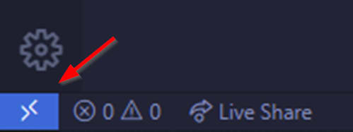
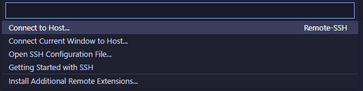
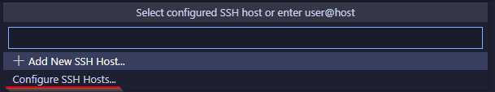
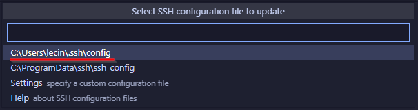
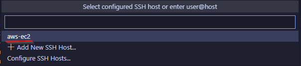

# How to Perform Remote Code Development Using VS Code on a Remote AWS EC2 Instance via SSH

Remote development has become a crucial tool for developers, enabling the convenience of coding and deploying directly to remote environments. In this blog, I’ll walk you through the process of setting up **Visual Studio Code (VS Code)** to develop remotely on an **AWS EC2 instance** using **SSH**. By the end of this guide, you'll be able to connect to your EC2 instance from VS Code and develop code as if you were working locally.

## Prerequisites

1. **AWS EC2 Instance**: Ensure that you have an EC2 instance up and running on AWS.
2. **VS Code**: Make sure you have the latest version of [VS Code](https://code.visualstudio.com/) installed on your local machine.
3. **OpenSSH**: You should have OpenSSH installed on your local machine (both macOS and Linux have it preinstalled, but Windows users might need to enable it manually).
4. **SSH Key Pair**: Ensure that you have the SSH key pair (`.pem` file) generated when creating your EC2 instance.
5. **AWS Security Group Configuration**: Ensure that port 22 (SSH) is open in your EC2 instance’s security group.

## Step-by-Step Guide to Connect VS Code to AWS EC2 Using SSH

### Step 1: Obtain your AWS Credentials and SSH Key(s)

When you launch an EC2 instance, you are prompted to create or use an existing SSH key pair to securely connect to the instance. In this section, we'll cover two scenarios: using the SSH key pair you created during instance setup and generating a new key pair if needed. Both methods will allow you to access your EC2 instance securely via SSH.

#### Scenario 1: Using the SSH Key Pair Created During EC2 Instance Setup

1.1.1. **Locate Your Key Pair (.pem File)**:
   - When you first launched your EC2 instance, AWS prompted you to either create a new SSH key pair or use an existing one. If you created a new key pair, AWS would have provided you with a `.pem` file. This file is crucial for connecting to your EC2 instance.
   - Make sure you have the `.pem` file downloaded on your local machine. It should be stored securely, as this is your private key to access the instance.

1.1.2. **Set the Correct Permissions**:
   - To ensure your SSH key is secure and usable, you need to set the correct permissions on the `.pem` file. Open your terminal and run the following command:
   
```bash
chmod 400 /path/to/your-key.pem
```
   - Replace `/path/to/your-key.pem` with the actual path where your key pair file is stored.

1.1.3. **Connect to Your EC2 Instance**:
   - Once your key permissions are set, you can use the following SSH command to connect to your instance:
   
```bash
ssh -i /path/to/your-key.pem ec2-user@your-instance-public-ip
```
   - Make sure to replace `/path/to/your-key.pem` with the path to your private key file and `your-instance-public-ip` with the public IP of your EC2 instance.

#### Scenario 2: Generating a New SSH Key Pair and Associating It with a Running EC2 Instance

If you don't have access to the original `.pem` file or want to use a different key pair, you can generate a new SSH key and associate it with an existing EC2 instance.

##### Generate a New SSH Key Pair
1.2.1. Open your terminal (macOS/Linux) or Git Bash (Windows) and run the following command to generate a new key pair:
   
```bash
ssh-keygen -t rsa -b 4096 -f ~/.ssh/new-ec2-key
```
   - The `-t` option specifies the type of key, and `-b 4096` defines the key length for extra security.
   - The `-f` flag specifies the file name and location where the key pair will be saved. In this example, it will be saved as `new-ec2-key` in the `~/.ssh` directory.

1.2.2. You will now have two files:
   - `new-ec2-key`: This is your **private key**. Keep this file secure.
   - `new-ec2-key.pub`: This is your **public key**. You’ll upload this to your EC2 instance.

##### Associate the New Public Key with the Running EC2 Instance

1.2.1. **Connect to the EC2 Instance** (with an existing key or through the AWS EC2 Instance Connect feature) and run the following command to create a directory for SSH keys:

```bash
mkdir -p ~/.ssh
```

1.2.2. **Upload the New Public Key** to the `~/.ssh/authorized_keys` file on the EC2 instance. You can use the `scp` command to copy the public key from your local machine to the EC2 instance:

```bash
scp -i /path/to/old-key.pem ~/.ssh/new-ec2-key.pub ec2-user@your-instance-public-ip:/home/ec2-user/new-ec2-key.pub
```

   - Replace `/path/to/old-key.pem` with the path to the existing SSH key you used to access the instance, and `your-instance-public-ip` with your EC2 instance’s public IP.

1.2.3. **Add the New Public Key to Authorized Keys**:
   - SSH into your EC2 instance using the existing SSH key and run:

```bash
cat ~/new-ec2-key.pub >> ~/.ssh/authorized_keys
```

1.2.4. **Set Correct Permissions**:
   - Ensure the permissions are set correctly for the `.ssh` directory and the `authorized_keys` file:

```bash
chmod 700 ~/.ssh
chmod 600 ~/.ssh/authorized_keys
```

1.2.5. **Connect with the New Key**:
   - Now you can SSH into your EC2 instance using the new key pair:

```bash
ssh -i ~/.ssh/new-ec2-key ec2-user@your-instance-public-ip
```

### Step 2: Install the VS Code Remote Development Extension
You may need to install the **Remote Development extension** for VS Code if it is not already installed.

2.1. Open VS Code and click on the **Extensions** icon in the sidebar (or press `Ctrl+Shift+X`).
2.2. Search for **Remote - SSH** by Microsoft.
2.3. Click **Install** to add the extension to VS Code.

### Step 3: SSH Into Your EC2 Instance Locally (Optional)
Before configuring SSH in VS Code, it's a good idea to test your connection via the terminal:

3.1. Open a terminal window.
3.2. Run the following command (replace `ec2-user` and `your-instance-public-ip` with your actual instance user and public IP):

```bash
ssh -i /path/to/your-key.pem ec2-user@your-instance-public-ip
```

3.3. If successful, you'll see a welcome message on your terminal from your EC2 instance. If not, double-check your IP, security group settings, and key path.

### Step 4: Configure SSH in VS Code

4.1. Open VS Code, and click on the 'Open a Remote Window' icon at the bottom left-hand corner of the window



4.2. Select 'Connect to Host'



4.3. Select 'Configure SSH Hosts...'



4.4. VS Code will prompt you to choose a file where the SSH configuration will be saved, or use an existing file. Select the `.ssh/config` file for your user. On Linux it will be `/home/<username>/.ssh/config`. On Windows it will be `C:/Users/<username>/.ssh/config`.



Use the following file content, replacing the Hostname, User, and IdentifyFile with your specific host information:

```bash
Host <nickname>
    HostName <your-ec2-ip-address or hostname>
    User ec2-user
    IdentityFile ~/.ssh/labsuser.pem
```

Example:

```bash
Host aws-ec2
    HostName ec2-3-22-20-2002.us-east-2.compute.amazonaws.com
    User ubuntu
    IdentityFile ~/.ssh/aws-ec2-demo.pem
```

4.5. Save the file.

### Step 5: Connect to a Remote Host (SSH)

5.1. When you click on the Open a Remote Window icon at the bottom left-hand corner again and choose Connect to Host, you will see aws-ec2 listed. You can get to the same place using the the **Command Palette** (press `Ctrl+Shift+P` or `Cmd+Shift+P` on macOS) and select or type **Remote-SSH: Connect to Host...**.

5.2 From the list of hosts, choose the EC2 instance you just configured.



5.3 If your SSH key has a passphrase, you'll be prompted to enter it when connecting. Enter the passphrase, and VS Code will establish the SSH connection to the EC2 instance.

5.4. Once connected, VS Code will automatically install its **VS Code Server** on your EC2 instance. This process happens behind the scenes, and you should see a series of progress notifications.

### Step 6: Start Coding!
Once the VS Code Server is installed, the remote connection is established. Now, you can open files, folders, and even entire projects on your EC2 instance as if they were on your local machine.

You can now:
- Navigate to the **Explorer** in VS Code.
- Click **Open Folder**.
- Select the folder you want to work with on the remote EC2 instance.

### Step 7: Closing the SSH Connection
To close the connection, simply close the VS Code window or manually disconnect by using the **Command Palette** and selecting **Remote-SSH: Close Remote Connection**.

## Conclusion
That's it! You are now connected to your AWS EC2 instance via SSH using VS Code. This allows you to edit files, run code, and perform development tasks as if you were working on a local machine. Remote development can greatly streamline your workflow when working with cloud environments like AWS EC2.

Happy coding!
