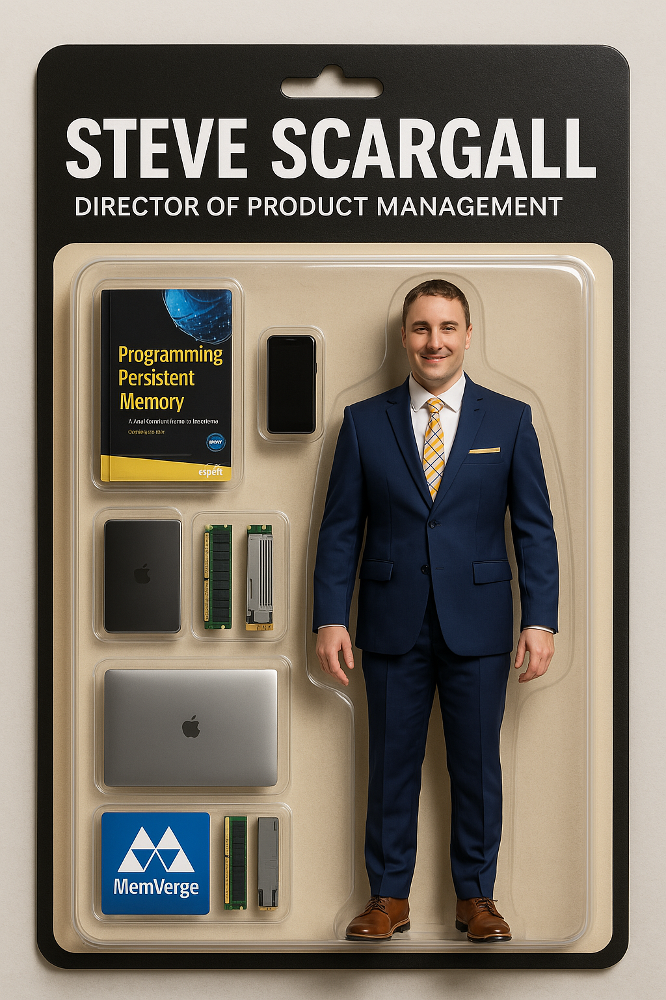

Part of being in tech, especially in emerging memory technology, is constantly switching between the serious and the surreal. One day you're in kernel debug mode, the next you're explaining complex system architectures on a whiteboard, and then suddenly you're jumping on the latest craze such as making yourself into an action figure.

It’s fun. It’s human. And honestly? It’s a reminder not to take yourself too seriously. (Even if your job title suggests differently)

## Why Blister Packs Are Suddenly Everywhere

If you've been seeing action figure-style blister packs all over your timeline lately, you're not imagining things; it’s a full-blown craze.

This trend kicked off when OpenAI released the ChatGPT-4o model on May 13, 2024, and introduced a set of new image generation capabilities that included more refined control over layout, packaging design, and high-fidelity photo rendering. People instantly began using it to turn themselves (and their friends, pets, and even fictional alter-egos) into collectible-style figures—complete with accessories, personality-driven packaging, and clever titles.

Why blister packs? They're nostalgic, instantly recognizable, and strangely satisfying. The combination of pop culture toy aesthetics with modern personal branding hits a sweet spot. Whether you're a tech professional, artist, or just someone who loves a good meme, these creations are the perfect blend of humor, identity, and design.

For me, it was a way to merge my professional identity with a playful twist. I spend my days working on serious memory tech—CXL, persistent memory, data platforms—but this was a chance to repackage that story (literally) in a totally unexpected way.

Plus… who wouldn’t want to be their own action figure?

## The Prompt

Here is the prompt I used to create the final image

```text
Create an image. Create an action figure of the person in the photo.

Next to the figure, there should be the toy’s equipment, each in its individual blister.

1. A book called “Programming Persistent Memory”. Use the attached book cover image
2. Cell Phone
3. A MacBook Pro (closed)
4. The MemVerge logo (Use the attached logo)

Don’t repeat the equipment under any circumstances. 

The blister pack should have a black header with a large white text –Steve Scargall – with smaller white text underneath – Director of Product Management. The blister pack background should be beige with a black border.

Visualize this in a realistic way. The action figure must retain my facial features with a smiling expression, and be rendered in high-detail, photorealistic quality.
```

## The Result

While the result is very impressive this generation/version of the model struggles to maintain the original facial features, so you end up with something that doesn't quite resemble your original image.



## Final Thoughts – Collect ’Em All!

Honestly, this whole thing was way more fun than I expected. I got to see myself as a mini collectible, complete with accessories I actually use every day. There are lots of model styles, so maybe this is the start of the Tech Legends collection. Next time I'll convert this to a 3D model that I can print on my 3D printer. Time to turn them into shelf-worthy greatness.
