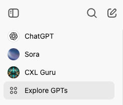
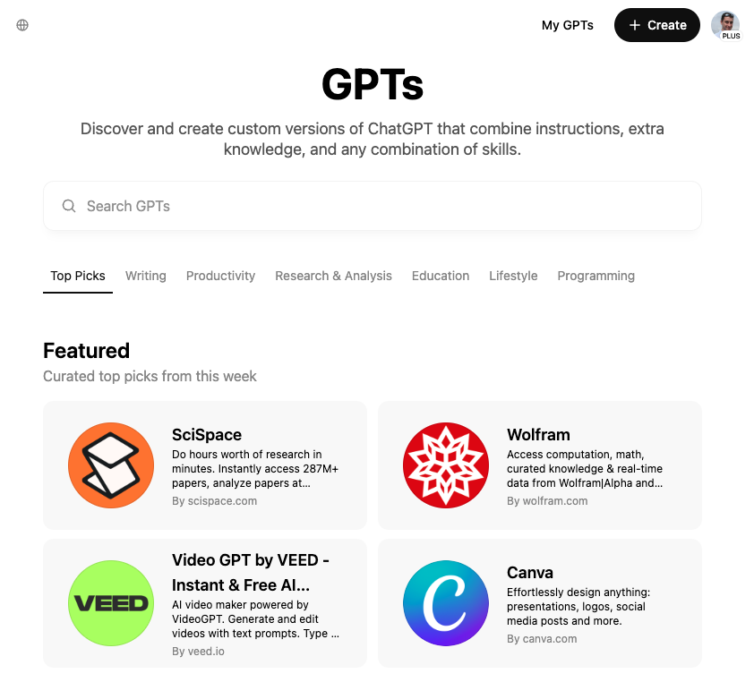
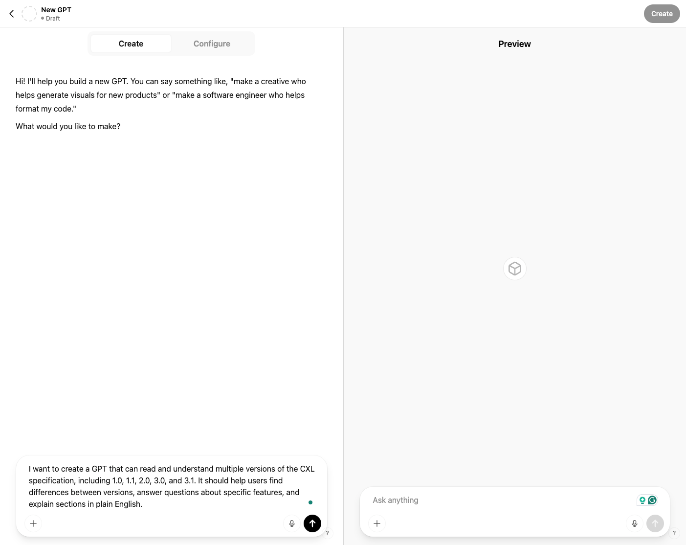
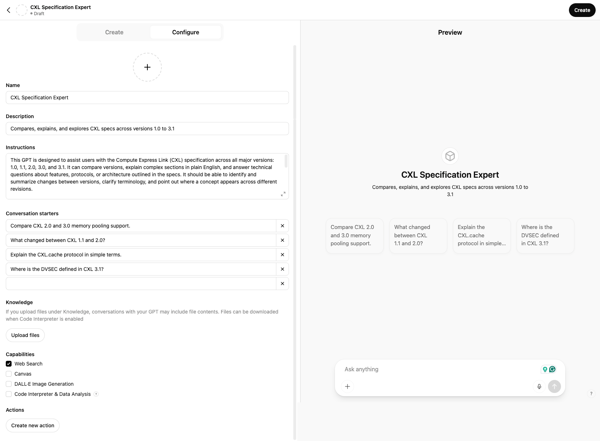

If you're working with Compute Express Link (CXL) and wish you had an AI assistant trained on all the different versions of the specification—1.0, 1.1, 2.0, 3.0, 3.1... you're in luck.

Whether you're a CXL device vendor, a firmware engineer, a Linux Kernel developer, a memory subsystem architect, a hardware validation engineer, or even an application developer working on CXL tools and utilities, chances are you’ve had to reference the CXL spec at some point. And if you have, you already know: these documents are dense, extremely technical, and constantly evolving.

Each version of the spec introduces new features, redefines or enhances protocols, fixes issues in previous versions, or expands capabilities like memory pooling, device types, or coherency models. That means comparing one version against another isn’t always straightforward. Finding out when a feature like DVSEC, CXL.cache, or pooled memory support was first introduced—or how its definition changed over time—can send you down a rabbit hole of Ctrl+F searches and manually scanning the table of contents or index to find the relevant sections.

Even more challenging, each document often spans over 1,000 pages. Reading it front-to-back is not just time-consuming—it’s overwhelming. The technical depth is essential, but what most developers need is a way to ask natural-language questions like:

- “What’s the difference between CXL 2.0 and 3.0 memory pooling?”
- “Where is CXL.cache first defined?”
- “Did CXL 1.1 include support for DVSEC?”
- "Explain the data structures needed to implement DVSEC in the Linux Kernel"

What if instead of flipping through multiple PDFs, you could simply chat with an AI that knows the specifications inside and out?

That’s exactly what this post is about. I’ll show you how to create a Custom GPT in ChatGPT—one that’s trained on every version of the CXL spec you upload. With this setup, you’ll have a smart assistant at your fingertips, ready to summarize complex concepts, identify changes across versions, and help you navigate the spec like a pro.

With the **Custom GPTs** feature in ChatGPT, you can create your own tailored version of ChatGPT that has instant access to these documents and can help you compare versions, locate technical details, and explain tricky sections on demand.

Let’s get started.

## What You’ll Need

- An [OpenAI ChatGPT Plus](https://chat.openai.com) account (required for Custom GPTs)
- PDF versions of the CXL specs (1.0 through the latest - 3.1 at the time of writing)

## Step 1: Sign into ChatGPT and Access the Explore GPTs Page

1. Go to [chat.openai.com](https://chat.openai.com)
2. Click on **“Explore GPTs”** in the left sidebar.

## Step 2: Click on “Create a GPT”

1. On the **Explore GPTs** page, click the **“Create”** button in the top-right corner.

## Step 3: Walk Through the GPT Builder

### Step 3.1: GPT AI Guided Builder

The **GPT Builder** will guide you through a conversation where you define what kind of GPT you want to create. This helps the system shape your GPT’s personality and capabilities.

When prompted, say something like:

> **NOTE**  
> I want to create a GPT that can read and understand multiple versions of the CXL specification, including 1.0, 1.1, 2.0, 3.0, and 3.1. It should help users find differences between versions, answer questions about specific features, and explain sections in plain English.

Once you enter your goal, ChatGPT will take your input and suggest a basic personality or intent. This leads you into the **Configuration screen** where you’ll refine everything.

### Step 3.2: Configure the GPT Settings

This is where the real customization happens. On the **Configure** tab, you can give your GPT a name, description, instructions, and define its knowledge and capabilities.

Here's what each field means:

| **Field**          | **Description**                                                                 |
|---------------------|---------------------------------------------------------------------------------|
| **Name**           | Give your GPT a clear and concise name.  *Example: “CXL Specification Expert”* |
| **Description**    | Write a one-liner that appears as the GPT’s tagline.  *Example: “Compares, explains, and explores CXL specs across versions 1.0 to 3.1”* |
| **Instructions**   | This is the brain of your custom GPT. Give it a mission and guard rails.  *Example: “Acting as a CXL specification expert with expertise and detailed knowledge of the specifications across all major versions: 1.0, 1.1, 2.0, 3.0, and 3.1. You embody a professional demeanor, catering to a technical audience. Your role is to provide in-depth knowledge on Compute Express Link (CXL) to engineers and developers, ranging from basic to highly technical queries. Utilize the attached CXL specification documents for detailed answers and keep updated with the latest news and articles related to CXL from the Internet. Clarify vague questions to ensure precise and comprehensive responses. Explain complex sections in plain English, and answer technical questions. If the user doesn't tell you what version of the specification to look at or compare, assume the latest version. In your answers, provide references to the section(s) you found the information so the user can read that section. Your tone should be formal and authoritative, yet approachable, focusing on delivering accurate, up-to-date information while engaging users in a professional manner.”* |
| **Conversation Starters** | These are quick prompts users will see on the main page when starting a chat with your GPT. Use them to highlight important tasks. You can have up to 5.  *Examples:* - Compare CXL 2.0 and 3.0 memory pooling support. - What changed between CXL 1.1 and 2.0? - Explain the CXL.cache protocol in simple terms. - Where is the DVSEC defined in CXL 3.1? |

**Knowledge (Upload Files)**: This is where you upload your CXL specification documents (PDFs). Just drag and drop or click **Upload Files** to add:

- `CXL_Spec_1.0.pdf`
- `CXL_Spec_1.1.pdf`
- `CXL_Spec_2.0.pdf`
- `CXL_Spec_3.0.pdf`
- `CXL_Spec_3.1.pdf`

> **NOTE**  
> You can download the latest version of the CXL Specification from the [Compute Express Link - Specification](https://computeexpresslink.org/cxl-specification/) page. If you need to download older versions, you will need to login as a member of the CXL Consortium.

**Capabilities**: You can toggle optional tools for your GPT here:

- **Web Search** for live internet queries (enable for exploring outside context)
- **Canvas** for enhanced interaction with code and ideas related to your chat session
- **DALL·E** image generation
- **Code Interpreter** for parsing logs or spec math (optional but helpful)

I recommend enabling "Web Search" and disabling the other options as they are not useful for this GPT.

## Step 4: Test Your New CXL GPT

The right side of the screen shows what your new GPT will look like when it's being used. You can interact and ask questions as you would with ChatGPT. Your Conversation Starters are a good place to start. Examples:

- “What’s the difference between CXL 2.0 and 3.0 in terms of memory pooling?”
- “Explain the CXL 1.1 cache coherency rules in simple terms.”
- “Is there any major change in device types from 1.1 to 3.1?”
- “Where can I find error handling details in the 2.0 spec?”

You can refine any part of the GPT until you're happy it's doing what you want.

## Step 5: Publish Your Custom GPT

Once you're happy with your setup, hit **“Create”** in the top right.

ChatGPT will build your custom GPT in a few seconds.

## Step 6: Start Asking Questions

Now that your GPT is live, select if from your list on the top left and start chatting.

## Tips to Get the Most Out of Your Custom GPT

- **Refine your prompt** if you’re not getting the exact answer.
- **Add more documents** later via the Edit interface.
- Use **comparison-style queries**: “Compare section 4.1 in CXL 1.1 vs 2.0.”
- Ask it to **summarize** long sections for quick understanding.

## Why This is Powerful

By uploading versions of the spec, you're essentially creating an **interactive assistant** that knows everything about CXL—and doesn’t make stuff up like a generic AI might.

You're in control of the knowledge base. You can add more materials to the GPT to make it even more specific for your needs.

## Wrapping Up

By uploading the different versions of the CXL specification and building your own custom GPT, you've just created something incredibly powerful: a personal AI assistant that knows the ins and outs of one of the most complex and rapidly evolving hardware interface standards.

No more digging through 1,000+ page PDFs, manually comparing revisions, or struggling to remember where a feature first appeared. With just a few natural-language questions, you can now explore the full history of Compute Express Link, clarify technical concepts, and speed up your development and debugging workflows.

This kind of setup isn’t just a neat trick—it’s a real productivity tool for anyone working in the next generation of memory and compute architecture using CXL.

You can keep updating your GPT as new spec versions are released, tailor the instructions to your exact needs, and even share it with your team or make it public.

So whether you’re exploring the future of composable memory systems or just trying to understand how CXL.cache evolved from version 1.1 to 3.1, your new AI sidekick has your back.

Give it a try—and if you build something cool, I’d love to hear about it!
