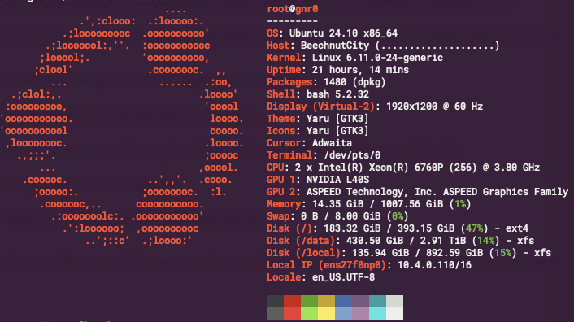

If you love customizing your Linux terminal and getting a quick, visually appealing overview of your system specs, you might have used `neofetch` in the past. However, **`neofetch` is now deprecated and no longer actively maintained**. A fantastic, actively maintained alternative is **Fastfetch** – known for its speed, extensive customization options, and feature set.

While you _might_ be able to install Fastfetch on Ubuntu 22.04 (Jammy Jellyfish) using the standard `sudo apt install fastfetch`, the version available in the default Ubuntu repositories is often outdated. To get the **latest features, bug fixes, and performance improvements**, you'll want to use a different method.

This guide presents two reliable ways to install a newer version of Fastfetch on Ubuntu 22.04:

1. **Manual Installation:** Downloading the `.deb` package directly from GitHub Releases.
2. **PPA Method:** Adding a Personal Package Archive (PPA) for easier installation and updates via `apt`.

Choose the method that best suits your needs!

### Prerequisites

- An Ubuntu 22.04 LTS system (or newer for the PPA method).
- Access to the terminal.
- `sudo` privileges (administrator rights).
- An internet connection.

----------

## Method 1: Manual Installation via DEB Package

This method gives you precise control over the version you install directly from the official GitHub source.

1. **Navigate to the GitHub Releases Page:** Open your web browser and go to the official Fastfetch releases page: [https://github.com/fastfetch-cli/fastfetch/releases](https://github.com/fastfetch-cli/fastfetch/releases)
2. **Locate the Latest Release:** Find the latest stable release (usually at the top).
3. **Find the Correct DEB File:** Under the "Assets" section, look for the `.deb` file built for 64-bit Debian/Ubuntu systems, e.g., `fastfetch-linux-amd64.deb`.
4. **Download the File:** Copy the link address from the GitHub page, open your terminal, and use `wget`:

    ```bash
    wget https://github.com/fastfetch-cli/fastfetch/releases/download/2.41.0/fastfetch-linux-amd64.deb
    ```

5. **Install the DEB package:** Use `sudo dpkg -i` followed by the downloaded filename:

    ```bash
    sudo dpkg -i fastfetch-linux-amd64.deb
    ```

    This command attempts to install the package but might fail due to missing dependencies.

6. **Resolve missing dependencies:** `dpkg` doesn't automatically handle dependencies. Use `apt` to fix this:

    ```bash
    sudo apt --fix-broken install -y
    ```

    This command downloads and installs any libraries Fastfetch needs from the Ubuntu repositories.

7. **Verify fastfetch works:** Run `fastfetch` or `sudo fastfetch`.  You should see the colorful system information output.

    

## Method 2: Installing via PPA (Recommended for Easier Updates)

Using a Personal Package Archive (PPA) allows you to install Fastfetch using `apt` and receive updates automatically when you run `sudo apt update && sudo apt upgrade`. This PPA is maintained for Ubuntu 22.04 and newer.

1. **Add the Fastfetch PPA:** Open your terminal and run the following command to add the PPA to your system's software sources:

    ```bash
    sudo add-apt-repository ppa:zhangsongcui3371/fastfetch
    ```

2. **Update Package Lists** After adding the PPA, you need to refresh your system's package list so it knows about the packages available from the new source:

    ```bash
    sudo apt update
    ```

3. **Install Fastfetch from the PPA:** You can install Fastfetch using the standard `apt` command. Since the PPA likely contains a newer version than the default Ubuntu repositories, `apt` will prefer the PPA version:

    ```bash
    sudo apt install fastfetch -y
    ```

4. **Verify fastfetch works:** Run `fastfetch` or `sudo fastfetch`.  You should see the colorful system information output.

    

## (Optional) Updating and Uninstalling

- **Updating (DEB Method):** Repeat Steps 1-3 of Method 1 with the newer `.deb` file.
- **Updating (PPA Method):** Simply run the standard system update commands. The PPA ensures you get the latest Fastfetch version it provides:

    ```bash
    sudo apt update
    sudo apt upgrade
    ```

- **Uninstalling (Either Method):** Use `apt` to remove the package:

    ```bash
    sudo apt remove fastfetch
    ```

- **(Optional) Removing the PPA:** If you used Method 2 and want to remove the PPA (e.g., before uninstalling):

    ```bash
    sudo add-apt-repository --remove ppa:zhangsongcui3371/fastfetch
    sudo apt update
    ```

## Fastfetch Examples

Fastfetch is incredibly powerful and configurable right from the command line. While simply running `fastfetch` gives you an excellent default output, here are some examples to help you explore its capabilities further.

Remember that Fastfetch has _many_ options. These examples cover some everyday use cases:

1. **Basic System Information:** Displays the default configured system information.

    ```bash
    fastfetch
    ```

2. **Get Help:** This command shows all available command-line options and arguments. It's the best place to start if you want to explore more!

    ```bash
    fastfetch --help
    ```

3. **List Available Information Modules:** See all the different pieces of information Fastfetch can potentially display (like OS, Kernel, CPU, GPU, Memory, Disk, etc.).

    ```bash
    fastfetch --list-modules
    ```

4. **List Available Configuration Presets:** Fastfetch comes with several pre-made configuration layouts. This command lists them.

    ```bash
    fastfetch --list-presets
    ```

5. **Use a Specific Preset:** Load one of the pre-made configuration layouts. For example, to use the minimal preset:

    ```bash
    fastfetch -c minimal
    ```

    _(Try others like `laptop`, `dev`, or `all` after listing them!)_

6. **List Available ASCII Logos:** See the extensive list of distribution and hardware logos Fastfetch can display.

    ```bash
    fastfetch --list-logos
    ```

7. **Use a Specific Logo:** Override the default logo. For example, to use the 'debian' logo regardless of your actual distribution:

    ```bash
    fastfetch -l debian
    ```

    _(Replace `debian` with any name from the `--list-logos` output)._

8. **Disable the Logo:** Run Fastfetch without displaying any ASCII art logo.

    ```bash
    fastfetch --logo none
    ```

9. **Show Specific Modules:** Display only the modules you specify, separated by colons (:).

    ```bash
    fastfetch -s OS:Host:Kernel:CPU:GPU:Memory
    ```

    _(Use module names from the `--list-modules` output)._

10. **Show System Colors:** Displays the 8 primary terminal colors and their codes.

    ```bash
    fastfetch --show-colors
    ```

11. **Generate a User Configuration File:** Creates a default configuration file at ~/.config/fastfetch/config.jsonc (or config.jsonc inside $XDG_CONFIG_HOME/fastfetch). You can then edit this file to customize Fastfetch's output permanently.

    ```bash
    fastfetch --gen-config
    ```

    _(Note: This command only generates the file; it doesn't show system info immediately.)_

Fastfetch offers a wealth of customization. Don't hesitate to use `fastfetch—-help` to discover all the flags and options available to tailor the output exactly to your liking.
