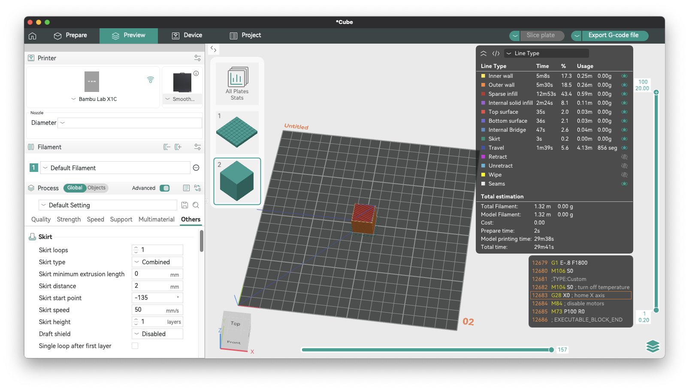
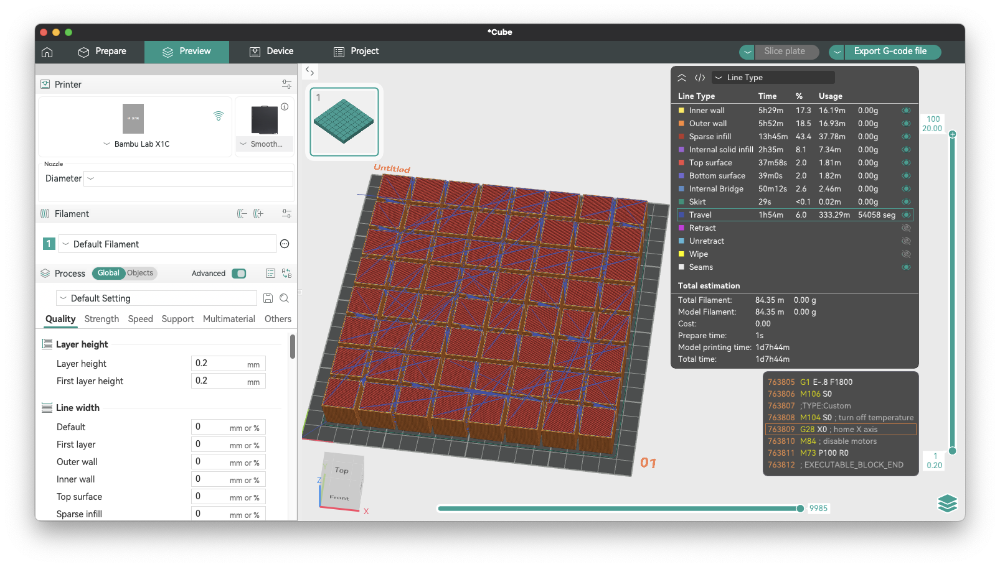

[OrcaSlicer](https://www.orcaslicer.com/) is a powerful and popular slicer for 3D printers, known for its rich feature set and active development community. In this blog post, we'll take a closer look at a new feature I proposed and implemented that provides more insight into your prints: the display of total travel distance and the number of travel moves. See the [feat: Display travel distance and move count in G-code summary](https://github.com/OrcaSlicer/OrcaSlicer/pull/11187) for more details.

## Why Care About Travel Moves?

As somebody who loves to optimize applications and dig deeper to understand where the bottlenecks are in systems, I've been interested in understanding and optimizing the travel moves in 3D printing. As an enthusiast, and someone who cares about efficiency, it bothers me that for many of my prints, travel moves can account for a significant portion of the total print time. We'll get into the seemingly unoptimized travel path decisions made by the slicer in future posts. To give me a solid foundation for that future work, I embarked on a journey to add a feature to OrcaSlicer that would give users clear visibility into the travel distance and the number of travel moves in their prints.

Travel moves are the non-extruding movements of the print head. While they are necessary to move from one part of the print to another, they are essentially "wasted" time. Optimizing travel moves can lead to faster print times and help reduce stringing and other print artifacts.

As a DIYer, 10 to 30 minutes here and there saved on travel moves it's a big deal, especially for overnight prints that can take many hours. But for print farms, even a 5-10% saving could mean significant cost reductions and increased productivity per printer. Reducing travel time can also lead to less wear and tear on the printer's mechanical components.

Until now, there was no way to get a clear picture of the total travel distance and the number of travel moves in a print. Slicers already display the amount of wallclock time consumed by travel moves and as a percentage of the overall print time, but don't show the total distance - in metres or feet/inches - or number of independent movement operations, making it challenging to assess the impact of different slicer settings on travel efficiency. The code was already there to calculate this information, but it wasn't being surfaced to the user.

I'm not the first to think about this problem, but I wanted to take a hands-on approach to solving it. See [Feature Request - Tool path odometer](https://github.com/SoftFever/OrcaSlicer/discussions/5269) for prior discussion.

## Why Distance AND Segments Matter

If we only show the total distance traveled, we lose information. It's a Traveling Salesman Problem (TSP) where distance and segments are important.

This metric can be quite valuable for users, including, but not limited to:

*   **Print Time Optimization**: Every travel move adds non-printing time to the print. A higher segment count means more time spent moving without extruding, so users aiming for faster prints can use this information to adjust the model or settings for more efficiency.
*   **Potential for Print Defects**: Beyond stringing, a high number of travel moves can contribute to issues like blobs or zits, where the nozzle starts and stops may leave marks on the model. Monitoring segment counts helps users identify when a model or slicer setting might be causing excessive starts and stops.
*   **Nozzle Path Planning**: Users might want to evaluate whether the slicer is generating efficient toolpaths. An unusually high number of travels may indicate inefficient routing, which can be improved by adjusting model orientation or slicer settings.
*   **Increased Wear & Maintenance**: More rapid and frequent moves can increase wear on printer mechanisms over time. Users tracking segment counts can anticipate maintenance needs or adjust their print settings to reduce unnecessary movement.
*   **Layer Changes**: Segment count can correlate with the number of layer changes or complex features in a model, which is useful for troubleshooting or refining designs with intricate geometries.

For anyone working on new algorithms or updating/tuning existing ones, the segment count helps to compare the results. The segment metric is critical when training AI models using reinforcement learning. This was my original goal/desire for this PR.

## Implementing the Odometer Feature

To address this, I wrote a new feature to OrcaSlicer that displays the total travel distance and the number of travel moves (segments) in the G-code viewer's "Line Type" summary in the "Usage" column. You can see the new feature in action with a single 20mm x 20mm x 20mm cube sliced with default settings, and a full plate of 64 cubes.





This new feature provides at-a-glance information about the travel moves in your print, allowing you to quickly assess the efficiency of your slicing settings.

## The Bug We Found Along the Way

During the development of this feature, an interesting bug was discovered in the G-code processor. The travel distance was not being calculated correctly for non-extruding travel moves. Results from the initial implementation showed the total travel distance for a single 20mm x 20mm x 20mm cube was over 7 metres, which seemed excessive. By observing the travel paths at different layers and doing some napkin trigonometry, it became clear that the result was significantly inflated. I calculated I should expect a result closer to 4 metres. The cause turned out to be the variable that stored the distance of a move was only being updated for extrusion moves, leading to inaccurate travel distance statistics.

This bug was fixed by ensuring that the distance is calculated for all relevant move types, not just extrusions. This fix, combined with the new feature, provides accurate and reliable travel statistics.

## Verifying with Python

To ensure the accuracy of the new feature and the bug fix, I developed a Python script to parse the sliced G-code file and calculate the travel distance and moves independently. By calculating the travel distance and number of moves/segments from the actual G-Code, allowed me to confirm my initial napkin math was correct, and that the solution implemented in OrcaSlicer could be trusted. The Python script, available from the appendix, mimics OrcaSlicer's G-code processor's logic, providing a valuable tool for verification and debugging.

This script can be run from the command line and takes a G-code file as an argument. It then prints the total travel distance and the number of travel moves, which can be compared with the values displayed in OrcaSlicer.

Running the script against the two test files used in the screenshots above produced the following results:

```bash
python3 travel_path_calc.py tmp/Cube_PLA_29m41s.gcode 
Total travel distance: 4.1285m
Number of travel moves: 856
```

```bash
python3 travel_path_calc.py tmp/Cube_PLA_1d7h44m.gcode 
Total travel distance: 333.2523m
Number of travel moves: 54058
```

Minor differences in how C++ and Python handle floating-point arithmetic can lead to small variations in the final calculated distance. The results are within the margin of acceptable difference (~4cm over ~333m ~= 0.012%). I'm okay with that level of discrepency.

## Conclusion

The new travel statistics in OrcaSlicer provide valuable insights into your prints, helping you to optimize your slicing settings for speed and quality.

I encourage you to try out this new feature and provide your feedback. You can find the implementation details in the GitHub pull request.

**Pull Request:** [https://github.com/SoftFever/OrcaSlicer/pull/11187](https://github.com/SoftFever/OrcaSlicer/pull/11187)

At the time of writing (Oct 29th 2025), this feature was developed on OrcaSlicer version 2.3.2-dev and I hope it's merged in a future stable release (>=2.3.2).

Happy printing!

## Appendix A: Python Script to Calculate Travel Distance and Moves

Here is the Python script:

```python
import math
import re
import sys

def calculate_travel_distance(gcode_content):
    """
    Calculates the total travel distance and number of travel moves from a G-code file content.

    This function parses the G-code line by line, keeps track of the printer's state (position, positioning mode),
    and classifies each move to identify travel moves. It then calculates the distance for each travel move
    and accumulates the total distance and segment count.

    Args:
        gcode_content (str): The content of the G-code file as a string.

    Returns:
        tuple: A tuple containing:
            - float: The total travel distance in meters.
            - int: The total number of travel moves (segments).
    """
    total_distance = 0
    num_segments = 0
    
    # Keep track of the last known position of the toolhead
    last_x, last_y, last_z, last_e = 0.0, 0.0, 0.0, 0.0
    
    # G-code positioning modes
    absolute_positioning = True
    e_absolute_positioning = True

    # State for wiping
    wiping = False

    lines = gcode_content.splitlines()

    for line_num, line in enumerate(lines, 1):
        # Strip comments and whitespace
        comment_part = ''
        code_part = line
        if ';' in line:
            parts = line.split(';', 1)
            code_part = parts[0]
            comment_part = parts[1]

        code_part = code_part.strip()

        # Update wiping state based on comments
        if "WIPE_START" in comment_part:
            wiping = True
        if "WIPE_END" in comment_part:
            wiping = False

        if not code_part:
            continue

        # Update positioning modes
        if code_part.startswith('G90'):
            absolute_positioning = True
            continue
        if code_part.startswith('G91'):
            absolute_positioning = False
            continue
        if code_part.startswith('M82'):
            e_absolute_positioning = True
            continue
        if code_part.startswith('M83'):
            e_absolute_positioning = False
            continue

        # Process G0/G1/G28 moves
        if code_part.startswith('G1') or code_part.startswith('G0') or code_part.startswith('G28'):
            current_x, current_y, current_z, current_e = last_x, last_y, last_z, last_e
            
            if code_part.startswith('G28'):
                # G28 is a homing command. OrcaSlicer treats it as a G1 move to origin.
                has_axis = False
                if 'X' in code_part:
                    current_x = 0
                    has_axis = True
                if 'Y' in code_part:
                    current_y = 0
                    has_axis = True
                if 'Z' in code_part:
                    current_z = 0
                    has_axis = True
                if not has_axis:
                    current_x, current_y, current_z = 0, 0, 0
            else:
                # Parse X, Y, Z, E coordinates from the G-code line
                x_match = re.search(r'X([\d.-]+)', code_part)
                if x_match:
                    val_str = x_match.group(1)
                    if val_str and val_str not in (".", "-."):
                        val = float(val_str)
                        current_x = val if absolute_positioning else last_x + val

                y_match = re.search(r'Y([\d.-]+)', code_part)
                if y_match:
                    val_str = y_match.group(1)
                    if val_str and val_str not in (".", "-."):
                        val = float(val_str)
                        current_y = val if absolute_positioning else last_y + val

                z_match = re.search(r'Z([\d.-]+)', code_part)
                if z_match:
                    val_str = z_match.group(1)
                    if val_str and val_str not in (".", "-."):
                        val = float(val_str)
                        current_z = val if absolute_positioning else last_z + val

                e_match = re.search(r'E(-?[\d.]+)', code_part)
                if e_match:
                    val_str = e_match.group(1)
                    if val_str and val_str not in (".", "-."):
                        val = float(val_str)
                        current_e = val if e_absolute_positioning else last_e + val

            # Calculate deltas for each axis
            delta_x = current_x - last_x
            delta_y = current_y - last_y
            delta_z = current_z - last_z
            delta_e = current_e - last_e

            # Classify the move type based on the deltas
            move_type = "Noop"

            if wiping:
                move_type = "Wipe"
            elif delta_e < 0.0: # Retraction
                if delta_x != 0.0 or delta_y != 0.0 or delta_z != 0.0:
                    move_type = "Travel"
                else:
                    move_type = "Retract"
            elif delta_e > 0.0: # Extrusion or Unretraction
                if delta_x == 0.0 and delta_y == 0.0:
                    if delta_z == 0.0:
                        move_type = "Unretract"
                    else:
                        # Z-hop during unretraction is considered a travel move
                        move_type = "Travel"
                elif delta_x != 0.0 or delta_y != 0.0:
                    move_type = "Extrude"
            elif delta_x != 0.0 or delta_y != 0.0 or delta_z != 0.0: # No extrusion change, but XYZ movement
                move_type = "Travel"

            # If the move is a travel move, calculate the distance and add to the total
            if move_type == "Travel":
                distance = math.sqrt(delta_x**2 + delta_y**2 + delta_z**2)
                if distance > 0.0001: # Avoid floating point errors
                    total_distance += distance
                    num_segments += 1
            
            # Update the last known position
            last_x, last_y, last_z, last_e = current_x, current_y, current_z, current_e
        
        elif code_part.startswith('G92'):
            # G92: Set Position. This command sets the current position to the given values.
            x_match = re.search(r'X([\d.-]+)', code_part)
            if x_match:
                val_str = x_match.group(1)
                if val_str and val_str not in (".", "-."):
                    last_x = float(val_str)
            y_match = re.search(r'Y([\d.-]+)', code_part)
            if y_match:
                val_str = y_match.group(1)
                if val_str and val_str not in (".", "-."):
                    last_y = float(val_str)
            z_match = re.search(r'Z([\d.-]+)', code_part)
            if z_match:
                val_str = z_match.group(1)
                if val_str and val_str not in (".", "-."):
                    last_z = float(val_str)
            e_match = re.search(r'E([\d.-]+)', code_part)
            if e_match:
                val_str = e_match.group(1)
                if val_str and val_str not in (".", "-."):
                    last_e = float(val_str)

    return total_distance / 1000, num_segments

if __name__ == "__main__":
    if len(sys.argv) != 2:
        print("Usage: python gcode_analyzer.py <gcode_file>")
        sys.exit(1)

    gcode_file_path = sys.argv[1]
    with open(gcode_file_path, 'r') as f:
        gcode_content = f.read()

    distance_m, segments = calculate_travel_distance(gcode_content)
    print(f"Total travel distance: {distance_m:.4f}m")
    print(f"Number of travel moves: {segments}")
```
