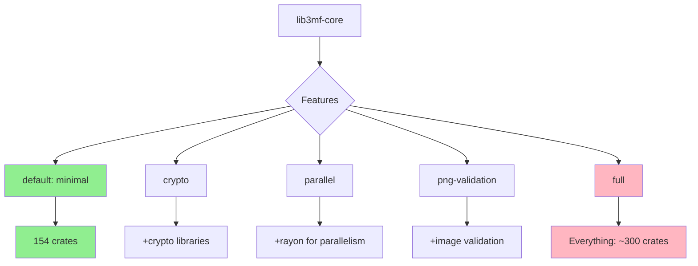

## Series: Building lib3mf-rs

This post is part of a 5-part series on building a comprehensive 3MF library in Rust:

1. [Part 1: My Journey Building a 3MF Native Rust Library from Scratch](<>)
2. [Part 2: The Library Landscape - Why Build Another One?](<>)
3. [Part 3: Into the 3MF Specification Wilderness - Reading 1000+ Pages of Specifications](<>)
4. [Part 4: Design for Developers - Features, Flags, and the CLI](<>)
5. [Part 5: Reflections and What's Next - Lessons from Building lib3mf-rs](<>)

Understanding the specifications was one thing. Designing a library that developers would actually want to use? That was another challenge entirely. I've worked on many libraries over the years, and I've learned a lot about what makes a good library, for example the [Persistent Memory Development Kit](https://github.com/pmem/pmdk). The difference is understanding how Rust does things.

This is the story of the architectural decisions that shaped lib3mf-rs, and how we made its power accessible to everyone—developers and non-developers alike.

## Core Design Principles

Three principles guided every design decision:

1. **Memory safety without compromise**
2. **Minimal dependencies by default (feature-flagged crates)**
3. **Developer choice over forced decisions**

## Principle 1: Memory Safety Without Compromise

Rust's promise is memory safety without garbage collection. But Rust also allows `unsafe` code when you need to bypass the borrow checker.

We made a hard rule: **Zero unsafe code in public APIs.**

This means:
```rust
// This compiles - the borrow checker guarantees safety
let model = Model::from_file("model.3mf")?;
let mesh = model.object(0)?.mesh();
for triangle in mesh.triangles() {
    // Iterate safely, no bounds checking needed at runtime
}
// Automatically cleaned up when model goes out of scope
```

Compare to manual memory management:

```cpp
// C++ equivalent - easy to get wrong
Lib3MF::PModel pModel;
wrapper->CreateModel(&pModel);
// ... use pModel
pModel->Release(); // Forget this? Memory leak.
                   // Call it twice? Crash.
```

The borrow checker enforces correctness at compile time. If your code compiles, entire categories of bugs simply cannot occur:

- No use-after-free
- No double-free
- No dangling pointers
- No data races in concurrent code

For file parsing—where you're processing untrusted input—this matters immensely.

## Principle 2: Minimal Dependencies by Default

A common complaint about any project: "I just wanted to parse a file, why did it pull in 500 dependencies?"

We addressed this with aggressive feature-flagging:


### The Default: Just Parsing

If you just want to read and parse 3MF files, you can use the default feature set:

```toml
[dependencies]
lib3mf-core = "0.1"
```

This gives you:
- Read and write 3MF files
- All nine specifications
- Validation and repair
- **154 dependencies** total

That's it. No cryptography libraries. No image processing. No parallel execution frameworks.

### Optional Features

Want digital signatures and encryption?

```toml
[dependencies]
lib3mf-core = { version = "0.1", features = ["crypto"] }
```

Now you get:
- Digital signature creation and verification
- Content encryption and decryption
- Certificate chain validation
- **~300 dependencies** (adds OpenSSL, ring, other crypto crates)

Want parallel processing for large meshes?

```toml
[dependencies]
lib3mf-core = { version = "0.1", features = ["parallel"] }
```

This adds:
- Rayon for data parallelism
- Concurrent mesh processing
- Parallel validation

Want everything?

```toml
[dependencies]
lib3mf-core = { version = "0.1", features = ["full"] }
```

The point: **You choose what you pay for.** Use a simple 3MF parser? Pay minimal cost. Need full functionality? Pay the full cost. Don't pay for what you don't use.

## Principle 3: Developer Choice Over Forced Decisions

We designed multiple ways to accomplish the same task, optimized for different use cases:

### Parsing Strategies: DOM vs. Streaming

**DOM (Document Object Model)** - Fast, memory-intensive:
```rust
// Load entire model into memory
let model = Model::from_file("large.3mf")?;

// Fast random access to any part
let obj = model.object(5)?;
let triangle = obj.mesh().triangle(1000)?;
```

**Streaming** - Slower, constant memory:
```rust
// Process model incrementally
let reader = ModelReader::from_file("large.3mf")?;

for event in reader.events() {
    match event? {
        Event::Triangle(tri) => process_triangle(tri),
        Event::Material(mat) => process_material(mat),
        // ... handle events as they arrive
    }
}
```

Use DOM when you have memory and need speed. Use streaming when processing multi-gigabyte files on limited hardware.

### Error Handling: No Panics

Rust has `panic!()` for unrecoverable errors. We never use it in public APIs:
```rust
// Always returns Result - never panics
pub fn object(&self, index: usize) -> Result<&Object> {
    self.objects.get(index)
        .ok_or(Error::ObjectNotFound(index))
}

// Caller decides how to handle errors
match model.object(10) {
    Ok(obj) => println!("Found object: {}", obj.name()),
    Err(e) => eprintln!("Error: {}", e),
}
```

This philosophy extends throughout: Every fallible operation returns `Result`. Callers can choose error handling strategy.

### Trait-Based Abstractions

We use Rust's trait system to enable flexibility:
```rust
// Read from anything that implements Read
pub fn from_reader<R: Read>(reader: R) -> Result<Model> {
    // ...
}

// Works with files:
let model = Model::from_reader(File::open("model.3mf")?)?;

// Works with byte arrays:
let model = Model::from_reader(&bytes[..])?;

// Works with network streams:
let model = Model::from_reader(tcp_stream)?;
```

Traits enable generic code that works across diverse contexts.

## The CLI: Democratizing Access

Here's where we made a crucial decision: **You shouldn't need to be a Rust developer—or any developer—to use lib3mf-rs.**

Enter `lib3mf-cli`.

### Installation
```bash
cargo install lib3mf-cli
```

One command. No Rust knowledge required to use it after installation.

### Capabilities

The CLI exposes every library capability through subcommands:

| Command | Purpose | Use Case |
|---------|---------|----------|
| `stats` | Analyze model geometry & metadata | "How many triangles in this model?" |
| `validate` | Check 3MF conformance | "Why does my slicer reject this file?" |
| `repair` | Fix mesh geometry issues | "Repair non-manifold geometry" |
| `list` | View archive contents | "What's inside this 3MF?" |
| `extract` | Extract embedded files | "Get the thumbnail image" |
| `convert` | Format conversion | "Convert STL to 3MF" |
| `diff` | Compare two models | "What changed between versions?" |
| `verify` | Check digital signatures | "Is this file authentic?" |
| `encrypt` | Encrypt content | "Protect proprietary design" |
| `decrypt` | Decrypt content | "Access encrypted model" |
| `sign` | Create digital signature | "Sign model for distribution" |
| `rels` | Inspect OPC relationships | "Debug relationship issues" |
| `dump` | Debug model structure | "See raw XML structure" |
| `copy` | Roundtrip validation | "Test read/write accuracy" |
| `benchmark` | Performance testing | "How fast does parsing run?" |
| `thumbnails` | Manage preview images | "Extract all thumbnails" |

### Real-World Examples

**Analyzing a Bambu Studio project:**

```bash
$ lib3mf-cli stats benchy.3mf

Model Statistics
═══════════════════════
File: benchy.3mf
Format: 3MF v1.4.0

Geometry
────────────────────────
  Objects: 1
  Triangles: 112,474
  Vertices: 56,237
  Bounding Box: 60.0 × 48.0 × 60.0 mm
  Volume: 28.3 cm³
  Surface Area: 89.4 cm²

Materials
────────────────────────
  Base Materials: 1
    • PLA (Generic) - #FF5722

Build Items
────────────────────────
  Items: 1
  Build Volume: 256 × 256 × 256 mm

Extensions
────────────────────────
  ✓ Production Extension
  ✓ Slice Extension (245 layers)
  ✓ Materials Extension
```

**Validating a file:**
```bash
$ lib3mf-cli validate model.3mf --level strict

Validation Results
═══════════════════════
Status: ⚠️ Warnings Found

Errors: 0
Warnings: 2
Info: 1

Warnings
────────────────────────
⚠ Object 'Cube': Triangle 1523 has near-zero area (< 0.001 mm²)
⚠ Material 'Red PLA': No physical properties defined

Info
────────────────────────
ℹ Using Core Specification v1.4.0 validation rules
```

**Extracting thumbnails for a gallery:**
```bash
$ lib3mf-cli thumbnails list model.3mf

Thumbnails
═══════════════════════
/Metadata/thumbnail.png (256×256, 45.2 KB)
/Metadata/thumbnail_small.png (64×64, 8.1 KB)

$ lib3mf-cli extract model.3mf "/Metadata/thumbnail.png" \
    --output preview.png

Extracted: preview.png (45.2 KB)
```

**Converting legacy STL to modern 3MF:**

This example uses actual code from our repository:
```bash
$ lib3mf-cli convert model.stl output.3mf \
    --material "PLA" \
    --color "#FF5722" \
    --units mm
```

The conversion uses [`examples/create_cube.rs`](https://github.com/sscargal/lib3mf-rs/blob/main/lib3mf-core/examples/create_cube.rs) logic:

```rust
use lib3mf_core::model::*;

// Create mesh programmatically
let mut mesh = Mesh::new();

// Add vertices
let v0 = mesh.add_vertex(0.0, 0.0, 0.0);
let v1 = mesh.add_vertex(10.0, 0.0, 0.0);
let v2 = mesh.add_vertex(10.0, 10.0, 0.0);
let v3 = mesh.add_vertex(0.0, 10.0, 0.0);
// ... more vertices

// Add triangles (2 per face, 12 total)
mesh.add_triangle(v0, v2, v1); // Bottom face
mesh.add_triangle(v0, v3, v2);
// ... more triangles

// Create object and build item
let mut model = Model::new();
let obj_id = model.add_object(mesh);
model.add_build_item(obj_id, Transform::identity());

// Save to file
model.save("cube.3mf")?;
```

**Debugging why a slicer rejects a file:**
```bash
$ lib3mf-cli validate broken.3mf --verbose

Validation Results
═══════════════════════
Status: ❌ Invalid

Errors: 3

Critical Errors
────────────────────────
✗ Object 'Part1': Triangle 847 references non-existent vertex index 15003
  Maximum valid vertex index: 15000
  Location: /3D/3dmodel.model line 1247

✗ Duplicate build item IDs: build items 0 and 3 both use ID "1"
  Location: /3D/3dmodel.model lines 89, 142

✗ Material 'Composite1' references undefined base material 'PLA_Red'
  Defined materials: ['PLA_Blue', 'TPU_Clear']
  Location: /3D/3dmodel.model line 67
```

Now you know exactly what's wrong and where to fix it.

## Why the CLI Matters

The CLI transforms lib3mf-rs from a developer tool into a universally accessible utility:

- **3D printing enthusiasts** can validate and analyze their files
- **Print farm operators** can batch-process models for validation
- **Designers** can extract thumbnails without opening CAD software
- **Educators** can teach 3MF structure with concrete examples
- **QA engineers** can automate 3MF testing in CI/CD pipelines

One library. Two audiences. Maximum impact.

## Performance Characteristics

We designed for performance, but without sacrificing safety:

- **Lazy parsing**: Only parse sections you access
- **Zero-copy where possible**: Reference data in place rather than copying
- **Streaming validation**: Validate multi-GB files in constant memory
- **Optional parallelism**: Use multiple cores when beneficial

Benchmark example from [`examples/benchmark.rs`](https://github.com/sscargal/lib3mf-rs/blob/main/lib3mf-cli/examples/benchmark.rs):
```bash
$ lib3mf-cli benchmark large-model.3mf

Benchmark Results
═══════════════════════
File: large-model.3mf (127.3 MB)
Triangles: 2,847,392

Parse Time: 847ms
  - Archive extraction: 124ms
  - XML parsing: 456ms
  - Mesh construction: 267ms

Peak Memory: 892 MB
Throughput: 3,360 triangles/ms
```

Performance data like this guides optimization efforts.

## Lessons in API Design

Building lib3mf-rs taught us valuable lessons about Rust API design:

**Type safety prevents runtime errors:**
```rust
// Compile-time guarantee: only valid indices accepted
pub struct VertexIndex(usize);
pub struct TriangleIndex(usize);

// This won't compile - type mismatch:
// mesh.vertex(triangle_index) // ❌ Compiler error
mesh.vertex(vertex_index)      // ✅ Correct
```

**Builder patterns improve ergonomics:**
```rust
let model = Model::builder()
    .units(Units::Millimeter)
    .title("My Model")
    .creator("lib3mf-rs")
    .build()?;
```

**Iterators enable efficient processing:**
```rust
// Process millions of triangles efficiently
model.objects()
    .flat_map(|obj| obj.mesh().triangles())
    .filter(|tri| tri.area() > 0.001)
    .count()
```

## Looking Ahead

The architecture we built enables future extensions:

- **WASM bindings** for browser-based 3MF tools
- **Python bindings** for scripting and data analysis
- **Language server** for VS Code 3MF editing
- **Format converters** for STL, OBJ, PLY

All built on the same memory-safe foundation.
