---
title: "Self-Hosting Firecrawl on Ubuntu 25.04 with Docker Compose"
meta_title: "How to Self-Host Firecrawl on Ubuntu 25.04 with Docker Compose"
description: "Learn how to self-host Firecrawl on Ubuntu 25.04 with Docker Compose. Includes detailed step-by-step instructions for humans, and if you prefer your AI agents to do the work, a separate task file for AI coding agents."
image: "featured_image.webp"
date: 2026-04-22T12:00:00-07:00
categories: ["AI"]
author: "Steve Scargall"
tags: ["Firecrawl", "Docker Compose", "Ubuntu 25.04", "web scraping", "crawling", "API", "AI agents", "Claude Code", "Codex", "OpenClaw", "Hermes-Agent", "LangChain"]
draft: false
reading_time: 6
---

Modern AI agents — Claude Code, Codex, OpenClaw, Hermes-Agent, and custom LangChain pipelines — need a way to read the web. Not raw HTML full of navigation debris, cookie banners, and JavaScript noise, but clean structured text that a language model can actually reason about. [Firecrawl](https://www.firecrawl.dev/) is the missing piece: an open-source web scraping and crawling API that fetches any URL and returns clean Markdown, ready to drop straight into a context window or a RAG pipeline.

When you're building AI-powered applications, calling a third-party scraping service creates several problems. Every page your agent reads costs API credits. Content passes through infrastructure you don't control. Rate limits kick in at the worst possible moment mid-workflow. And for enterprise use cases, sending your agent's browsing activity to an external service may not be acceptable at all. Self-hosting Firecrawl solves all of this: your agent calls a local endpoint, latency is measured in milliseconds rather than round-trip network time, and your data never leaves your own infrastructure.

I will use FireCrawl with my Hermes-Agent to build Agent Teams. We will follow the [FireCrawl Self Hosting](https://docs.firecrawl.dev/contributing/self-host) instructions and make a few changes (improvement?) along the way for my environment.

The official `docker-compose.yaml` defaults to building all five services from source, but it ships with commented-out directives pointing to pre-built images on the GitHub Container Registry (GHCR). Switching to those images means you can run the full stack without cloning the monorepo, installing `pnpm`, or waiting through a multi-minute build. All you need are two files and about ten minutes.

## What Self-Hosting Supports (and Doesn't)

Read this before investing time in the install. Some FireCrawl cloud features are not available in self-hosted mode.

| Feature | Cloud | Self-hosted |
|---|---|---|
| `/v1/scrape`, `/v1/crawl`, `/v1/map` | ✅ | ✅ |
| JavaScript rendering (Playwright) | ✅ | ✅ |
| Screenshots | ✅ | ✅ |
| `/v1/extract` (AI extraction) | ✅ | ✅ requires an LLM configured (see Step 11) |
| `/v1/search` | ✅ | ✅ requires SearXNG configured |
| Local LLMs via Ollama or vLLM | ❌ | ✅ Experimental |
| `/agent` and `/browser` endpoints | ✅ | ❌ Not supported |
| Fire-engine (IP rotation, bot evasion) | ✅ | ❌ Not available |

If you need `/agent`, `/browser`, or Fire-engine, the cloud offering is the right choice.

## What You'll End Up With

Five containers on a shared private Docker network, with the API Service running on port 3002 as the only externally visible service:



### Installation Steps at a Glance

- **Step 1** — Install Docker Engine
- **Step 2** — Create Your Working Directory
- **Step 3** — Create `docker-compose.yaml`
- **Step 4** — Create `.env`
- **Step 5** — Authenticate with GHCR (If Required)
- **Step 6** — Pull the Images
- **Step 7** — Start the Stack
- **Step 8** — Verify the API
- **Step 9** — Run a Full Smoke Test
- **Step 10** — Operational Tips (Optional)
- **Step 11** — Connect a Local or Remote LLM (Optional)

## Prerequisites

- Ubuntu 25.04 (Use any supported version)
- 8 GB RAM and 4 CPU cores minimum
- `jq` installed (`sudo apt-get install -y jq`)
- A GitHub account and API key (only needed if GHCR image pulls fail with 401 — covered in Step 5)

## How Do You Want to Install This?

Before running a single command, decide which path suits you.

### Option 1 — Install manually (this guide is intended for humans)

Follow Steps 1–11 below. You'll run each command yourself, read the output, and work through any issues using the troubleshooting section. Choose this if you want to understand what every piece does, you're new to Docker Compose, or you simply prefer hands-on control.

### Option 2 — Let an AI agent install it for you

A separate task file, [firecrawl-INSTALL.md](https://stevescargall.com/blog/2026/04/self-hosting-firecrawl-on-ubuntu-25.04-with-docker-compose/firecrawl-INSTALL.md), is written specifically for AI coding agents. Read this first to ensure you're happy running it on your system. It describes the installation as a structured sequence of phases with explicit success criteria and pre-baked recovery steps for every known failure mode. Point your agent at it and let it handle the shell work while you supervise.

This approach has been tested with **Claude Code**, but any agent that can execute bash commands and read a Markdown task file will do. Copy and Paste the following prompt into your AI agent and let it run. It may ask you questions about your environment to help configure the installation.

```text
Read the installation task file from https://stevescargall.com/blog/2026/04/firecrawl-self-hosted-install/firecrawl-INSTALL.md

Then install Firecrawl on this Ubuntu 25.04 host by executing each phase in order exactly as described.
Validate every success criterion before moving to the next phase. If a phase fails, follow the recovery
instructions in the file before retrying. DO NOT skip ahead. Report the final installation summary when
complete. Ask the user questions about their environment and system setup and make changes to the
installation steps, `docker-compose.yml`, and `.env` as needed to the result is a perfectly working
Firecrawl installation. If the user has an LLM running locally or they prefer to use API keys, update
`.env` with the settings for that. If they don't have an LLM do not prompt them to install one.
```

Both options produce an identical running stack. The agent path is faster for experienced operators who
trust their agent; the manual path is better for first-time installs where understanding the system matters.

## Step 1 — Install Docker Engine

Ubuntu ships Docker in its universe repository, but Docker's own repo is more current and includes the Compose plugin.

Use the official [Install Docker Engine on Ubuntu](https://docs.docker.com/engine/install/ubuntu/) documentation for the latest instructions.

Add your user to the `docker` group so you don't need `sudo` for every command:

```bash
sudo usermod -aG docker $USER
newgrp docker
```

Confirm it worked:

```bash
docker compose version
# Docker Compose version v2.x.x
```

## Step 2 — Create Your Working Directory

You do **not** need to clone the [Firecrawl monorepo](https://github.com/firecrawl/firecrawl). Everything you need fits in two files.

```bash
mkdir -p ~/firecrawl
cd ~/firecrawl
```

## Step 3 — Create `docker-compose.yaml`

Create `~/firecrawl/docker-compose.yaml` with the content below. This is the [upstream file](https://raw.githubusercontent.com/firecrawl/firecrawl/refs/heads/main/docker-compose.yaml) with several fixes applied on top of the `build` → `image` swap the comments already suggest. The changes from upstream are documented in the **What changed** list after the file.

```yaml
name: firecrawl

x-common-service: &common-service
  # Switched from: build: apps/api
  image: ghcr.io/firecrawl/firecrawl:latest
  ulimits:
    nofile:
      soft: 65535
      hard: 65535
  networks:
    - backend
  extra_hosts:
    - "host.docker.internal:host-gateway"
  logging:
    driver: "json-file"
    options:
      max-size: "10m"
      max-file: "3"
      compress: "true"

x-common-env: &common-env
  PORT: ${INTERNAL_PORT:-3002}
  HOST: ${HOST:-0.0.0.0}
  REDIS_URL: ${REDIS_URL:-redis://redis:6379}
  REDIS_RATE_LIMIT_URL: ${REDIS_RATE_LIMIT_URL:-redis://redis:6379}
  PLAYWRIGHT_MICROSERVICE_URL: ${PLAYWRIGHT_MICROSERVICE_URL:-http://playwright-service:3000/scrape}
  USE_DB_AUTHENTICATION: ${USE_DB_AUTHENTICATION:-false}
  OPENAI_API_KEY: ${OPENAI_API_KEY:-}
  OLLAMA_BASE_URL: ${OLLAMA_BASE_URL:-}
  MODEL_NAME: ${MODEL_NAME:-}
  MODEL_EMBEDDING_NAME: ${MODEL_EMBEDDING_NAME:-}
  BULL_AUTH_KEY: ${BULL_AUTH_KEY:-}
  LOGGING_LEVEL: ${LOGGING_LEVEL:-info}
  PROXY_SERVER: ${PROXY_SERVER:-}
  PROXY_USERNAME: ${PROXY_USERNAME:-}
  PROXY_PASSWORD: ${PROXY_PASSWORD:-}
  # Boolean flags must have an explicit true/false default.
  # An empty string causes Zod config validation to throw and crash the API on startup.
  BLOCK_MEDIA: ${BLOCK_MEDIA:-false}
  ALLOW_LOCAL_WEBHOOKS: ${ALLOW_LOCAL_WEBHOOKS:-false}
  SEARXNG_ENDPOINT: ${SEARXNG_ENDPOINT:-}
  POSTHOG_API_KEY: ${POSTHOG_API_KEY:-}
  POSTHOG_HOST: ${POSTHOG_HOST:-}
  SLACK_WEBHOOK_URL: ${SLACK_WEBHOOK_URL:-}
  LLAMAPARSE_API_KEY: ${LLAMAPARSE_API_KEY:-}
  MAX_CPU: ${MAX_CPU:-0.8}
  MAX_RAM: ${MAX_RAM:-0.8}
  POSTGRES_HOST: nuq-postgres
  POSTGRES_PORT: 5432
  POSTGRES_DB: ${POSTGRES_DB:-firecrawl}
  POSTGRES_USER: ${POSTGRES_USER:-firecrawl}
  POSTGRES_PASSWORD: ${POSTGRES_PASSWORD:-firecrawl}
  # Required by extract-worker — the API harness will crash without this.
  # Must use the same credentials as RABBITMQ_DEFAULT_USER/PASS below.
  NUQ_RABBITMQ_URL: amqp://${RABBITMQ_USER:-firecrawl}:${RABBITMQ_PASSWORD:-firecrawl}@rabbitmq:5672

services:
  playwright-service:
    # Switched from: build: apps/playwright-service-ts
    image: ghcr.io/firecrawl/playwright-service:latest
    environment:
      PORT: 3000
      PROXY_SERVER: ${PROXY_SERVER:-}
      PROXY_USERNAME: ${PROXY_USERNAME:-}
      PROXY_PASSWORD: ${PROXY_PASSWORD:-}
      ALLOW_LOCAL_WEBHOOKS: ${ALLOW_LOCAL_WEBHOOKS:-false}
      BLOCK_MEDIA: ${BLOCK_MEDIA:-false}
      MAX_CONCURRENT_PAGES: ${CRAWL_CONCURRENT_REQUESTS:-10}
    networks:
      - backend
    # Sized for 8 GB / 4 vCPU. Reduce for smaller hosts (e.g. cpus: 1.0, mem_limit: 1G).
    cpus: 2.0
    mem_limit: 4G
    memswap_limit: 4G
    logging:
      driver: "json-file"
      options:
        max-size: "10m"
        max-file: "3"
        compress: "true"
    tmpfs:
      - /tmp/.cache:noexec,nosuid,size=512m

  api:
    <<: *common-service
    environment:
      <<: *common-env
    depends_on:
      redis:
        condition: service_started      # Redis retries in-process; started is sufficient
      playwright-service:
        condition: service_started      # only called at job execution time, not startup
      nuq-postgres:
        condition: service_healthy      # pg_isready — waits for initdb + schema to complete
      rabbitmq:
        condition: service_healthy      # rabbitmq-diagnostics ping — waits for broker ready
    ports:
      - "${PORT:-3002}:${INTERNAL_PORT:-3002}"
    command: ["node", "dist/src/harness.js", "--start-docker"]
    # Sized for 8 GB / 4 vCPU. Reduce for smaller hosts (e.g. cpus: 1.5, mem_limit: 1536M).
    cpus: 4.0
    mem_limit: 8G
    memswap_limit: 8G

  redis:
    image: redis:alpine
    networks:
      - backend
    volumes:
      - redis-data:/data
    cpus: 0.25
    mem_limit: 256M
    memswap_limit: 256M
    logging:
      driver: "json-file"
      options:
        max-size: "10m"
        max-file: "3"
        compress: "true"

  rabbitmq:
    image: rabbitmq:3-management
    networks:
      - backend
    volumes:
      - rabbitmq-data:/var/lib/rabbitmq
    environment:
      RABBITMQ_DEFAULT_USER: ${RABBITMQ_USER:-firecrawl}
      RABBITMQ_DEFAULT_PASS: ${RABBITMQ_PASSWORD:-firecrawl}
    cpus: 0.5
    # 512M minimum — RabbitMQ flow-control watermark is 40% of available memory.
    # At 256M it would alarm immediately and throttle all message publishers.
    mem_limit: 512M
    memswap_limit: 512M
    healthcheck:
      test: ["CMD", "rabbitmq-diagnostics", "ping"]
      interval: 5s
      timeout: 10s
      retries: 10
      start_period: 30s
    logging:
      driver: "json-file"
      options:
        max-size: "10m"
        max-file: "3"
        compress: "true"

  nuq-postgres:
    # Switched from: build: apps/nuq-postgres
    image: ghcr.io/firecrawl/nuq-postgres:latest
    # Required: sets cron.database_name before initdb runs so pg_cron can install
    # into the 'firecrawl' database. Without this, the init script exits with
    # code 3, killing the container and preventing the API health check from passing.
    command: postgres -c cron.database_name=${POSTGRES_DB:-firecrawl}
    environment:
      POSTGRES_DB: ${POSTGRES_DB:-firecrawl}
      POSTGRES_USER: ${POSTGRES_USER:-firecrawl}
      POSTGRES_PASSWORD: ${POSTGRES_PASSWORD:-firecrawl}
    networks:
      - backend
    volumes:
      - postgres-data:/var/lib/postgresql/data
    cpus: 0.5
    mem_limit: 512M
    memswap_limit: 512M
    healthcheck:
      test: ["CMD-SHELL", "pg_isready -U ${POSTGRES_USER:-firecrawl} -d ${POSTGRES_DB:-firecrawl}"]
      interval: 5s
      timeout: 5s
      retries: 10
      start_period: 30s
    logging:
      driver: "json-file"
      options:
        max-size: "10m"
        max-file: "3"
        compress: "true"

networks:
  backend:
    driver: bridge

volumes:
  redis-data:
  postgres-data:
  rabbitmq-data:
```

**What changed from the upstream file:**

- `build:` replaced with `image:` on all three GHCR services (as the upstream comments suggest)
- Named volumes added for Redis, Postgres, and RabbitMQ so data survives restarts
- `NUQ_RABBITMQ_URL` added to `x-common-env` — required by `extract-worker`, omitting it crashes the entire API harness
- `BLOCK_MEDIA` and `ALLOW_LOCAL_WEBHOOKS` given explicit `false` defaults — empty strings cause a `ZodError` crash at startup
- `command: postgres -c cron.database_name=firecrawl` added to `nuq-postgres` — without this, the `pg_cron` init script exits with code 3 and kills the container
- Health checks added to `rabbitmq` (`rabbitmq-diagnostics ping`) and `nuq-postgres` (`pg_isready`); `api` `depends_on` upgraded to `condition: service_healthy` for both — prevents the startup race conditions where workers crash trying to connect before services are ready
- `rabbitmq` memory limit raised to 512M — its flow-control threshold is 40% of available memory; 256M triggers constant alarms
- Resource limits sized for 8 GB / 4 vCPU host with comments showing smaller-host values

## Step 4 — Create `.env`

Create `~/firecrawl/.env`. The passwords marked "change me" must be set to unique values before starting. If you run models locally or cloud hosted, you will need to uncomment and update the "AI features" section.

```bash
# ===== Required =====
PORT=3002
HOST=0.0.0.0
INTERNAL_PORT=3002
USE_DB_AUTHENTICATION=false
LOGGING_LEVEL=info

# ===== Passwords — change all three =====
# Generate strong values: openssl rand -hex 32
BULL_AUTH_KEY=change-this-to-a-long-random-string

POSTGRES_DB=firecrawl
POSTGRES_USER=firecrawl
POSTGRES_PASSWORD=firecrawl_secret_change_me

# RABBITMQ_PASSWORD must match in both the rabbitmq service and NUQ_RABBITMQ_URL.
RABBITMQ_USER=firecrawl
RABBITMQ_PASSWORD=firecrawl_rabbitmq_change_me

# ===== Boolean flags — must be explicit true/false, never empty =====
# Empty string causes a ZodError crash in the API container.

# Block images/video in Playwright fetches (saves bandwidth behind a proxy)
BLOCK_MEDIA=false

# Allow webhook callbacks to internal network addresses (localhost, 192.168.x.x, etc.)
# false: protects against SSRF attacks — use when exposed to untrusted callers
# true: use when you're the sole caller and need callbacks to local services
ALLOW_LOCAL_WEBHOOKS=false

# ===== Optional: AI features =====
# Enables /extract, JSON format on scrape, summary format.
# Uncomment ONE block only — see Step 11 for full configuration guide.

# Option A — OpenAI cloud
# OPENAI_API_KEY=sk-...

# Option B — Ollama on the same host as Firecrawl
# OLLAMA_BASE_URL=http://host.docker.internal:11434/api
# MODEL_NAME=qwen3:32b
# MODEL_EMBEDDING_NAME=nomic-embed-text

# Option C — vLLM on the same host as Firecrawl
# host.docker.internal resolves to the Docker host from inside containers.
# OPENAI_BASE_URL=http://host.docker.internal:8000/v1
# OPENAI_API_KEY=placeholder    # required non-empty; vLLM ignores the value
# MODEL_NAME=your-model-id      # use the "id" field from GET /v1/models

# Option D — vLLM on a remote host
# Use the hostname/IP directly — host.docker.internal only reaches this machine.
# Verify first: curl -s http://<remote-host>:<port>/v1/models | jq '.data[].id'
# OPENAI_BASE_URL=http://dgx-spark001:8000/v1
# OPENAI_API_KEY=placeholder
# MODEL_NAME=gemma4-31B-nvfp4

# ===== Optional: Proxy =====
# PROXY_SERVER=http://10.0.0.1:3128
# PROXY_USERNAME=
# PROXY_PASSWORD=

# ===== Optional: SearXNG for /search endpoint =====
# SEARXNG_ENDPOINT=http://your-searxng-host
```

> **Security:** `BULL_AUTH_KEY` protects the queue admin UI. `POSTGRES_PASSWORD` and `RABBITMQ_PASSWORD` protect the data stores. Generate all three with `openssl rand -hex 32`. Do not use the defaults in any non-local deployment.

## Step 5 — Authenticate with GHCR (If Required)

The three Firecrawl images are public on GHCR (GitHub Container Registry), but rate limits or temporary access controls can cause `401 Unauthorized` on pulls. If `docker compose pull` fails, authenticate with a GitHub Personal Access Token (PAT):

1. Go to **GitHub → Settings → Developer settings → Personal access tokens → Fine-grained tokens** and create a token with **read:packages** scope.
2. Log in:
   ```bash
   echo $YOUR_PAT | docker login ghcr.io -u YOUR_GITHUB_USERNAME --password-stdin
   ```

Docker stores the credentials in `~/.docker/config.json` — you only need to do this once per machine.

## Step 6 — Pull the Images

```bash
cd ~/firecrawl
docker compose pull
```

Expect 3-4 GB of downloads on first run. The Playwright image is the largest — it bundles a full Chromium installation.

## Step 7 — Start the Stack

```bash
docker compose up -d
```

Give it 30–60 seconds for the health checks to pass, then confirm all five containers are running:

```bash
docker ps -a
```

Expected output — both `nuq-postgres` and `rabbitmq` must show `(healthy)` before the API is permitted to start:

```
CONTAINER ID   IMAGE                                         COMMAND                  CREATED              STATUS                        PORTS                                                                  NAMES
1afb0174a933   ghcr.io/firecrawl/firecrawl:latest            "docker-entrypoint.s…"   About a minute ago   Up 57 seconds                 0.0.0.0:3002->3002/tcp, [::]:3002->3002/tcp, 8080/tcp                  firecrawl-api-1
5e464ffddaf2   redis:alpine                                  "docker-entrypoint.s…"   About a minute ago   Up About a minute             6379/tcp                                                               firecrawl-redis-1
8989a95bbd54   rabbitmq:3-management                         "docker-entrypoint.s…"   About a minute ago   Up About a minute (healthy)   4369/tcp, 5671-5672/tcp, 15671-15672/tcp, 15691-15692/tcp, 25672/tcp   firecrawl-rabbitmq-1
6109888dc3a7   ghcr.io/firecrawl/playwright-service:latest   "docker-entrypoint.s…"   About a minute ago   Up About a minute                                                                                    firecrawl-playwright-service-1
a6bc0e6c5fa2   ghcr.io/firecrawl/nuq-postgres:latest         "docker-entrypoint.s…"   About a minute ago   Up About a minute (healthy)   5432/tcp                                                               firecrawl-nuq-postgres-1
```

If any container shows `Exited` or `Restarting`, check that service's logs directly:

```bash
docker logs firecrawl-api-1
docker logs firecrawl-nuq-postgres-1
```

To watch all services stream live (useful during first boot):

```bash
docker compose logs -f --tail=100
```

> **Redis kernel warning:** Redis may log `WARNING Memory overcommit must be enabled`. Fix it on the host:
> ```bash
> sudo sysctl vm.overcommit_memory=1                          # immediate
> echo 'vm.overcommit_memory = 1' | sudo tee -a /etc/sysctl.conf  # permanent
> ```
> Then `docker compose restart redis` to clear the warning from future logs.

## Step 8 — Verify the API

Test that the API is accepting requests:

```bash
curl -s http://localhost:3002/v1/scrape \
  -H 'Content-Type: application/json' \
  -d '{"url": "https://stevescargall.com", "formats": ["markdown"]}' | jq .success
```

Expected: `true`

Check the Bull queue admin UI in a browser — this confirms workers are running and the queue system is healthy:

```
http://<your-server-ip>:3002/admin/<YOUR_BULL_AUTH_KEY>/queues
```

On a headless server, use SSH port forwarding:

```bash
ssh -L 3002:localhost:3002 user@your-server
# then open http://localhost:3002/admin/<KEY>/queues locally
```

## Step 9 — Run a Full Smoke Test

**Synchronous scrape** (fastest, returns immediately):

```bash
curl -s -X POST http://localhost:3002/v1/scrape \
  -H 'Content-Type: application/json' \
  -d '{"url": "https://stevescargall.com", "formats": ["markdown"]}' | jq .data.markdown | head -20
```

**Async crawl** (follows links, returns a job ID):

```bash
JOB=$(curl -s -X POST http://localhost:3002/v1/crawl \
  -H 'Content-Type: application/json' \
  -d '{"url": "https://stevescargall.com", "limit": 5}' | jq -r .id)

echo "Job ID: $JOB"
```

Poll for results:

```bash
curl -s http://localhost:3002/v1/crawl/$JOB | jq '{status: .status, pages: (.data | length)}'
```

A successful crawl response looks like:

```json
{
  "status": "completed",
  "pages": 5
}
```

## Step 10 — Operational Tips (Optional)

**Pin Docker image tags.** Running `latest` means any upstream push can silently break your stack on the next `docker compose pull`. Once the stack is working, check the [GHCR packages page](https://github.com/firecrawl/firecrawl/pkgs/container/firecrawl) and pin all three GHCR images to matching release tags:

```yaml
image: ghcr.io/firecrawl/firecrawl:v1.x.x
```

**Updating.** Pull new images and restart only changed containers:

```bash
docker compose pull
docker compose up -d --remove-orphans
```

**Resource limits.** The compose file is sized for 8 GB / 4 vCPU. Always leave ~500 MB and half a CPU free for the host OS. If running on a smaller VM, reduce `cpus` and `mem_limit` / `memswap_limit` on the `api` and `playwright-service` containers — comments in the compose file show example smaller values.

**Security.** Port 3002 has no authentication (`USE_DB_AUTHENTICATION=false`). If you need external access, put it behind a reverse proxy (Nginx, Caddy, Traefik) with IP allowlisting or basic auth.

**Log rotation** is already configured in the compose file — `json-file` driver with 10 MB rolling files, 3 files per container.

**Wipe and reset** (destroys all crawl data):

```bash
docker compose down -v   # removes containers AND named volumes
docker compose up -d     # re-initializes from scratch
```

## Step 11 — Connect a Local or Remote LLM (Optional)

This step enables `/v1/extract`, JSON format on scrape, summary format, and branding format. Without an LLM configured, basic scraping and crawling work fine.

Set **one** option at a time in `.env` — mixing providers is not supported.

### Discover your model name first

For any vLLM or Ollama endpoint, confirm the exact model ID before editing `.env`:

```bash
# vLLM
curl -s http://<host>:<port>/v1/models | jq '.data[].id'

# Ollama
curl -s http://localhost:11434/api/tags | jq '.models[].name'
```

The `id` (vLLM) or `name` (Ollama) is what you set as `MODEL_NAME`. For vLLM, use the `id` field — not `root`, which is the base model name and won't be recognised by the server.

Example against a remote vLLM host:

```json
{
  "object": "list",
  "data": [
    {
      "id": "gemma4-31B-nvfp4",          
      "root": "nvidia/Gemma-4-31B-IT-NVFP4",
      "max_model_len": 65536
    }
  ]
}
```

Use `gemma4-31B-nvfp4` (the `id`), not `nvidia/Gemma-4-31B-IT-NVFP4` (the `root`).

### Option A — OpenAI cloud

```bash
OPENAI_API_KEY=sk-...
```

### Option B — Ollama on the same host

`host.docker.internal` resolves to the Docker host from inside containers, wired by the `extra_hosts` directive in `x-common-service`.

```bash
OLLAMA_BASE_URL=http://host.docker.internal:11434/api
MODEL_NAME=qwen3:32b
MODEL_EMBEDDING_NAME=nomic-embed-text
```

### Option C — vLLM on the same host

```bash
OPENAI_BASE_URL=http://host.docker.internal:8003/v1
OPENAI_API_KEY=placeholder    # vLLM ignores this; must be non-empty
MODEL_NAME=your-model-id
```

### Option D — vLLM on a remote host

`host.docker.internal` only resolves to the local Docker host — it cannot reach other machines on the network. Use the remote hostname or IP directly.

```bash
OPENAI_BASE_URL=http://aitopatom-3da2:8003/v1
OPENAI_API_KEY=placeholder    # vLLM ignores this; must be non-empty
MODEL_NAME=gemma4-31B-nvfp4
```

### Apply the change

After editing `.env`, restart only the API container:

```bash
docker compose up -d api
```

Confirm the variable is active inside the container:

```bash
docker exec firecrawl-api-1 env | grep OPENAI_BASE_URL
```

## Troubleshooting

### `NUQ_RABBITMQ_URL is not configured` — API shuts down immediately

```
extract-worker Error: NUQ_RABBITMQ_URL is not configured
✗ extract-worker 11.4s (1)
── Shutting down ──
```

The `extract-worker` requires this variable to connect to RabbitMQ. The harness treats any worker exit as fatal and shuts down everything. Ensure your `.env` has `RABBITMQ_USER` and `RABBITMQ_PASSWORD` set, and that the `NUQ_RABBITMQ_URL` line is present in `x-common-env` in the compose file. Then do a full clean restart:

```bash
docker compose down -v && docker compose up -d
```

### `connect ECONNREFUSED <ip>:5672` — nuq-worker crashes on startup

RabbitMQ took longer than expected to boot and the workers connected before it was ready. Verify the compose file has the `rabbitmq-diagnostics ping` health check and `condition: service_healthy` in the `api` `depends_on`. If both are present, simply restart:

```bash
docker compose up -d
```

### `getaddrinfo EAI_AGAIN nuq-postgres` — API crashes on startup

Same race condition as above, but for Postgres. Verify the compose file has the `pg_isready` health check on `nuq-postgres` and `condition: service_healthy` in the `api` `depends_on`. On a first boot with a fresh volume this can also occur if `initdb` is slow — the `start_period: 30s` on the health check should absorb this. If the issue persists:

```bash
docker compose down -v && docker compose up -d
```

### `nuq-postgres` exits with code 3

The `pg_cron` init script failed because `cron.database_name` wasn't set before Postgres started. Verify the compose file has `command: postgres -c cron.database_name=${POSTGRES_DB:-firecrawl}` on the `nuq-postgres` service, then wipe and restart:

```bash
docker compose down -v && docker compose up -d
```

### ZodError on `ALLOW_LOCAL_WEBHOOKS` or `BLOCK_MEDIA`

```
ZodError: Invalid option: expected one of "true"|...|"false"|...
  path: ["ALLOW_LOCAL_WEBHOOKS"]
```

These boolean variables cannot be empty strings. Ensure your `.env` contains:

```bash
ALLOW_LOCAL_WEBHOOKS=false
BLOCK_MEDIA=false
```

### `extract-worker` killed — exit code 137

The container ran out of memory. Exit code 137 means the Linux OOM killer sent `SIGKILL`. Increase `mem_limit` on the `api` service, or expand the VM's RAM. 8 GB total is the recommended minimum.

### `relation "..." does not exist` in API logs

The Postgres schema doesn't match the API image version — usually from reusing a volume after pulling a newer image. Reset:

```bash
docker compose down -v && docker compose up -d
```

### Supabase errors in logs

```
ERROR - Supabase client is not configured
WARN  - You're bypassing authentication
```

Expected and harmless in self-hosted mode. Supabase is only used in the cloud offering. `USE_DB_AUTHENTICATION=false` is the correct setting.

### 401/403 on GHCR pulls

Authenticate with a GitHub PAT as described in Step 5.

### `ALLOW_LOCAL_WEBHOOKS` — when to enable it

When you kick off an async crawl, you can provide a webhook URL that Firecrawl calls on completion. `ALLOW_LOCAL_WEBHOOKS` controls whether that URL can target internal network addresses (`localhost`, `192.168.x.x`, etc.). The default `false` protects against SSRF — a caller could supply an internal URL and trick Firecrawl into probing your network. Set to `true` only when you're the sole caller and need callbacks delivered to services on the same host or Docker network.
