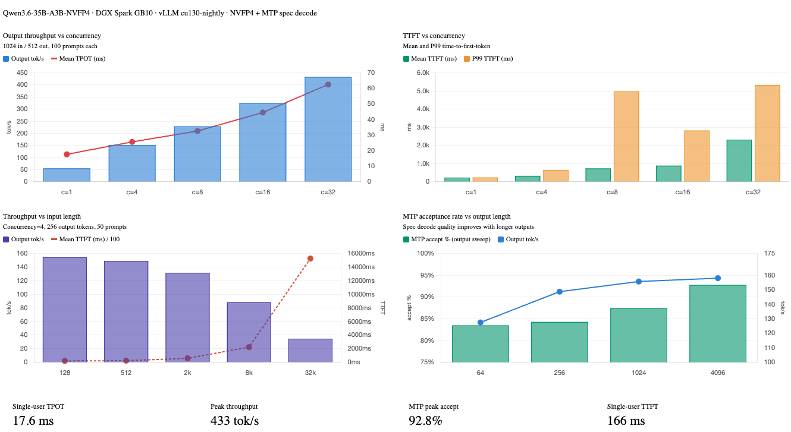

This is a **vLLM Recipe** - a production-ready Docker Compose configuration for running open-weight models on local hardware. It documents the exact setup, configuration rationale, and benchmark results so you can get a model running quickly. You are welcome to change the parameters to suit your workloads. This worked for me, so I hope you find it helpful.

This recipe covers **Qwen3.6-35B-A3B-NVFP4** - a Mixture-of-Experts model with 35B total parameters but only ~3B active at inference - quantized to NVFP4 by Red Hat AI and running on the **NVIDIA DGX Spark** (my GigaByte AI Top Atom) with a GB10 Blackwell GPU and 128 GB of unified CPU/GPU memory.

---

## Table of Contents

1. [Model Overview](#model-overview)
2. [Hardware](#hardware)
3. [Why This Model on DGX Spark](#why-this-model-on-dgx-spark)
4. [Prerequisites](#prerequisites)
5. [Step 1 - Log in to Hugging Face](#step-1--log-in-to-hugging-face)
6. [Step 2 - Pull the vLLM Docker Image](#step-2--pull-the-vllm-docker-image)
7. [Step 3 - Download the Model Weights](#step-3--download-the-model-weights)
8. [Step 4 - Start the Server](#step-4--start-the-server)
9. [Step 5 - Verify the Server is Ready](#step-5--verify-the-server-is-ready)
10. [Docker Compose Configuration](#docker-compose-configuration)
11. [API Usage](#api-usage)
12. [Running the Benchmarks](#running-the-benchmarks)
13. [Benchmark Results](#benchmark-results)
14. [Monitoring with Docker Logs](#monitoring-with-docker-logs)
15. [Troubleshooting](#troubleshooting)
16. [References](#references)

---

## Model Overview

[Qwen3.6-35B-A3B](https://huggingface.co/Qwen/Qwen3.6-35B-A3B) is part of the [Qwen3.6 model family](https://huggingface.co/collections/Qwen/qwen36) from Alibaba's Qwen team. It is a Mixture-of-Experts (MoE) model with:

- **35B total parameters**, ~**3B active** at inference per token
- **131K native context window** (128K tokens usable after system overhead)
- **MTP (Multi-Token Prediction)** speculative decoding head built in (`model_mtp.safetensors`)
- Built-in chain-of-thought reasoning via `<think>` blocks
- Tool calling / function calling with MCP support
- Apache 2.0 license

The [RedHatAI/Qwen3.6-35B-A3B-NVFP4](https://huggingface.co/RedHatAI/Qwen3.6-35B-A3B-NVFP4) checkpoint was quantized by Red Hat AI using `llm-compressor` with the `compressed-tensors` format, targeting NVIDIA Blackwell's native FP4 tensor cores. This reduces model weight storage significantly while preserving quality - the NVFP4 format is supported natively by vLLM's `compressed-tensors` quantization backend.

---

## Hardware

| Component | Specification |
|-----------|--------------|
| Device | NVIDIA DGX Spark (GigaByte AI Top Atom) |
| GPU | NVIDIA GB10 (Blackwell, SM121) |
| Memory | 128 GB unified (shared CPU/GPU) |
| CUDA Capability | 12.1 |
| Storage | Samsung NVMe 3.7 TB (`MZALC4T0HBL1`) |
| OS | Ubuntu 24.04.4 LTS |
| Kernel | 6.17.0-1014-nvidia |
| GPU Driver | 580.142 |
| CUDA Version | 13.0 |
| nvidia-smi | 580.142 |

---

## Why This Model on DGX Spark

The NVIDIA DGX Spark is an exceptional platform for local, high-performance AI tasks. Paired with **RedHatAI/Qwen3.6-35B-A3B-NVFP4**, you can capitalize on the strengths of the Blackwell architecture via NVFP4 precision, achieving immense computational speed while preserving high accuracy. 

At a high level, this model is incredibly potent for a wide range of tasks, particularly when leveraging its expansive 262K context window and advanced Agentic capabilities.

Here is a quick summary of the model's capabilities based on its official Hugging Face documentation:

| Capability | Supported | Notes |
|------------|----------|-------|
| **Text Generation** | Yes | Exceptional general reasoning, chain-of-thought, and writing. |
| **Code / Development** | Yes | Excellent Agentic Coding, handles frontend workflows & repo-level reasoning. |
| **Image Understanding** | Yes | Built-in vision encoder for complex multimodal inputs. |
| **Video Understanding** | Yes | Supports long-video understanding with customizable frame sampling. |
| **Image Creation** | No | Image-Text-to-Text model; does not natively generate images. |
| **Video Creation** | No | Does not generate video frames natively. |
| **Audio Understanding** | No | Does not have an audio encoder or audio reading capabilities. |
| **Audio Creation** | No | Does not generate audio natively. |

---

## Prerequisites

- Docker installed and configured with GPU support
- Your user in the `docker` group (or run with `sudo`)
- Approximately **25–35 GB** free disk space for model weights (NVFP4 quantized)
- A Hugging Face account (free) for downloading the model

If you haven't added your user to the `docker` group yet:

```bash
sudo usermod -aG docker $USER
newgrp docker
```

---

## Step 1 - Log in to Hugging Face (Optional)

The RedHatAI checkpoint is publicly available but downloading large model files without authentication can hit rate limits or anonymous download throttling. Always log in before pulling large models - the weights are ~20–25 GB and can take many minutes depending on your internet connection.

**Option A: Interactive login (recommended for first-time setup)**

```bash
pip install huggingface_hub --quiet
huggingface-cli login
```

Paste your token when prompted. You can generate a read-only token at [huggingface.co/settings/tokens](https://huggingface.co/settings/tokens).

**Option B: Environment variable (CI/automation-friendly)**

```bash
export HF_TOKEN=hf_your_token_here
```

The Docker Compose file picks this up via the `env_file` directive - place your token in `/home/aidev/models/.env`:

```bash
echo "HF_TOKEN=hf_your_token_here" > /home/aidev/models/.env
chmod 600 /home/aidev/models/.env
```

---

## Step 2 - Pull the vLLM Docker Image (Optional)

The standard NVIDIA vLLM container does not support NVFP4 quantization or the Blackwell-specific `flashinfer_cutlass` MoE backend. You need the nightly cu130 build.

> **Important:** This image is large (~15–20 GB). Pull it before starting the container is recommended so you can watch the download progress and verify it completes cleanly.

```bash
docker pull vllm/vllm-openai:cu130-nightly
```

This image includes:

- vLLM with `compressed-tensors` NVFP4 support
- CUDA 13.0 / PyTorch with Blackwell (SM121) support
- FlashInfer CUTLASS backend for MoE routing on GB10
- The `vllm bench` CLI for benchmarking

---

## Step 3 - Download the Model Weights (Optional)

While you _can_ skip this step and let Docker Compose pull the weights automatically on first start, it's much easier to monitor a standalone download first - especially since the model is large and any interruption during container startup is harder to debug.

```bash
huggingface-cli download RedHatAI/Qwen3.6-35B-A3B-NVFP4 \
  --local-dir ~/models/huggingface/hub/models--RedHatAI--Qwen3.6-35B-A3B-NVFP4
```

Or if you prefer the cache layout vLLM expects natively:

```bash
python3 -c "
from huggingface_hub import snapshot_download
snapshot_download('RedHatAI/Qwen3.6-35B-A3B-NVFP4', cache_dir='/home/$USER/models/huggingface')
"
```

The download will print per-file progress. Once complete, confirm the snapshot directory exists:

```bash
ls ~/models/huggingface/hub/models--RedHatAI--Qwen3.6-35B-A3B-NVFP4/snapshots/
```

You should see a single hash-named directory containing `model_mtp.safetensors` alongside the main shards - the MTP head is required for speculative decoding.

---

## Step 4 - Start the Server

Save the Docker Compose file below (see [Docker Compose Configuration](#docker-compose-configuration)) as `Qwen3.6-35B-A3B-NVFP4.yml`, then start the service:

```bash
docker compose -f Qwen3.6-35B-A3B-NVFP4.yml up -d
```

On first boot, vLLM will:
1. Download the `vllm/vllm-openai:cu130-nightly` model (if you skipped Step 2)
2. Download the model weights (if you skipped Step 3)
3. Load and validate weights (~1–2 min)
4. Compile CUDA graphs for the NVFP4 kernels (~5–8 min)
5. Start the OpenAI-compatible API server

The health check allows up to 10 minutes (`start_period: 600s`) for this to complete. You can watch progress with:

```bash
docker logs -f qwen3.6-35B-A3B-NVFP4
```

Subsequent starts are much faster since CUDA graphs are cached and the image and weights are already downloaded.

---

## Step 5 - Verify the Server is Ready

```bash
curl http://localhost:8000/v1/models
```

Expected output:

```json
{
  "data": [
    {
      "id": "Qwen3.6-35B-A3B-NVFP4",
      "object": "model",
      "max_model_len": 131072
    }
  ]
}
```

Send a quick test chat:

```bash
curl http://localhost:8000/v1/chat/completions \
  -H "Content-Type: application/json" \
  -d '{
    "model": "Qwen3.6-35B-A3B-NVFP4",
    "messages": [{"role": "user", "content": "Hello! What model are you?"}],
    "max_tokens": 128
  }'
```

---

## Docker Compose Configuration

```yaml
# Qwen3.6-35B-A3B-NVFP4 - DGX Spark (GB10 / SM121, 128 GB unified memory)
# vLLM nightly cu130 for Blackwell NVFP4 support
# MTP speculative decoding enabled (model_mtp.safetensors present in RedHatAI checkpoint)

services:
  vllm-qwen3.6-35B-A3B-NVFP4:
    image: vllm/vllm-openai:cu130-nightly
    container_name: qwen3.6-35B-A3B-NVFP4
    restart: unless-stopped

    deploy:
      resources:
        reservations:
          devices:
            - driver: nvidia
              count: all
              capabilities: [gpu]

    ipc: host

    ulimits:
      memlock:
        soft: -1
        hard: -1
      stack:
        soft: 67108864
        hard: 67108864

    env_file:
      - /home/aidev/models/.env

    environment:
      - HF_HOME=/root/.cache/huggingface
      - TOKENIZERS_PARALLELISM=false

    volumes:
      - ${HOME}/models/huggingface:/root/.cache/huggingface
      - ${HOME}/models/logs:/var/log/vllm

    ports:
      - "8000:8000"

    healthcheck:
      test: ["CMD", "curl", "-f", "http://localhost:8000/health"]
      interval: 90s
      timeout: 10s
      retries: 5
      start_period: 600s

    command:
      - RedHatAI/Qwen3.6-35B-A3B-NVFP4
      - --served-model-name=Qwen3.6-35B-A3B-NVFP4
      - --host=0.0.0.0
      - --port=8000
      - --quantization=compressed-tensors
      - --language-model-only
      - --moe-backend=flashinfer_cutlass
      - --tensor-parallel-size=1
      - --gpu-memory-utilization=0.87
      - --max-model-len=131072
      - --max-num-seqs=32
      - --max-num-batched-tokens=32768
      - --kv-cache-dtype=fp8_e4m3
      - --enable-chunked-prefill
      - --enable-prefix-caching
      - --speculative-config={"method":"mtp","num_speculative_tokens":1}
      - --reasoning-parser=qwen3
      - --enable-auto-tool-choice
      - --tool-call-parser=qwen3_coder
      - --default-chat-template-kwargs={"preserve_thinking":false}
      - --limit-mm-per-prompt={"image":1,"video":0,"audio":0}
      - --generation-config=vllm
      - --override-generation-config={"temperature":0.6,"top_p":0.80,"top_k":20,"presence_penalty":0.0,"repetition_penalty":1.0}
      - --trust-remote-code
```

### Key Parameters Explained

The table below covers the most impactful parameters. Everything not listed here is standard vLLM housekeeping (networking, health checks, volume mounts).

| Parameter | Value | Why |
|-----------|-------|-----|
| `--quantization` | `compressed-tensors` | The format Red Hat AI used with `llm-compressor`. Do **not** use `modelopt` - it's a different format. |
| `--language-model-only` | - | Skips loading `model_visual.safetensors`, freeing ~900 MB for additional KV cache. Remove only if you need image input. |
| `--moe-backend` | `flashinfer_cutlass` | The verified MoE routing backend for GB10/SM121. Required for NVFP4 on Blackwell. |
| `--gpu-memory-utilization` | `0.87` | Leaves ~17 GB for the OS, CUDA runtime, and MTP head. Tune up to `0.90` if you need more KV cache. |
| `--max-model-len` | `131072` | Full native context. Reduce to `65536` or `32768` to increase concurrent KV cache slots significantly. |
| `--max-num-seqs` | `32` | Maximum concurrent sequences in flight. Increase if you need higher concurrency. |
| `--max-num-batched-tokens` | `32768` | Token budget per scheduler step. Good balance for multi-agent workloads. |
| `--kv-cache-dtype` | `fp8_e4m3` | Halves KV cache memory vs. bf16, effectively doubling available cache slots. |
| `--enable-chunked-prefill` | - | Splits long prompts into chunks so prefill and decode can overlap, reducing TTFT under load. |
| `--enable-prefix-caching` | - | Caches KV state for identical prompt prefixes. Large win for agents sharing system prompts or tool schemas. |
| `--speculative-config` | `{"method":"mtp","num_speculative_tokens":1}` | Uses the built-in MTP head. `num_speculative_tokens=1` is correct - Qwen3.6 has one MTP layer. Setting `>1` reuses the same layer repeatedly with diminishing returns. |
| `--reasoning-parser` | `qwen3` | Parses `<think>...</think>` blocks from the response stream. |
| `--preserve_thinking` | `false` | Strips reasoning tokens from the final response. Set to `true` if you want to inspect the chain-of-thought. |
| `--override-generation-config` | see below | Sets explicit sampling defaults rather than inheriting model-baked `generation_config.json`. |

**Sampling presets** - swap the `--override-generation-config` line to match your workload:

```yaml
# Agentic / coding tasks (default in this recipe)
- --override-generation-config={"temperature":0.6,"top_p":0.80,"top_k":20,"presence_penalty":0.0,"repetition_penalty":1.0}

# Creative / general tasks
- --override-generation-config={"temperature":1.0,"top_p":0.95,"top_k":20,"presence_penalty":1.5,"repetition_penalty":1.0}
```

---

## API Usage

The server exposes an OpenAI-compatible API at `http://localhost:8000/v1`.

### Basic chat

```bash
curl http://localhost:8000/v1/chat/completions \
  -H "Content-Type: application/json" \
  -d '{
    "model": "Qwen3.6-35B-A3B-NVFP4",
    "messages": [{"role": "user", "content": "Explain CXL memory in one paragraph."}],
    "max_tokens": 512
  }'
```

### Disable thinking mode (faster responses)

By default the model uses chain-of-thought reasoning. Disable it when you just want quick answers:

```bash
curl http://localhost:8000/v1/chat/completions \
  -H "Content-Type: application/json" \
  -d '{
    "model": "Qwen3.6-35B-A3B-NVFP4",
    "messages": [{"role": "user", "content": "What is 42 * 17?"}],
    "max_tokens": 64,
    "extra_body": {"chat_template_kwargs": {"enable_thinking": false}}
  }'
```

### Python (OpenAI SDK)

```python
from openai import OpenAI

client = OpenAI(base_url="http://localhost:8000/v1", api_key="not-needed")

response = client.chat.completions.create(
    model="Qwen3.6-35B-A3B-NVFP4",
    messages=[{"role": "user", "content": "Write a Rust function to compute Fibonacci numbers."}],
    max_tokens=1024,
    temperature=0.6,
)

print(response.choices[0].message.content)
```

---

## Running the Benchmarks

### Setup: connect to the running container

The `vllm bench` CLI is already installed inside the container. Connect to it with an interactive shell:

```bash
docker exec -it qwen3.6-35B-A3B-NVFP4 bash
```

> **Tip:** In a second terminal, run `docker logs -f qwen3.6-35B-A3B-NVFP4` to watch the engine's token throughput and speculative decoding acceptance rate in real time while benchmarks run.

### Create the benchmark script

The container has no text editor, so use a heredoc to create the script:

```bash
cat <<'EOF' > benchmark.sh
#!/usr/bin/env bash
set -euo pipefail

TOKENIZER_PATH="/root/.cache/huggingface/hub/models--RedHatAI--Qwen3.6-35B-A3B-NVFP4/snapshots/e850c696e6d75f965367e816c16bc7dacd955ffa"
MODEL="Qwen3.6-35B-A3B-NVFP4"
BASE_URL="http://localhost:8000"
TIMESTAMP=$(date +%Y%m%d_%H%M%S)
OUT_FILE="benchmark_${TIMESTAMP}.out"
ERR_FILE="benchmark_${TIMESTAMP}.err"

run_bench() {
  vllm bench serve --model "$MODEL" --tokenizer "$TOKENIZER_PATH" \
    --base-url "$BASE_URL" --endpoint /v1/chat/completions \
    --backend openai-chat "$@"
}

echo "=== WARMUP ===" && \
run_bench \
  --dataset-name random --random-input-len 512 --random-output-len 128 \
  --num-prompts 10 --max-concurrency 1

echo "=== TEST 1: Single-user baseline ===" && \
run_bench \
  --dataset-name random --random-input-len 512 --random-output-len 512 \
  --num-prompts 50 --max-concurrency 1 \
  --percentile-metrics ttft,tpot,itl,e2el \
  --save-result --result-filename bench_c1_512in_512out.json

echo "=== TEST 2: Concurrency sweep ===" && \
for CONC in 1 4 8 16 32; do
  run_bench \
    --dataset-name random --random-input-len 1024 --random-output-len 512 \
    --num-prompts 100 --max-concurrency "$CONC" \
    --percentile-metrics ttft,tpot,itl,e2el \
    --save-result --result-filename "bench_c${CONC}_1024in_512out.json"
  echo "=== Done concurrency=$CONC ===" && sleep 5
done

echo "=== TEST 3: Input length sweep ===" && \
for INLEN in 128 512 2048 8192 32768; do
  run_bench \
    --dataset-name random --random-input-len "$INLEN" --random-output-len 256 \
    --num-prompts 50 --max-concurrency 4 \
    --percentile-metrics ttft,tpot,itl,e2el \
    --save-result --result-filename "bench_c4_${INLEN}in_256out.json"
  echo "=== Done input_len=$INLEN ===" && sleep 5
done

echo "=== TEST 4: Output length sweep ===" && \
for OUTLEN in 64 256 1024 4096; do
  run_bench \
    --dataset-name random --random-input-len 512 --random-output-len "$OUTLEN" \
    --num-prompts 50 --max-concurrency 4 \
    --percentile-metrics ttft,tpot,itl,e2el \
    --save-result --result-filename "bench_c4_512in_${OUTLEN}out.json"
  echo "=== Done output_len=$OUTLEN ===" && sleep 5
done

echo "=== TEST 5: ShareGPT agentic ===" && \
run_bench \
  --dataset-name hf --dataset-path Aeala/ShareGPT_Vicuna_unfiltered --hf-split train \
  --num-prompts 200 --max-concurrency 8 \
  --percentile-metrics ttft,tpot,itl,e2el \
  --save-result --result-filename bench_sharegpt_c8.json

echo "=== TEST 6: MTP spec decode ===" && \
run_bench \
  --dataset-name spec_bench \
  --num-prompts 100 --max-concurrency 4 \
  --percentile-metrics ttft,tpot,itl,e2el \
  --save-result --result-filename bench_specbench_c4.json

echo ""
echo "=== ALL TESTS COMPLETE ==="
echo ""
echo "=== RESULT FILE SUMMARY ==="
for f in bench_*.json; do
  [ -f "$f" ] || continue
  req=$(python3 -c "import json,sys; d=json.load(open('$f')); print(d.get('total_requests', d.get('num_prompts','?')))" 2>/dev/null || echo "?")
  ttft=$(python3 -c "import json,sys; d=json.load(open('$f')); print(round(d.get('mean_ttft_ms', 0), 1))" 2>/dev/null || echo "?")
  tput=$(python3 -c "import json,sys; d=json.load(open('$f')); print(round(d.get('output_throughput', 0), 1))" 2>/dev/null || echo "?")
  printf "  %-40s  requests=%-4s  mean_ttft=%-8s ms  output_tok/s=%s\n" "$f" "$req" "$ttft" "$tput"
done
EOF
chmod +x benchmark.sh
```

### Run the benchmarks

Run the full suite, capturing output to timestamped log files while also streaming to your terminal:

```bash
./benchmark.sh 2> >(tee benchmark_$(date +%Y%m%d_%H%M%S).err >&2) \
               1> >(tee benchmark_$(date +%Y%m%d_%H%M%S).out)
```

The full suite takes approximately **60–90 minutes** depending on concurrency. The warmup and single-user baseline complete quickly; the output-length sweep at 4096 tokens is the longest test.

### Copy results to the host

Once the benchmarks finish, exit the container and copy the results:

```bash
exit
```

```bash
docker cp qwen3.6-35B-A3B-NVFP4:/vllm-workspace/bench_*.json ~/models/logs/
docker cp qwen3.6-35B-A3B-NVFP4:/vllm-workspace/benchmark_*.out ~/models/logs/
docker cp qwen3.6-35B-A3B-NVFP4:/vllm-workspace/benchmark_*.err ~/models/logs/
```

---

## Benchmark Results

Please note that these benchmarks are not a complete sweep of all possible options. They are merely provided to give some idea of performance for the workload(s) that will use this model (e.g., OpenClaw, Hermes-Agent, custom apps, etc.).

All benchmarks were run on **2026-04-26** inside the `vllm/vllm-openai:cu130-nightly` container on the DGX Spark with the configuration above. MTP speculative decoding was **enabled** throughout (acceptance rate consistently 83–93%).

### Warmup (10 prompts, 512 in / 128 out, concurrency 1)

| Metric | Value |
|--------|-------|
| Mean TTFT | 166 ms |
| Mean TPOT | 17.7 ms |
| Output throughput | 53.1 tok/s |
| MTP acceptance rate | 83.2% |
| MTP acceptance length | 1.83 tokens |

---

### Test 1 - Single-user baseline (50 prompts, 512 in / 512 out, concurrency 1)

| Metric | Value |
|--------|-------|
| Mean TTFT | 166 ms |
| Median TTFT | 167 ms |
| P99 TTFT | 173 ms |
| Mean TPOT | 17.6 ms |
| Mean ITL | 32.5 ms |
| Mean E2EL | 9,168 ms |
| Output throughput | 55.9 tok/s |
| MTP acceptance rate | 85.4% |
| MTP acceptance length | 1.85 tokens |

With a single user, the TTFT is rock-steady at ~167 ms and TPOT at ~17.6 ms - this is effectively the hardware floor for this quantization and model size.

---

### Test 2 - Concurrency sweep (100 prompts, 1024 in / 512 out)

| Concurrency | Duration (s) | Output tok/s | Mean TTFT (ms) | P99 TTFT (ms) | Mean TPOT (ms) | Mean E2EL (ms) | MTP Accept % |
|:-----------:|:------------:|:------------:|:--------------:|:-------------:|:--------------:|:--------------:|:------------:|
| 1 | 921 | 55.6 | 228 | 237 | 17.6 | 9,209 | 86.1% |
| 4 | 337 | 152.1 | 326 | 653 | 25.6 | 13,401 | 85.8% |
| 8 | 224 | 229.0 | 737 | 4,979 | 32.6 | 17,387 | 86.1% |
| 16 | 157 | 325.3 | 889 | 2,825 | 44.5 | 23,647 | 86.1% |
| 32 | 118 | 433.4 | 2,317 | 5,335 | 62.5 | 34,249 | 85.2% |

Output throughput scales nearly linearly from concurrency 1 to 32 - **7.8× throughput gain** with only a proportional TPOT increase. The MTP acceptance rate stays flat at ~86% regardless of concurrency, confirming the draft head quality is independent of batch pressure.

---

### Test 3 - Input length sweep (50 prompts, concurrency 4, 256 output tokens)

| Input Tokens | Output tok/s | Mean TTFT (ms) | P99 TTFT (ms) | Mean TPOT (ms) | Mean E2EL (ms) | MTP Accept % |
|:------------:|:------------:|:--------------:|:-------------:|:--------------:|:--------------:|:------------:|
| 128 | 154.4 | 205 | 274 | 24.4 | 6,420 | 85.3% |
| 512 | 149.2 | 245 | 380 | 25.2 | 6,660 | 85.6% |
| 2,048 | 131.6 | 591 | 1,214 | 27.4 | 7,572 | 83.5% |
| 8,192 | 88.4 | 2,245 | 4,753 | 35.7 | 11,359 | 85.4% |
| 32,768 | 34.8 | 15,264 | 22,098 | 54.8 | 29,238 | 85.2% |

TTFT scales linearly with input length as expected - prefilling 32K tokens takes ~15 seconds. Output throughput degrades as prefill dominates the scheduling budget. For real-time applications requiring sub-second TTFT, keep prompts under ~2K tokens or enable streaming.

---

### Test 4 - Output length sweep (50 prompts, 512 input, concurrency 4)

| Output Tokens | Output tok/s | Mean TTFT (ms) | Mean TPOT (ms) | Mean ITL (ms) | Mean E2EL (ms) | MTP Accept % |
|:-------------:|:------------:|:--------------:|:--------------:|:-------------:|:--------------:|:------------:|
| 64 | 127.5 | 313 | 26.0 | 46.0 | 1,949 | 83.5% |
| 256 | 148.7 | 266 | 25.2 | 46.1 | 6,701 | 84.3% |
| 1,024 | 155.7 | 242 | 24.7 | 46.3 | 25,555 | 87.5% |
| 4,096 | 158.0 | 251 | 24.6 | 47.3 | 100,796 | 92.8% |

Output throughput is remarkably stable across output lengths (~128–158 tok/s). TTFT is consistent since input length is fixed. Notably, the MTP acceptance rate **improves** significantly at long output lengths - reaching 92.8% at 4096 tokens - because the model becomes more predictable in sustained generation, making the draft head increasingly accurate.

### Results Charts



---

## Monitoring with Docker Logs

While benchmarks or workloads are running, you can watch the vLLM engine logs in another terminal. These show live throughput, KV cache pressure, and speculative decoding efficiency:

```bash
docker logs -f qwen3.6-35B-A3B-NVFP4
```

Example output:

```
(APIServer pid=1) INFO 04-26 20:06:34 [loggers.py:271] Engine 000: Avg prompt throughput: 103.4 tokens/s, Avg generation throughput: 57.4 tokens/s, Running: 1 reqs, Waiting: 0 reqs, GPU KV cache usage: 0.2%, Prefix cache hit rate: 0.0%
(APIServer pid=1) INFO 04-26 20:06:34 [metrics.py:101] SpecDecoding metrics: Mean acceptance length: 1.90, Accepted throughput: 27.20 tokens/s, Drafted throughput: 30.10 tokens/s, Accepted: 272 tokens, Drafted: 301 tokens
```

Key things to watch:

- **GPU KV cache usage** - if this approaches 90%+, the scheduler will start queuing requests rather than running them concurrently
- **Prefix cache hit rate** - should climb toward 80–100% once your application warms up with repeated system prompts or tool schemas
- **MTP acceptance length** - should be ~1.85–1.90 in normal operation; a drop may indicate prompt distribution has changed

---

## Troubleshooting

**Container fails to start / exits immediately**

Check logs for the actual error:

```bash
docker logs qwen3.6-35B-A3B-NVFP4
```

**`compressed-tensors: quantization format not recognized`**

The wrong vLLM image is being used. Confirm you're running `vllm/vllm-openai:cu130-nightly`, not the NVIDIA-provided container.

**`moe-backend flashinfer_cutlass not available`**

This backend is only available in cu130-nightly. Pull the latest nightly: `docker pull vllm/vllm-openai:cu130-nightly`.

**TTFT spikes at higher concurrency**

This is expected - with concurrency 8+, some requests queue while others prefill. The P99 TTFT at concurrency 8 is ~5 seconds, vs. ~237 ms at concurrency 1. If your application is latency-sensitive rather than throughput-sensitive, cap `--max-num-seqs` lower (e.g., 8) to reduce queuing depth.

**High KV cache usage / OOM**

Reduce `--max-model-len` to `65536` or `32768`. This frees a significant amount of KV cache memory without affecting quality for workloads that don't need 128K context.

**MTP acceptance rate drops below 70%**

The draft head is struggling with the current prompt distribution (often very short outputs or highly random text). This is normal for synthetic benchmarks with random token inputs. Real workloads with coherent text see 85–93% acceptance as shown above.

---

## References

- [Qwen3.6 Model Collection on Hugging Face](https://huggingface.co/collections/Qwen/qwen36)
- [Qwen3.6-35B-A3B (base model)](https://huggingface.co/Qwen/Qwen3.6-35B-A3B)
- [RedHatAI/Qwen3.6-35B-A3B-NVFP4 (this recipe's checkpoint)](https://huggingface.co/RedHatAI/Qwen3.6-35B-A3B-NVFP4)
- [vLLM Documentation](https://docs.vllm.ai/)
- [NVIDIA DGX Spark User Guide](https://docs.nvidia.com/dgx/dgx-spark/index.html)
- [qwen3.5-dgx-spark reference guide](https://github.com/adadrag/qwen3.5-dgx-spark) - inspiration for this recipe series